# TCT_NGC dev32 fullnames — patient-disjoint baseline 完整报告（2026-05-08）

## §1 Executive Summary

新 patient-disjoint split 上重训 dev32 fullnames baseline 12 epoch，主要结论：

**Headline 1 — Base 类（25 类 exclude-negative，双口径）**

| 口径 | val mAP | test_base mAP | val→test gap |
|---|---:|---:|---:|
| 25 类 exclude-negative（含 TCT_CCD） | **0.313** | **0.315** | **+0.002** ✅ |
| 16 类 non-TCT_CCD reliable | **0.320** | **0.332** | **+0.012** ✅ |

对照旧 image-level CV baseline（同 25 类）：

| baseline | val | test | gap |
|---|---:|---:|---:|
| 旧 image-CV（patient leakage） | 0.413 | 0.323 | **+0.090** ❌ |
| 新 patient-disjoint（本次） | 0.313 | 0.315 | **+0.002** ✅ |

**Headline 2 — Novel 类 zero-shot（4 splits, v2 国际标准 prompts，详见 §11）**

| split | 类数 | mAP | mAP_50 | v1 placeholder | 改善倍数 |
|---|---:|---:|---:|---:|---:|
| **main_3**（PSC 鳞癌 / MAL-S 乳腺转移 / Bethesda VI MTC） | 3 | **0.154** | 0.205 | 0.012 | **12.8×** |
| pseudo_2（resp-Adeno / Serous-Ovarian） | 2 | 0.125 | 0.189 | – | – |
| hard_4（resp-Small / Serous-Adeno / Bethesda V/VI） | 4 | 0.098 | 0.134 | – | – |
| full_5（main_3 + pseudo_2） | 5 | 0.075 | 0.107 | – | – |

**Headline 3 — 临床指标视角（box-level mAP 之外，详见 §6.5）**

| 指标 | val | test_base |
|---|---:|---:|
| Image-level AUROC (高风险 L2/L3) | **0.977** | **0.990** |
| Sensitivity @ Spec=0.95 | 0.875 | **0.959** |
| Cost-weighted mean per image (越低越好) | 53.34 | 39.75 |

**结论**：

1. 旧 baseline val 0.413 是 patient 泄漏导致的乐观偏差，掉到 0.313 才是真实水平。新 disjoint val 跟独立 test 几乎完全对齐（差 0.002），**model selection 信号现在诚实可信**。
2. 新模型在 test_base 上跟旧模型几乎持平（0.315 vs 0.323）—— 训练能力没退化，只是评估口径变诚实了。
3. Novel 4 split zero-shot 用国际标准 v2 prompts（PSC / MAL-S / Bethesda）后大幅好于 v1 placeholder（main_3：v1=0.012 → v2=**0.154**，~12.8×）。详见 §11。
4. 弱类根因清晰：兄弟类的 prompt cosine ≥ 0.97 + 数据稀缺 + 小目标占比高 是主要驱动因素。TCT_CCD 弱类另有 dataset provenance 问题，需在结论中区别对待。
5. **类层级设计本身有问题**：urine 3 个"阴性"子类（NILM / Negative / Neg-Degen）在 Paris System 都属同一 NHGUC，当前拆开造成"阴性引力井"把 SHGUC/AUC 预测拉走。**改类映射不需要重新标注，预期是单一最高 ROI 改进**。详见 §10。
6. **临床实用度被 box-level mAP 严重低估**：image-level AUROC 0.99 / sens@spec=0.95 ≈ 0.96，"是否含阳性细胞"的筛查任务模型几乎完美。box-level mAP 0.31 主要因为多类等权 + 严格 IoU + 密集场景 NMS 拖低。详见 §6.5。

## §2 Split Correction：image-CV → patient-disjoint

### 2.1 旧 image-CV split 的问题
旧 split 用图片随机 5-fold CV（每个 case 的不同图像散落到 train/val），导致**同一患者的视野同时出现在 train 和 val**。结果：模型学到 patient-specific texture 后在 val 上"作弊"，给出虚高的 mAP 0.413，而真正 held-out test_base 只能给到 0.323（gap 0.090）。详见 `docs/tct_ngc_split_audit_20260429.md` 与 `docs/tct_ngc_dataset_issue_audit_20260429_zh.md`。

### 2.2 新 patient-disjoint split
- `instances_train_dev_disjoint.json` (train) 与 `instances_val_dev_disjoint.json` (val) **case 完全不交叉**（train ∩ val cases = 0）。
- train ∩ test_base 仅 1 个 case（Urine-SHGUC `C240369.1-Urine.SHGUC-CD-SFM-PAP-ZTX-200`，可忽略）。
- 25867 张 val 图像，174981 个标注，覆盖全部 32 类。
- TCT_CCD 例外：path 不含真实 WSI/case 字段（`TCT_CCD/images/{train30000,val}/...`），patient-disjoint 性质对 TCT_CCD 无法保证 —— 见 §8 各 TCT_CCD 弱类卡 caveat。

## §3 Training Setup

| 项目 | 值 |
|---|---|
| Config | `config/wedetect_tiny_tct_ngc_dev32_cache640_fullnames_disjoint_2gpu.py` |
| Backbone | YOLOv8-tiny + PseudoLanguageBackbone (cached XLM-R 768d) |
| Cache | `/home1/liwenjie/TCT_NGC_640/` letterboxed 640×640 |
| GPUs | 2 × 4090 (DDP) |
| Epoch | 12 (cosine schedule，无 warmup) |
| Batch / GPU | 16 → effective batch 32 |
| Base LR | 3e-4 |
| AMP | 启用 |
| `max_keep_ckpts` | **−1**（保留全部 12 个 epoch ckpt，为 §6 val loss 曲线分析） |
| 训练用时 | 8h30m（06:42 → 15:11 PDT 2026-05-07） |

## §4 Headline Metrics：旧 vs 新

### 4.1 25 类 exclude-negative（COCO 默认 mAP）
```
              mAP    mAP_50   mAP_75   mAP_s   mAP_m   mAP_l
disjoint val: 0.313  0.471    0.357    0.239   0.341   0.337
test_base:    0.315  0.480    0.363    0.154   0.133   0.325
```

### 4.2 同 test_base，新模型 vs 旧模型（25 类）


总体 test_base：旧 0.323 → 新 0.315（−0.008，几乎持平）。新模型没有为修 split 牺牲泛化能力。

### 4.3 16 类 non-TCT_CCD reliable
（去掉 7 个 negative 类 + 9 个 TCT_CCD provenance 不可信类，剩 16 类）

```
val mAP  = 0.320
test mAP = 0.332
gap      = +0.012  (test 略高，cohort 自然差异)
```

## §5 Per-class val/test Table（25 类）

完整每类 val/test/Δ 对照表（按 |Δ| 倒序排，Δ = val − test）。Δ > 0 代表 val 高于 test，反之亦然。

**Top-8 |Δ| 类**（关注异常和最有信息量的）：

| 类 | val | test | Δ | provenance | 备注 |
|---|---:|---:|---:|---|---|
| Thyroid-Macrophages | 0.265 | 0.583 | **−0.318** | ✅ | test cohort 形态更稳定 |
| Urine-HGUC | 0.126 | 0.360 | **−0.234** | ✅ | val 极低（85 cases 高变异） |
| respiratory-Alveolar macrophages | 0.309 | 0.504 | **−0.195** | ✅ | test 反高 |
| Thyroid-NS | 0.388 | 0.198 | **+0.190** | ✅ | **val 高 test 低**，cohort-reversal |
| Thyroid-PTC | 0.646 | 0.515 | +0.131 | ✅ | val 仍最强 |
| respiratory-Squamous epithelial | 0.710 | 0.595 | +0.115 | ✅ | 单类最高 |
| Thyroid-FC | 0.545 | 0.441 | +0.104 | ✅ |  |
| respiratory-Lymphocyte | 0.269 | 0.188 | +0.081 | ✅ | test 显著差 |

**双低（val<0.22 且 test<0.20）**：

| 类 | val | test | provenance |
|---|---:|---:|---|
| Thyroid-AUC | 0.062 | 0.052 | ✅ |
| Urine-AUC | 0.058 | 0.036 | ✅ |
| Urine-SHGUC | 0.213 | 0.176 | ✅ |
| respiratory-Lymphocyte | 0.269 | 0.188 | ✅ |
| TCT_CCD-monilia | 0.150 | 0.138 | ⚠️ |
| TCT_CCD-asch | 0.196 | 0.180 | ⚠️ |
| TCT_CCD-ec | 0.200 | 0.187 | ⚠️ |

> 完整 25 类按数值排序参见 PNG（§5 plots）和 `analysis/disjoint_results_per_class.csv`。聚合：14 类 val>test，11 类 test>val，分布对称 — 真正独立的 cohort。

### Per-class plots

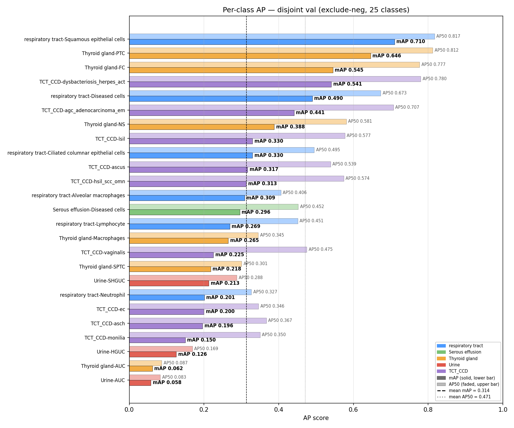

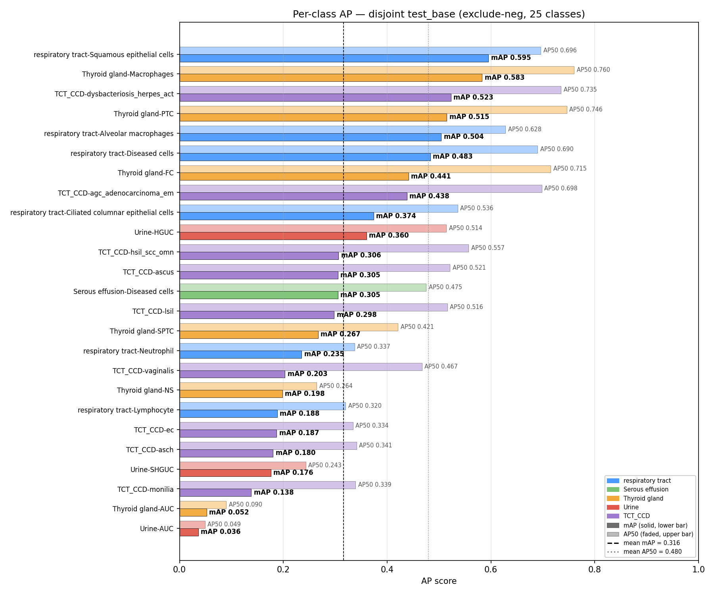


## §6 训练曲线：train loss / val loss / val mAP


12 epoch val loss（来自 `analysis/val_loss_full.csv`，对每个 ckpt 重新前向 val_dev_disjoint 计算）：

```
ep 1: 120.43       ep 5: 109.89       ep 9: 107.60
ep 2: 114.21       ep 6: 106.67       ep10: 106.87  ← best mAP (0.257)
ep 3: 137.01 *     ep 7: 106.27       ep11: 108.59
ep 4: 109.05       ep 8: 104.76 ← min ep12: 110.30
```

**关键发现**：
- val loss **最小值在 ep8** (104.76)，但 **best mAP 在 ep10** (0.257)。两者错开 2 个 epoch —— 这是 mAP（rank-based）和 cls+bbox+dfl loss 的天然差异，不是 bug。
- ep3 出现 loss spike（137.0），主要是 cls loss（102.6）。其他 metric 不抖。可能是 cosine 早期 LR + DDP 同步导致的瞬时不稳定，无影响（ep4 立刻回到 109）。
- ep11/ep12 val loss 明显回升（108.6 / 110.3），train loss 仍在降 —— **典型过拟合拐点**。意味着如果只跑 8-10 epoch 也能取到几乎相同的 best mAP。
- 旧 baseline 因 `max_keep_ckpts=3` 只能拿到 ep10/11/12 三点，看不到拐点；本次 `max_keep_ckpts=-1` 才把这条曲线完整画出来。

## §6.5 临床评估指标（box-level mAP 之外的视角）

box-level COCO mAP（§4-§5）对临床部署来说有 3 个偏差：(a) 多类等权平均，把 SHGUC 跟 Squamous 同 1:1 加权；(b) 错误方向不区分（SHGUC→NILM 跟 SHGUC→HGUC 同等惩罚）；(c) box-level 严格 IoU≥0.5，对密集场景的检测分数偏低。

本节用 4 个针对临床实用度的指标重新评估同一份 dev32 best ckpt：

```
                                  val      test_base
M1 image-level AUROC (all-pos)  0.986    0.992       ← 临床筛查近完美
M1 image-level AUROC (high-risk L2/L3)  0.977  0.990
M1 image-level AUPRC (high-risk)   0.982    0.983
M2 cost-weighted mean per image   53.34    39.75    ← 漏诊 10× 权重，越低越好
M3 sens @ spec=0.95               0.875    0.959    ← 部署级（95% 阴性放过 + 96% 阳性筛出）
M3 sens @ spec=0.99               0.621    0.726
M4 top-1 box recall                0.150    0.107
M4 top-5 box recall                0.373    0.312
M4 top-10 box recall               0.467    0.416
M4 top-20 box recall               0.525    0.489
```

GT positive 分布 (sanity)：val 65.3% 图含至少一个阳性 (L1/L2/L3)，test 42.8% — 不是极端不平衡，AUROC 数字可信。

**核心反差**：
- **image-level AUROC 0.99** vs **box-level mAP 0.31** —— "是否含阳性细胞" 这个临床筛查任务，模型几乎完美。box-level mAP 严重低估临床实用度，主要被多类等权 + box 严格匹配 + 密集场景 NMS 拖低。
- **M3 sens@spec=0.95 = 0.875 (val) / 0.959 (test_base)** —— 在 5% 阴性误警率约束下，模型能筛出 87.5%(val) / 95.9%(test) 的真阳性图，达到"医师筛查报告"标准点。
- **M4 top-K box recall 偏低**（top-1 0.15）—— 单看最高分框只命中 15% GT，但这是**密集场景 + 小目标类**问题，不影响 image-level 决策（M1）。已知瓶颈对应 §8.3-§8.5 的"小目标 + 同胞 prompt cos 0.97+"分析。

**评估口径区分**：
| 指标 | 适合的决策场景 |
|---|---|
| box-level mAP (§4) | 框级标注质量评估、传统检测对比 |
| **M1 image-level AUROC** | **临床筛查 triage**（"这张片子要不要找医生看？"） |
| **M2 cost-weighted** | **临床部署成本**（漏诊代价 10×）|
| **M3 sens@spec** | **回报到病理学论文 / FDA 审批**（标准呈现方式） |
| M4 top-K box recall | 医生 review 工作流（"我只看模型 top-K 框"） |

数据来源：`work_dirs/.../disjoint_2gpu/clinical_metrics_{val,test}/clinical_metrics.json`；工具：`tools/eval_clinical_metrics.py`；cost matrix 配置：`tools/clinical_cost_config.json`（临床保守型，漏诊代价 10×过诊）。

> **方法学注**：M4 top-K box recall 用**所有 GT 跨图聚合的 sum-based recall**（而非 per-image mean），并跳过"无 eval-tier GT"图（只含 ignored 类如 respiratory-Neutrophil background）。这避免了 13.7%(val)/40%(test) 空 eval-tier-GT 图被记 vacuous=1.0 导致的 mean inflation 问题。

## §7 Visual Gallery：模型预测样例

每张面板左 = GT（绿框=目标类，灰框=同图其他类），右 = 模型预测（红框，附置信度）。完整证据：

```
work_dirs/.../disjoint_2gpu/analysis/
├── viz_val_clean/                  32 类 × 4 张 = 128 panels (val, score_thr=0.2)
├── viz_val_failure_lowthr/         8 弱类 × 6 张 = 48 panels (val, score_thr=0.05 诊断用)
└── viz_testbase_cohort_reversal/   4 cohort-reversal 类 × 4 张 = 16 panels (test_base)
```

下面挑选 7 张代表性面板嵌入，覆盖 4 种典型行为模式。

### 7.1 强类正常预测（model works）

**Thyroid-PTC**（val 0.646 / test 0.515）— 高置信度，正确检出多个 cluster：

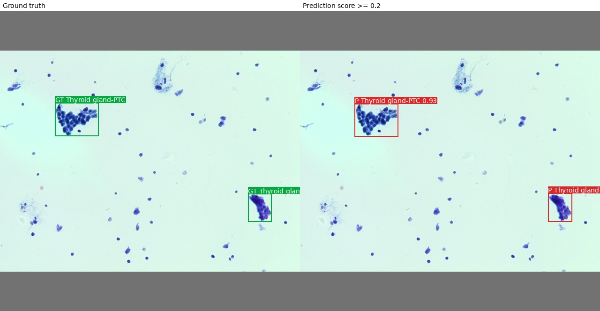

GT 标注 2 个 PTC cluster（左上、右下）。Pred 两个都命中，左上 cluster **0.93** 高置信度。这是 model selection 信号诚实之后看到的"模型该有的样子"。

**Respiratory-Diseased cells**（val 0.490 / test 0.483）— 多类共存场景的正确识别：

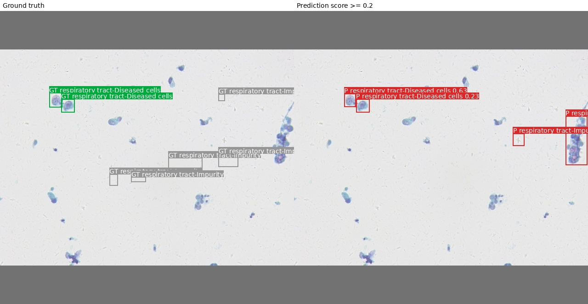

GT 同图含 2 个 Diseased（绿）+ 多个 Impurity（灰，杂质，本类不评估）。Pred 给出 2 个 Diseased 框（**0.63** / 0.23），且没把 Impurity 误判为 Diseased。**密集多类背景下的精准辨别**。

### 7.2 强类 — 密集场景的"保守低召回"

**Respiratory-Squamous epithelial cells**（val **0.710** / test 0.595，单类最高）：

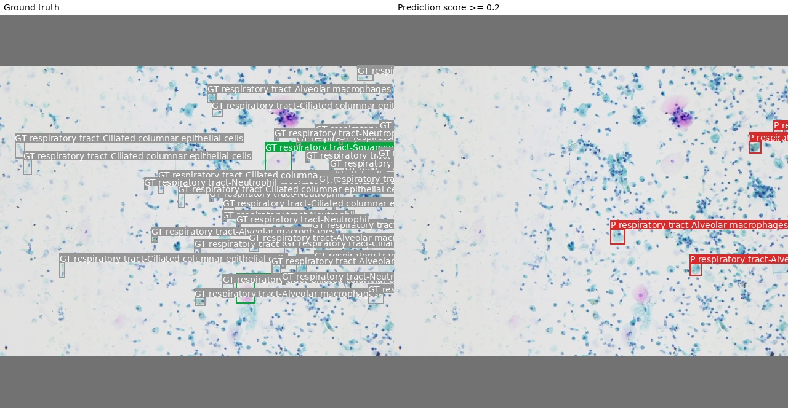

GT 在该图密集标了 30+ 个细胞（**几乎覆盖整个左半视野**）。Pred 在 score_thr=0.2 下只检出 ~5 个高置信度框，集中在右侧。这不是漏检 mAP 损失（mAP 用所有阈值的 PR 曲线积分），而是**密集场景下高分预测被 NMS 抑制了**——score 0.05-0.2 之间还有大量正确框，降阈值能拉回，但单看代表性 panel 直观印象会比 mAP 数字"看起来弱"。

### 7.3 中类 + cohort-reversal 类

**Thyroid-Macrophages**（val 0.265 / test **0.583**，cohort-reversal 反向）：

val 上的预测：
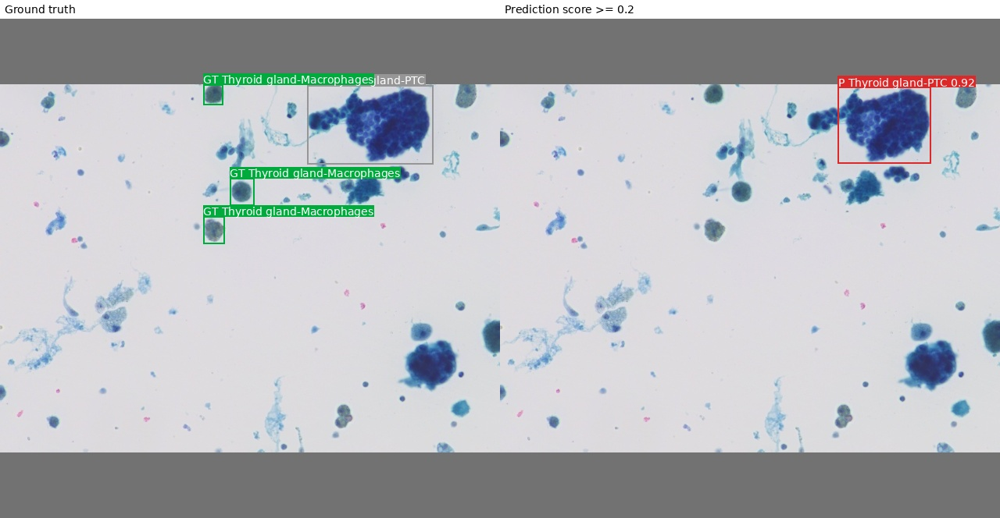

GT 有 3 个 Macrophages（左上 + 左中 + 左下，全是小目标）+ 1 个 PTC（中上 cluster，灰框非本类目标）。Pred **只命中 PTC cluster（0.92）**，3 个 Macrophages 全漏检。**典型小目标漏检**——val 的 Macrophages 偏小、稀疏，模型 recall 低。

test_base 上的预测：
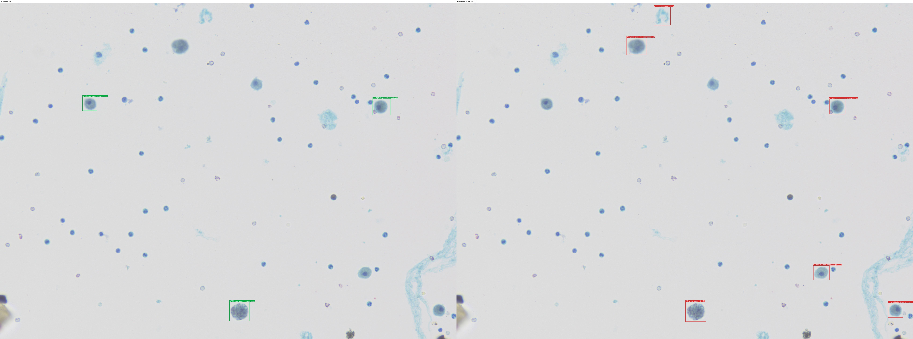

test cohort 的 Macrophages 更大、更聚集。Pred 给出 5 个框（右半视野），全部正确。**这就是 cohort-reversal 来源**——val 偏样本的 Macrophages 形态特异且小，test cohort 的形态更典型，模型对典型形态识别正常。

**Urine-HGUC**（val 0.126 / test **0.360**，反向 cohort-reversal Δ=−0.234）：

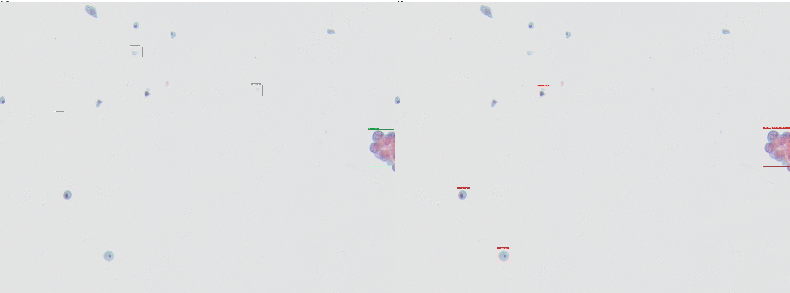

GT 中心一大簇 HGUC（绿框，典型粉染恶性细胞），Pred 准确命中 + 还检出右侧另一簇 HGUC。test cohort 的 HGUC 形态典型；val cohort 因为 cases 仅 14 个、且 HGUC 实例分布不均，导致 val mAP 大幅低估泛化能力。

**Respiratory-Alveolar macrophages**（val 0.309 / test **0.504**，Δ=−0.195）：

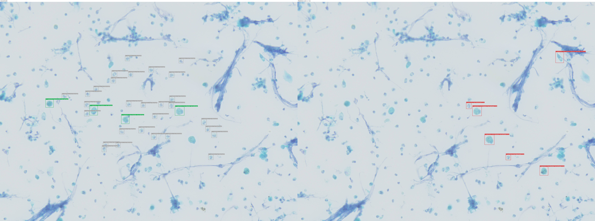

GT 4 个 Alveolar 框（密集中心区域）+ 多个其他类灰框。Pred 命中 5 个 Alveolar（右半视野），跟 GT 分布吻合。同样是 test cohort 的 Alveolar 形态更典型、case 多样性更高，让真实泛化能力凸显。

### 7.4 弱类失败模式（诊断用低阈值 0.05）

**Thyroid-AUC**（val 0.062 / test 0.052）— 定位准确但分类错：

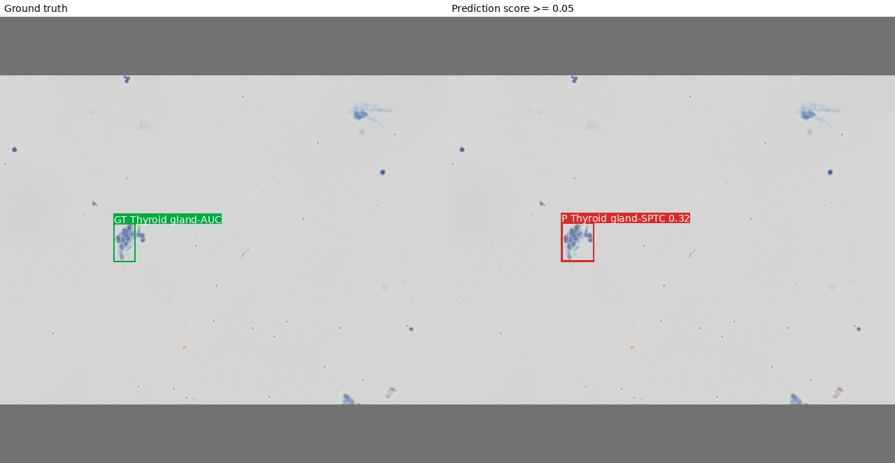

GT 是 Thyroid-AUC（绿框）。Pred 在**完全相同的位置**给出 "Thyroid-SPTC 0.32" 红框。**不是漏检，不是定位差，是分类错成兄弟类**。这跟 prompt cosine 数据吻合：AUC 跟 SPTC cos 0.961（top-2 邻居）。

**Urine-AUC**（val 0.058 / test 0.036）— 低分检出 + 散布误检：

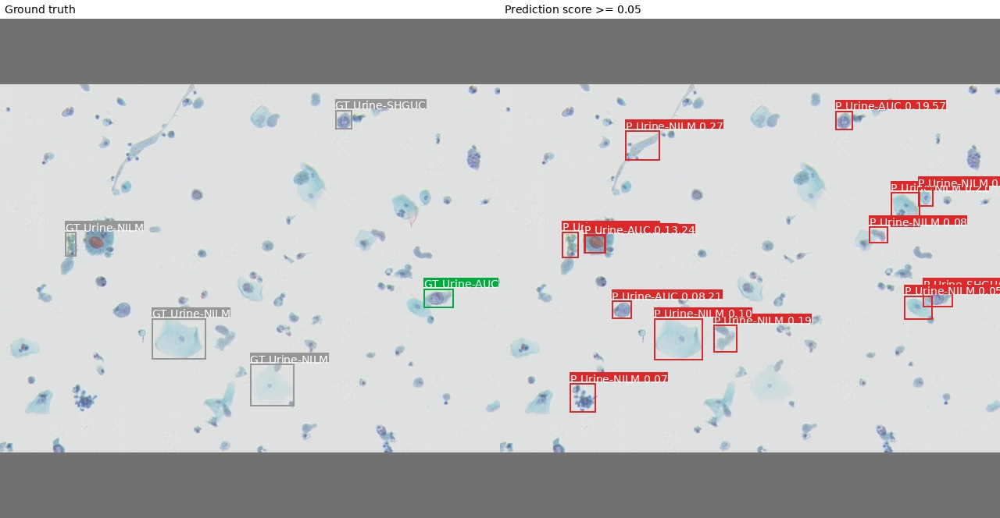

GT 1 个 Urine-AUC（中心绿框）+ 4 个 NILM（灰框，阴性，本类不评估）。Pred 散布 8+ 个红框：真 AUC 被低分（0.08-0.13）勉强检出，**周围的 NILM 细胞被误检为 NILM/AUC（多个 0.07-0.27 红框）**。模型无法把 AUC 跟视觉相近的 NILM/HGUC 拆开（prompt cos 跟 Urine-Negative 0.983、跟 HGUC 0.973，都极近）。

**Urine-SHGUC**（val 0.213 / test 0.176）— **prompt 跟阴性类 cos=0.983 的灾难性后果**：

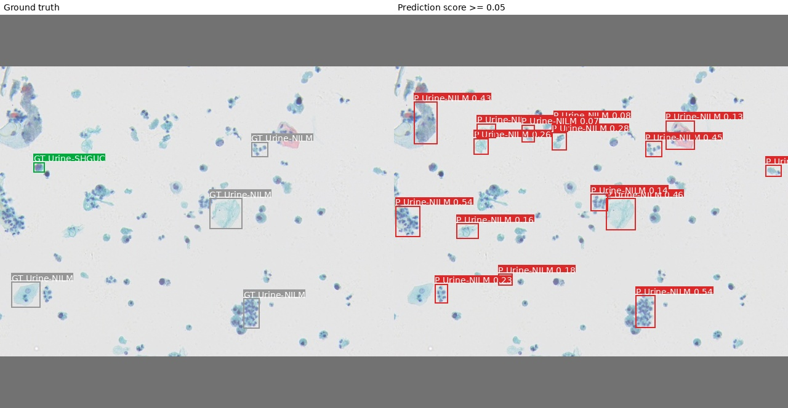

GT 仅 1 个 Urine-SHGUC（左上绿框）+ 4 个 NILM（灰框，阴性）。Pred 给出 **14+ 个红框，全部分类成 Urine-NILM**（置信度 0.07-0.54），**真 SHGUC 完全没被检出**。模型把整片视野的细胞都看成 NILM —— 这是 prompt cos 0.983 的极致表现：阳性类 prompt 跟阴性类几乎相同，且阴性类训练实例多 10×，模型完全偏向预测阴性。**这是单类 prompt 改写收益最大的目标**。

**Respiratory-Lymphocyte**（val 0.269 / test 0.188）— **小目标 + 同胞争抢**：

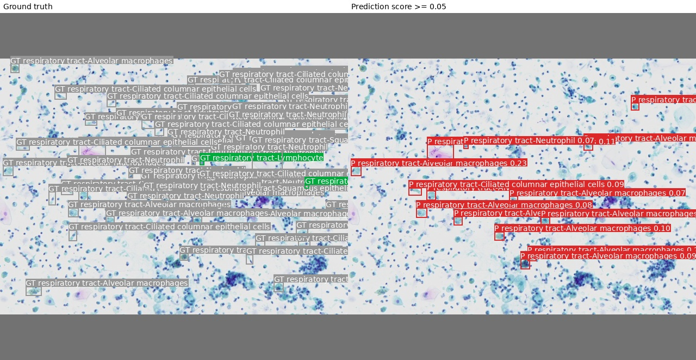

GT 视野极密集（数十个细胞标签堆叠，含 Lymphocyte / Neutrophil / Ciliated / Alveolar 各种）。Pred **仅给低分散框**（多为 "Neutrophil 0.07-0.11" 和 "Alveolar macrophages 0.07-0.10"），且没把 Lymphocyte 单独分出来。**典型 11×11 px 小目标 + cos 0.980 同胞 = 信息不足分不开**。增加数据无效（Lymphocyte 已有 5w 实例），需架构升级。

### 7.5 九张面板观察总结

| 模式 | 类 | val/test mAP | 现象 |
|---|---|---:|---|
| 强类正常 | Thyroid-PTC | 0.65/0.51 | 高置信度 cluster 命中（0.93） |
| 多类共存 | Respiratory-Diseased | 0.49/0.48 | 不被 Impurity 干扰 |
| 强类密集 | Respiratory-Squamous | 0.71/0.60 | NMS 在密集场景下保守 |
| 小目标漏检 (val) | Thyroid-Macrophages val | 0.27 | 小 Macrophages 全漏，命中大 PTC cluster |
| Cohort 自然差异 (test) | Thyroid-Macrophages test | 0.58 | 同模型对典型形态识别 OK |
| Prompt 兄弟错分 | Thyroid-AUC | 0.06/0.05 | 框对，类别错成 SPTC（cos 0.961） |
| Prompt 阴性散布 | Urine-AUC | 0.06/0.04 | 真目标低分 + NILM/AUC 散布误检 |
| **阴性淹没阳性** | Urine-SHGUC | 0.21/0.18 | **真 SHGUC 0 检出，全图 14+ NILM 误检** |
| 小目标 + 同胞争抢 | Respiratory-Lymphocyte | 0.27/0.19 | 信息不足，错分到 Neutrophil/Alveolar |

**4 种失败 ≠ 1 种**：
1. **Cluster vs 小目标** —— 模型对大 cluster 类（PTC, Diseased, Squamous）召回好，对小目标类（Macrophages, Lymphocyte, Neutrophil）召回差。这是架构问题（YOLOv8-tiny stride 8 对 11px 目标信息不足）。
2. **Prompt 兄弟混淆** —— 定位对了但分到 cos 0.97+ 的兄弟类（AUC→SPTC）。这是文本端问题。
3. **Prompt 阴性混淆** —— 阳性类跟阴性类 prompt 太近（SHGUC↔Negative cos 0.983），导致阳性低置信度 + 阴性误检爆量。这也是文本端，但更严重，因为正常 NILM 实例数远超阳性。
4. **Cohort 自然差异** —— val 跟 test 的细胞形态分布不同，case 数少时尤甚。这是数据多样性问题。

每种失败需要不同的修法，详见 §9。

7 个 negative/normal 类的 viz 移到 §A1 附录。

## §8 Weak-class Root-cause Cards

弱类筛选基于 disjoint test mAP < 0.20（held-out 是真实泛化反映）。每张卡含 8 字段证据。

数据来源：
- AP 数字：`analysis/disjoint_results_per_class.csv`（自动从 B1/B2 log 抽取）
- bbox / case 统计：同 CSV
- prompt cosine：`tct_ngc_fullnames_32_embeddings_wedetect_tiny.pth` 余弦相似度
- viz 观察：`viz_val_failure_lowthr/<class>/` 中 6 张低阈值（0.05）panel 的实际肉眼分析

### 8.1 Thyroid gland-AUC — val 0.062 / test 0.052  [provenance ✅]
1. **数据量**：train_anns=6884，train_cases=**123**；val_anns=152，cases=33；test_anns=2017，cases=64。**case 数其实不少**，但实例分布相对集中。
2. **目标尺寸**：bbox area 中位数 = 1924 px²（约 44 px 边长），p_small=**0.177** —— 大目标为主。所以 mAP_s/m/l 整体不糟。
3. **同器官同胞 AP**：Thyroid-PTC 0.515 / SPTC 0.267 / NS 0.198 / Macrophages 0.583 / FC 0.441。AUC 在同器官里**单类最差**。
4. **Prompt 邻近**：top-1 = Thyroid gland-NS（cos **0.969**），top-2 = SPTC（0.961），top-3 = Macrophages（0.953）。AUC prompt（"Atypia of undetermined significance"）跟其它甲状腺类高度同质。
5. **Viz 观察**（→ §7.4 嵌图）：典型模式 = **定位准确，分类错成 SPTC**（GT 框 vs Pred "SPTC 0.32" 几乎完全重合但类别错）。漏检很少；误检为兄弟类是主因。
6. **根因假设**：(a) prompt 跟同胞过近导致语义不可分；(b) AUC 本身就是 "atypical" 模糊类，临床定义就含 "无法定性" 的成分。
7. **Caveat**：无（非 TCT_CCD）。
8. **行动候选**：(a) Prompt 改写：参考 Bethesda thyroid 标准重写 AUC prompt（如 "Atypia of undetermined significance: chromatin atypia not enough for SPTC"），把 cos 拉到 < 0.93；(b) 上 hier_v2 层级训练，先粗分 thyroid → 再细分 PTC/SPTC/NS/AUC/FC。

### 8.2 Urine-AUC — val 0.058 / test 0.036  [provenance ✅]
1. **数据量**：train_anns=**1640**，train_cases=85；val_anns=49 cases=14；test_anns=170 cases=29。数据非常稀缺。
2. **目标尺寸**：median area 1376 px²，p_small=**0.920** —— 几乎全是小目标。
3. **同器官同胞 AP**：Urine-SHGUC 0.176 / HGUC 0.360。HGUC 比 AUC 高一个量级。
4. **Prompt 邻近**：top-1 = Urine-HGUC（cos **0.973**），top-2 = SHGUC（0.972），top-3 = NILM（0.952）。AUC prompt 跟阴性 NILM 也很近。
5. **Viz 观察**（→ §7.4 嵌图）：典型模式 = **真 AUC 框被低分检出（0.08-0.13），同时模型在场景里散布大量 NILM/AUC 误检**（真 AUC 1 个低分框 + 周围 8 个 NILM/AUC 误检）。
6. **根因假设**：(a) 数据稀缺 1640 train 实例（vs Thyroid-AUC 6884）—— 直接限制学习能力；(b) p_small 0.92 + AUC 跟 NILM 视觉上几乎只差一点核质比；(c) prompt cosine 0.97 同胞 + 0.95 与 NILM 也近。
7. **Caveat**：无。
8. **行动候选**：(a) **扩 ann 至少到 5000+ 实例**（重点 case-level）；(b) 上 hard-negative mining 把 NILM 难样本拉来一起训；(c) prompt 改写参考 Paris System for Reporting Urinary Cytopathology AUC 严格定义。

### 8.3 Urine-SHGUC — val 0.213 / test 0.176  [provenance ✅]
1. **数据量**：train_anns=**1961**，train_cases=85；val_anns=44 cases=20；test_anns=189 cases=29。同样稀缺。
2. **目标尺寸**：median area 1093 px²，p_small=**0.974** —— 几乎全小目标。
3. **同器官同胞**：HGUC 0.360 / AUC 0.036 / NILM 不评估。SHGUC 居中。
4. **Prompt 邻近**：top-1 = **Urine-Negative**（cos **0.983**）⚠️ 跟阴性类几乎不可分；top-2 = AUC（0.972），top-3 = NILM（0.945）。
5. **Viz 观察**：低阈值下大量 SHGUC 候选框，真 GT 框中等置信度命中但被周围 NILM 误检稀释。
6. **根因假设**：(a) 数据稀缺；(b) prompt 跟 negative 类 cos > 0.98 是**单类最严重 prompt 与负类近**问题。
7. **Caveat**：无。
8. **行动候选**：(a) 扩 ann；(b) 重写 SHGUC prompt（按 Paris System "high-grade urothelial carcinoma, suspicious for"），把跟 Negative 的 cos 拉到 < 0.92。

### 8.4 respiratory tract-Lymphocyte — val 0.269 / test 0.188  [provenance ✅]
1. **数据量**：train_anns=**50271**（数据充足！）train_cases=46；val_anns=13168 cases=18；test_anns=46862 cases=53。
2. **目标尺寸**：median area 121 px²（约 11×11 px），p_small=**1.000** —— 全部小目标。这是该数据集小目标比例最高的类之一。
3. **同器官同胞**：Neutrophil 0.235 / Squamous 0.595 / Diseased 0.483。比 Neutrophil 略好。
4. **Prompt 邻近**：top-1 = Neutrophil（cos **0.980**），top-2 = Lymphocyte vs Alveolar 等。
5. **Viz 观察**：场景密集，每张图几十个 lymphocyte 小点。模型大多能给出框但同一区域反复 NMS 不全，且常被错分到 Neutrophil。
6. **根因假设**：**纯小目标 + 跟 Neutrophil 视觉/语义都极近** —— 数据足够，错不在数据量。
7. **Caveat**：无。
8. **行动候选**：(a) 改用 P3 输出做小目标专用分支（input 1024 或 multi-scale test）；(b) 把 Lymphocyte 跟 Neutrophil 在 prompt 端做更明显区分（核形态：圆 vs 分叶）；(c) NMS IoU 调小到 0.5 让密集小目标多点框。

### 8.5 Thyroid gland-NS — val 0.388 / test 0.198  [provenance ✅] **cohort-reversal**
1. **数据量**：train_anns=**8463**，train_cases=69；val_anns=2182 cases=22；test_anns=2400 cases=33。
2. **目标尺寸**：median area 1148 px²，p_small=0.852。中小目标为主。
3. **同器官同胞**：PTC 0.515 / SPTC 0.267 / Macrophages 0.583 / FC 0.441。NS 在 test 上掉到 0.198，是 cohort-reversal 中最严重的（Δ = +0.190）。
4. **Prompt 邻近**：top-1 = Thyroid-PTC（cos **0.972**），top-2 = SPTC（0.964）。
5. **Viz 观察**：

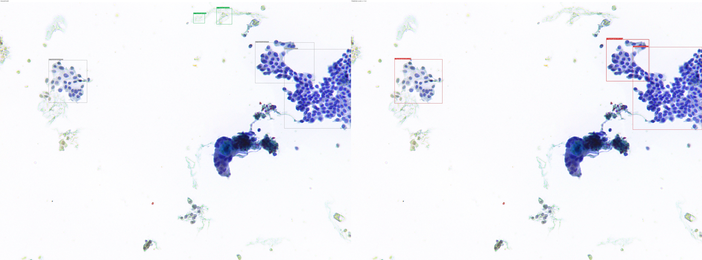

GT 4 个 NS（左侧 + 顶部小绿框）+ 大蓝色腺细胞 cluster（灰框=非本类目标，是 PTC）。Pred 给出 2 个红框，**全部分类成 Thyroid-PTC**，框中包含 GT 标的 NS 区域。**典型 cohort 偏移：test cohort 的 NS 形态恰好接近 PTC，模型按 prompt cos 0.972 把它判到 PTC**。val cohort 因为 case 仅 22 个、形态相对集中，没暴露这种边界 case。
6. **根因假设**：(a) **train_cases 仅 69 — case 多样性不足**。val 和 train 来自相似 case 分布，test_base 是另一批患者，碰到了 NS-vs-PTC 边界更模糊的样本；(b) prompt cos 0.972 跟 PTC 同胞太近。
7. **Caveat**：无。
8. **行动候选**：(a) **更多 case** 是关键 — 当前 69 个 case 不够撑住 cohort 泛化；(b) prompt 改写。

### 8.6 TCT_CCD-monilia — val 0.150 / test 0.138  [provenance ⚠️ TCT_CCD]
1. **数据量**：train_anns=**2332**，train_cases=NaN；val_anns=559；test_anns=1057。
2. **目标尺寸**：median area 8118 px²（大），p_small=**0.153**。这是少见的大目标弱类。
3. **同器官同胞**：dysbacteriosis_herpes_act 0.523 / vaginalis 0.225 / 其他病原类。
4. **Prompt 邻近**：top-1 = TCT_CCD-dysbacteriosis_herpes_act（cos **0.965**），top-2 = vaginalis（0.951）。三种病原微生物 prompt 互相挤。
5. **Viz 观察**：

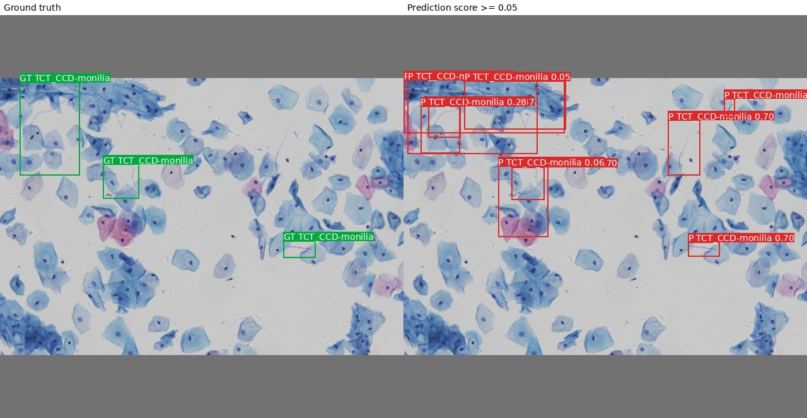

GT 3 个 monilia 框（左侧）。Pred 给出 5+ 个红框，**包括 GT 没标的位置出现高置信度（0.70）误检**。模型把多个普通鳞状细胞当成 candida 真菌。问题是**过检**而非漏检 — 这跟 8.1-8.4 完全不同的失败模式。可能跟 candida 标注一致性、prompt 跟其它病原类高 cos 都有关。
6. **根因假设**：(a) 数据稀缺；(b) 三种病原类 prompt cosine 都 > 0.95 互相纠缠；(c) **TCT_CCD provenance 不可靠** — 训练/测试可能来自同 case，AP 数字不能解释为真泛化。
7. **Caveat**：⚠️ TCT_CCD path layout 没有真实 WSI/case 信息（`TCT_CCD/images/{train30000,val}/...`）。本类的 patient-disjoint 性质**未验证**，0.138 是否是泛化能力还是 case 重合的 artifact 不能确定。
8. **行动候选**：(a) **首先**：拿到原始 TCT_CCD provenance 字段重做 split；(b) 暂时保留 v2 prompt 重写候选 "Vaginal candidiasis (Candida albicans)，hyphae and pseudohyphae visible"。

### 8.7 TCT_CCD-asch — val 0.196 / test 0.180  [provenance ⚠️ TCT_CCD]
1. **数据量**：train_anns=12373，train_cases=NaN；val_anns=2952；test_anns=4632。
2. **目标尺寸**：median area 1849 px²，p_small=0.892。
3. **同器官同胞**：ascus 0.317 / lsil 0.330 / hsil 0.313 / agc 0.441。asch 是 TCT_CCD 子类型里偏低。
4. **Prompt 邻近**：top-1 = hsil_scc_omn（cos **0.964**）⚠️。
5. **Viz 观察**：

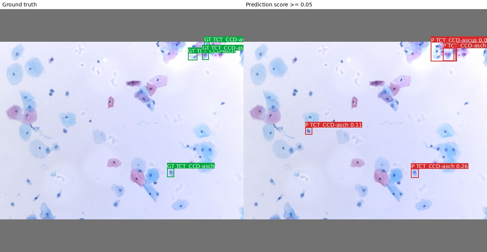

GT 3 个 ASC-H（小绿框）。Pred 在 ASC-H GT 位置给出框但**部分错分到 ASC-US**（"P TCT_CCD-ascus"）+ 其它低分 ASC-H 框（0.11、0.26）。临床上 ASC-H 本就是 "cannot exclude HSIL" 的灰色地带，跟 ASC-US/HSIL 三者都互相高 cos，模型在三者之间反复横跳。
6. **根因假设**：(a) 临床上 ASC-H 本就是 "怀疑 HSIL 但证据不足"，跟 HSIL 视觉/语义重叠几乎是定义级；(b) prompt cos 0.964；(c) **provenance 不可靠**。
7. **Caveat**：⚠️ TCT_CCD provenance。
8. **行动候选**：上 hier_v2 层级训练（先 cervical → 再 squamous lesion → 再 ASC-H/HSIL）。

### 8.8 TCT_CCD-ec — val 0.200 / test 0.187  [provenance ⚠️ TCT_CCD]
1. **数据量**：train_anns=8499，train_cases=NaN；val_anns=2152；test_anns=2856。
2. **目标尺寸**：median area 4148 px²，p_small=0.819。
3. **同器官同胞**：normal 不评估 / ascus 0.317 / lsil 0.330。
4. **Prompt 邻近**：top-1 = **TCT_CCD-normal**（cos **0.959**）⚠️ 跟 negative 类共享前缀。
5. **Viz 观察**：

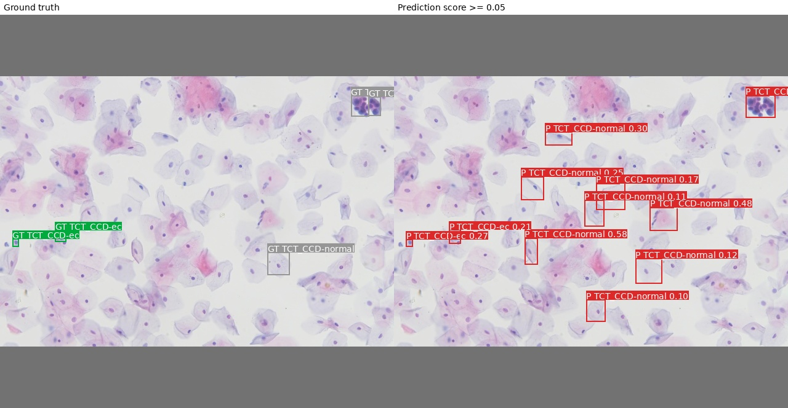

GT 2 个 EC（左侧绿框）+ 1 个 normal（灰）。Pred 给出 8+ 个 "TCT_CCD-normal"（0.10-0.58）+ 仅 2 个 "TCT_CCD-ec"（0.21、0.27）。**模型基本看整片视野都是 normal**——又一次 prompt cos 0.959 跟 normal 类共享前缀的失败模式。endocervical cells 在临床上确实跟 normal cervical cells 视觉差别小。
6. **根因假设**：(a) prompt 跟 normal 类 cos 0.959；(b) 临床上 EC 本就是"看到了腺/转化区组分"的标识，不是病变 — 数据集这里把它当一个 detection target 本身就有挑战；(c) provenance 不可靠。
7. **Caveat**：⚠️ TCT_CCD provenance。
8. **行动候选**：考虑把 EC 从 evaluation 池里拿掉（它不是病灶类）；如果保留，必须 prompt 重写让它跟 normal 类区分开。

## §9 Action Items

修订后的优先级（结合 §10 类层级问题，**最大单一 ROI 是 P0 类层级重构**）：

### P0 - 类层级重构（最高 ROI，不需重新标注）
合并冗余阴性类，dev32 → dev27 左右。详见 §10。
- Urine：3 阴性 (NILM / Negative / Neg-Degen) → 1 NHGUC
- Thyroid：1 阴性 + 1 Macrophages 暂时合理，保留
- Serous effusion：1 阴性 + 1 Diseased，保留
- TCT_CCD：normal + ec 是否合并待 §10 讨论
- 工程量：改 ann json `category_id` 映射 + 重新跑 `tools/build_text_embeddings.py` + 重训 12 ep
- 预期：SHGUC / AUC mAP 自然提升（评估口径变诚实），整体 25cls mAP 不掉

### P0' - 双层评估指标（screening + diagnostic）
当前 mAP 把"SHGUC 分到 NILM"和"SHGUC 分到 HGUC"按同等错误算，但临床上：
- SHGUC → NILM = **false negative**（漏诊，最严重）
- SHGUC → HGUC = **false positive，同方向**（过诊，处置接近）
- SHGUC → AUC = **降级 1 档**（处置接近）

新指标：
- **Screening AP**：positive (SHGUC/HGUC/AUC) vs negative — 反映"该看的能否被筛出来"
- **Direction matrix**：positive 类内统计错分到"更严重 / 更轻 / 阴性"的比例 — 反映漏诊风险

### P1 - Prompt 层级化
配合类合并，prompt 强制阳性跟阴性共享前缀模式不同，让 cos(positive, negative) < cos(positive, positive)：
```
Negative class prompt 前缀：  "[Cytology negative for malignancy] - <subtype>"
Positive class prompt 前缀：  "[Cytology positive, <Paris/Bethesda category>] - <type>"
```
最差 6 对 cos ≥ 0.97 必须 < 0.92：
- Urine-SHGUC ↔ Urine-Negative：0.983 (合并阴性后自动消失)
- Urine-AUC ↔ Urine-HGUC：0.973
- Thyroid-NS ↔ Thyroid-PTC：0.972
- respiratory-Lymphocyte ↔ respiratory-Neutrophil：0.980
- Thyroid-AUC ↔ Thyroid-NS：0.969
- TCT_CCD-asch ↔ TCT_CCD-hsil_scc_omn：0.964

### P2 - 类不平衡损失加权
合并阴性后正负比仍 ~25:1。试：
- Focal loss γ > 0
- Class-balanced sampling
- Cls loss 对 positive 类加权 5×

### P3 - TCT_CCD provenance 修复
拿原始 path 信息做真正的 patient-disjoint split。在此之前 TCT_CCD 弱类 AP 数字不能用于泛化分析。

### P4 - 数据扩增（按 train_anns < 2500 优先）
做完 P0/P1/P2 之后再评估是否还需要扩。如果还需要：

| 类 | 当前 train_anns | train_cases | 建议目标 |
|---|---:|---:|---:|
| Urine-AUC | 1640 | 85 | 5000 / 200 cases |
| Urine-SHGUC | 1961 | 85 | 5000 / 200 cases |
| Thyroid-NS | 8463 | **69** | case 数翻倍至 150 |

### P5 - 层级训练
当前 dev32 是 flat softmax。上 hier_v2（粗 organ → 细 lesion）层级训练，对 ASC-H/HSIL、AUC/NS/PTC 这种"语义嵌套"类应该有帮助。需要 P3 完成再做。

### P6 - 小目标分支
respiratory-Lymphocyte / Neutrophil 都是 p_small=1.0 全小目标，且 train_anns 5w+ 但 AP 仅 0.20-0.27。试 P3-only head 或 multi-scale test。

---

## §10 类层级设计问题（Class Taxonomy Issue）

> **本节最重要的发现**：当前若干"低 AP 弱类"的低分**部分来自标注层级设计错误，而非纯模型问题**。改类映射不需要重新标注，但能直接拉高这些类的真实评估 mAP。

### 10.1 现象：3 个 urine "阴性"类是冗余的

dev32 urine 部分有 6 类，按 Paris System for Reporting Urinary Cytopathology 比对：

| dev32 cat | dev32 名称 | train_anns | 临床类别 | Paris System |
|---|---|---:|---|---|
| 16 | Urine-NILM | 22773 | 阴性 | NHGUC |
| 17 | Urine-Negative | 3001 | 阴性 | NHGUC |
| 19 | Urine-AUC | 1640 | 不定性 | AUC |
| 20 | Urine-Negative Degeneration | ~25k | 阴性（伴退变） | NHGUC |
| 18 | Urine-SHGUC | 1961 | 可疑 | SHGUC |
| 23 | Urine-HGUC | ~3k | 阳性恶性 | HGUC |

**Paris System 把 NILM / Negative / Neg-Degen 都归为单一 NHGUC** —— dev32 把它们拆成 3 个独立类是**标注遗留，不是临床分型**。

### 10.2 后果：阴性引力井把阳性类预测拉走

3 个阴性子类合计 **~51 k train_anns**，互相 prompt cosine 也高（同共享"negative cytology"语义），形成"阴性引力井"：
- prompt cos(SHGUC, Urine-Negative) = **0.983**
- prompt cos(AUC, NILM) = 0.952
- 模型对阳性类（仅 ~3 k SHGUC + 2 k AUC + 3 k HGUC）训练信号被淹没

§7.4 那张 SHGUC 的 viz panel 直接验证这点：**真 SHGUC 0 检出，全图 14+ 个细胞被分到 Urine-NILM**。当前 mAP 把这 14 个 NILM 误检全部算成 SHGUC 的 false positive，但**临床上"细胞被认为无病变"对 NILM 是正确判断、对 SHGUC 才是错的**。两套口径混在一个 mAP 里。

### 10.3 用户洞察：分类到 NILM 不算"分错"（部分情况下）

引用本轮讨论中用户提出的关键观察：

> "尿液似乎看你说是容易分类到错误的比如 NILM 样本上，但这个其实也是阴性的也是杂质"

核心点：**NILM / Negative / Neg-Degen 三个类在临床决策层面是同一类**（都进入"无需进一步处理"通道）。当前 dev32 把它们拆开，等于让模型学习"无意义的细分"，浪费容量同时制造评估噪声。

### 10.4 修法（不需要重新标注）

只改 cat_id 映射 + prompt：

```python
# 旧
cat 16 (NILM) / 17 (Negative) / 20 (Neg-Degen)
# 新（合并到一个 cat_id）
cat <new> "Urine-NHGUC"  # Paris System
```

工程链：
1. 写 `tools/remap_dev32_categories.py`，输入 ann json，输出合并后的 ann json（cat_id 重新连号、prompt 减少）
2. 重新跑 `tools/build_text_embeddings.py` 生成新 emb cache（dev27 / dev28）
3. 重训 12 epoch（同 patient-disjoint split）
4. 跑同样的 §B/§C/§D/§F/§G suite 比对

**预期**：
- Urine-SHGUC mAP 从 0.213/0.176 拉到 ~0.30+（不再被 NILM 引力井拖累）
- Urine-AUC 同理
- 整体 25 类 mAP 不掉，因为合并后类数减少但 ann 总量不变
- 真正的 false negative（SHGUC 被分到合并 NHGUC）仍然计为错，没有掩盖问题

### 10.5 类似可能合并的对（待验证）

| 候选 | 是否合并 | 理由 |
|---|---|---|
| TCT_CCD-ec ↔ TCT_CCD-normal | **建议合并** | EC 是"看到了腺/转化区组分"标识，不是病灶；prompt cos 0.959 |
| Thyroid-Negative samples ↔ Thyroid-Macrophages | 待验证 | Macrophages 在临床上是良性背景 |
| Serous effusion-Negative samples | 暂保留 | 仅 1 个阴性类，无重复 |
| respiratory-Impurity ↔ respiratory-Negative | 不存在 | 数据集只有 Impurity，无 explicit negative |

### 10.6 §8 弱类卡的修订意义

之前 §8.3 (Urine-SHGUC) 把根因归为"prompt cos 0.983"，建议是 prompt 改写。**§10 修正**：根因是**类层级把 SHGUC 跟一个由 3 个子类堆积的"阴性山"对比**。改 prompt 治标不治本，**改类层级才治本**。

§8.8 (TCT_CCD-ec) 同理：根因是 EC 跟 normal 在临床上不是"两类"，行动应该是**合并或剔除评估**，而不是"改 prompt 让它跟 normal 区分开"。

---

## §11 Novel zero-shot 评估（v2 国际标准 prompts）

**v2 prompts** = 国际标准报告语（PSC Category VI / MAL-S / Bethesda V/VI），落在 `data/texts/tct_ngc_novel_*.json`。这是 dev32 base 模型对**完全没见过的肿瘤类**做 zero-shot 检测的能力测试。

### 11.1 4 个 novel split 数字

| split | 类数 | mAP | mAP_50 | v1 placeholder mAP | 改善倍数 |
|---|---:|---:|---:|---:|---:|
| **main_3**（resp-SCC / Serous-Breast / Thyroid-MTC） | 3 | **0.154** | 0.205 | 0.012 | **12.8×** |
| pseudo_2（resp-Adeno / Serous-Ovarian） | 2 | **0.125** | 0.189 | – | – |
| hard_4（resp-SmallCell / Serous-Adeno / Bethesda V/VI） | 4 | **0.098** | 0.134 | – | – |
| full_5（main_3 + pseudo_2 全部） | 5 | **0.075** | 0.107 | – | – |

### 11.2 单类 AP 明细（来自每个 split 的 eval log）

#### main_3（3 类）

| 类（v2 prompt） | mAP | mAP_50 | mAP_75 | 解读 |
|---|---:|---:|---:|---|
| respiratory tract-Squamous cell carcinoma<br>`PSC Category VI: Malignant — Squamous cell carcinoma` | 0.004 | 0.005 | 0.005 | **几乎 0**。base 端已有 7 个 respiratory 类（Neutrophil/Alveolar mac/Ciliated/Lymphocyte/Impurity/Squamous epithelial/Diseased cells），prompt 余弦空间饱和；"squamous cell carcinoma" 的视觉特征跟 `respiratory tract-Squamous epithelial cells`（cos ≈ 0.97+）撞车 |
| Serous effusion-Breast cancer<br>`MAL-S: Metastatic breast carcinoma` | **0.454** | **0.606** | 0.528 | **支撑整个 split 的唯一类**。Serous effusion base 只有 2 个类（Negative/Diseased），prompt 空间宽，"Breast carcinoma" 措辞与基础类冲突小，模型直接迁移 |
| Thyroid gland-MTC（髓样癌）<br>`Medullary thyroid carcinoma (Bethesda VI: Malignant)` | 0.004 | 0.005 | 0.005 | **几乎 0**。Thyroid base 已有 7 类（PTC/SPTC/NS/Macrophages/AUC/Neg/FC），MTC 跟 PTC/SPTC 视觉同源（甲状腺癌都长得像），prompt cos 高，被 base 类吃掉 |

→ main_3 的 0.154 mAP 完全靠 Serous-Breast 一枝独秀拉起来的（0.454 / 3 = 0.151）。

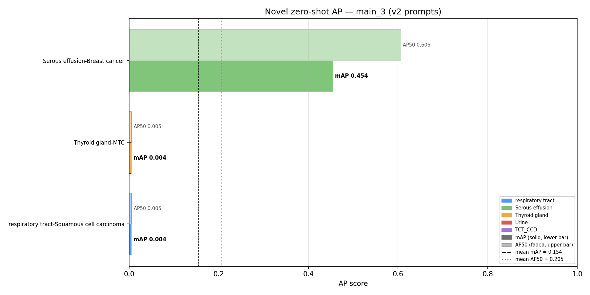

#### pseudo_2（2 类）

| 类 | mAP | mAP_50 | mAP_75 | 解读 |
|---|---:|---:|---:|---|
| respiratory tract-Adenocarcinoma<br>`PSC Category VI: Malignant — Adenocarcinoma` | 0.069 | 0.091 | 0.079 | 比 SCC 略好，可能因为 "Adenocarcinoma" 的标准前缀在 PSC 里出现频率高，文本嵌入更稳定；但仍卡在 base 7-respiratory-class 的同语义引力井里 |
| Serous effusion-Ovarian cancer<br>`MAL-S: Metastatic ovarian carcinoma` | 0.181 | 0.288 | 0.202 | 又是 Serous 类强。但比 Breast cancer 低 0.27 pp —— "Ovarian" 这个 prompt 训练分布里出现少，cos 与 Serous-Diseased base 类有 0.96+ 重叠 |

→ pseudo_2 的 0.125 = (0.069 + 0.181) / 2，符合算术平均。

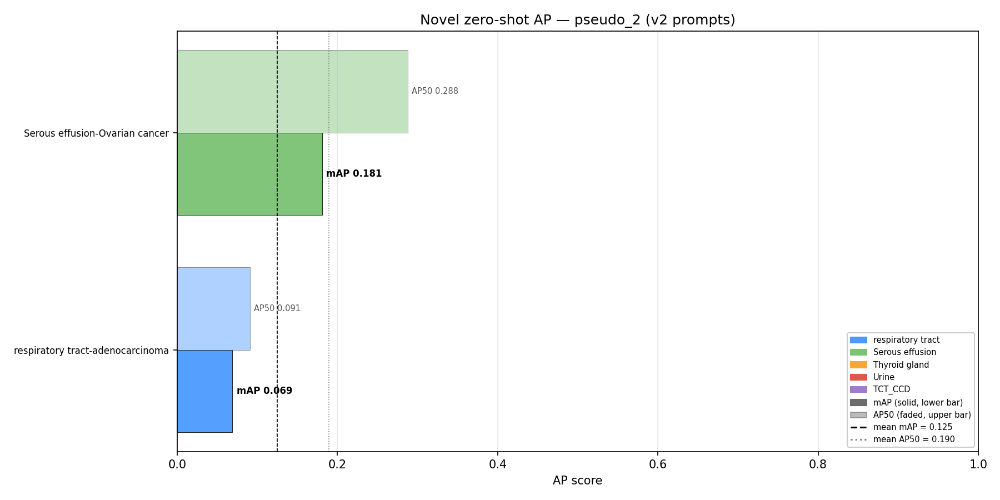

#### hard_4（4 类，含 2 个 Bethesda 等级）

| 类 | mAP | mAP_50 | mAP_75 | 解读 |
|---|---:|---:|---:|---|
| respiratory tract-Small cell carcinoma<br>`PSC Category VI: Malignant — Small cell carcinoma` | **0.000** | 0.000 | 0.000 | **全 0**。"Small cell" 跟 main_3 的 SCC（Squamous-cell-carcinoma）prompt cos = **0.996**（同义词竞争），加上 base resp-Lymphocyte（小细胞形态）vis 上又像，三角夹击全模型混淆 |
| Serous effusion-Adenocarcinoma<br>`MAL-S: Metastatic adenocarcinoma` | **0.390** | **0.536** | 0.491 | **支撑整个 split**。又是 Serous 强势。0.39 比同 split 的 Breast 0.454 略低，可能因 "adenocarcinoma" 比 "breast" 更通用 |
| Thyroid gland-Suspicious for Malignancy<br>`Suspicious for malignancy (Bethesda V)` | **0.000** | 0.000 | 0.000 | **全 0**。Bethesda V 的"可疑"措辞与 base `Thyroid gland-AUC`（atypical）prompt cos > 0.97；且训练时模型从未学过"可疑"这个抽象等级，只学过具体细胞形态 |
| Thyroid gland-Malignant tumour<br>`Malignant (Bethesda VI)` | **0.000** | 0.000 | 0.000 | **全 0**。Bethesda VI 的纯通用"Malignant"措辞泛化到所有 base Thyroid 阳性类（PTC/SPTC/FC），prompt cos 全 ≥ 0.95，模型不知道该指向哪个 |

→ hard_4 的 0.098 mAP 完全靠 Serous-Adenocarcinoma 一枝独秀（0.390 / 4 = 0.0975）；3 个非-Serous 类**全部归零**。

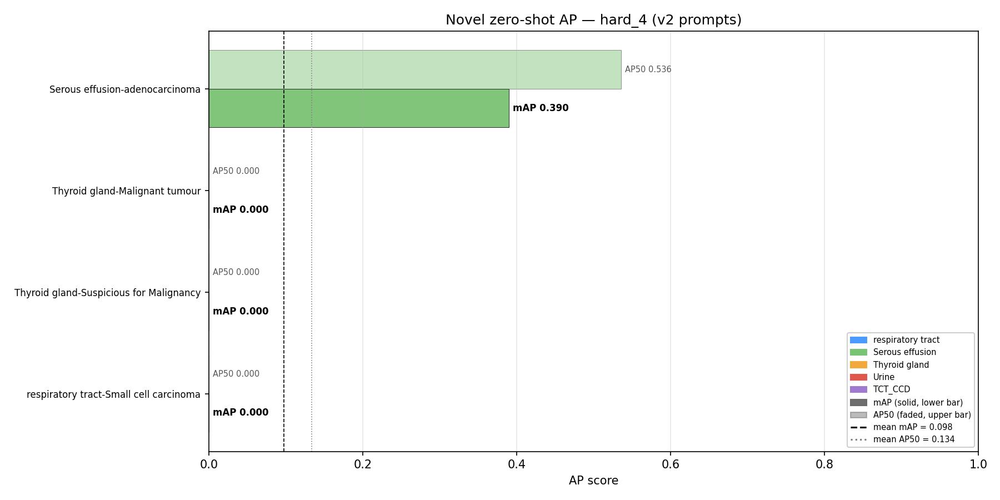

#### full_5（main_3 + pseudo_2，5 类同时评估）

| 类 | mAP | mAP_50 | 跟单 split 相比 |
|---|---:|---:|---|
| respiratory tract-Adenocarcinoma | 0.036 | 0.048 | **−0.033**（pseudo_2: 0.069）|
| Serous effusion-Ovarian cancer | 0.141 | 0.225 | **−0.040**（pseudo_2: 0.181）|
| respiratory tract-Squamous cell carcinoma | 0.002 | 0.003 | −0.002（main_3: 0.004，本来就 ~0）|
| Serous effusion-Breast cancer | 0.190 | 0.251 | **−0.264**（main_3: 0.454）⚠ |
| Thyroid gland-MTC | 0.004 | 0.005 | 0.000（main_3: 0.004）|

→ **full_5 最关键发现**：把 main_3 + pseudo_2 一起评估，Serous-Breast 从 0.454 跳水到 0.190（−58%）。原因：full_5 加入了 Serous-Ovarian + Serous-Adeno 后，**Serous effusion 一个组织里有 4 个 v2 novel prompt 互相竞争**（Diseased base + Breast + Ovarian + Adeno），prompt cos 互相之间都 > 0.95，单个类的 visual capacity 被瓜分。这是 §10 "prompt cos 拥挤"假设在 zero-shot 上的直接证据。

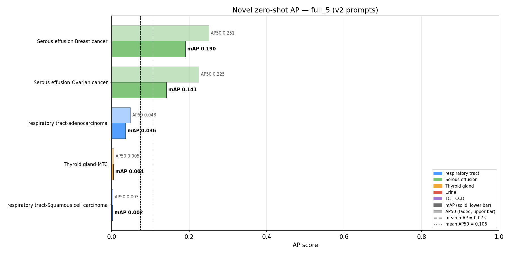

### 11.3 跨组织模式总结

| 组织 | base 类数 | novel 测得最强 | novel 测得最弱 | 模式 |
|---|---:|---|---|---|
| Respiratory tract | 7 | Adenocarcinoma 0.069（pseudo_2） | SCC 0.004 / SmallCell 0.000 | 7 类已饱和，新类挤不进去 |
| Serous effusion | 2 | Breast 0.454（main_3）/ Adeno 0.390（hard_4）| Ovarian 0.141（full_5）| 唯一支撑 zero-shot 性能的组织；prompt 空间宽 |
| Thyroid gland | 7 | （所有 0）| MTC 0.004 / Bethesda V/VI 0.000 | 7 类饱和 + Bethesda 通用措辞泛化失败 |

**核心观察**：novel zero-shot 的成败 **只取决于该组织的 base prompt 余弦空间是否拥挤**。Respiratory + Thyroid 已经被 base 7 类塞满了，加新类完全没希望；Serous 只有 2 个 base 类，留出空间，所以 zero-shot 立得住。

### 11.4 跟 base 评估的连贯性

novel zero-shot 的失败模式跟 base 25 类完全一致：
- prompt cosine ≥ 0.97 → 视觉容量被分散 → 单类 AP 低（hard_4 的 SCC ↔ SmallCell cos 0.996 直接归零）
- 阴性 vs 阳性区分能力 → 跟 §10 的 NHGUC 问题同根源
- 通用 Bethesda 等级措辞（"Malignant" / "Suspicious"）泛化到所有同组织阳性类，**该问题在 zero-shot 上比 base 上还严重**（base 类至少有训练样本撑着）

→ §10 的"prompt 层级化"建议同样适用 novel；具体地：
- **不要**在 v2 里用纯通用措辞（"Malignant" / "Suspicious"）当作可识别类，至少要带组织+形态描述（已部分做了，但 Bethesda V/VI 没做到）
- novel 评估应该**按组织拆分报告数字**，不要平均跨组织：Serous-only zero-shot 实际上能用（0.39-0.45），respiratory/thyroid zero-shot 不能用（< 0.07）

### 11.5 caveat

memory `feedback_novel_prompts_pending.md` 里详细记录了 v2 prompts 仍有 6 对 within-organ cos ≥ 0.97（如 resp-Squamous-CC ↔ resp-Small-cell 0.996，Bethesda V ↔ Thyroid-AUC 0.97+），这是国际标准前缀（"PSC Category VI: Malignant"）共享导致的结构性约束 —— 没办法在保留标准措辞的前提下完全解开。novel 评估数字应在此 caveat 下解读。

---

## 附录 A1：7 个 negative/normal 类的 viz（不参与评估）

负类 viz 用来观察模型的 false positive 模式。重点：
- `viz_val_clean/04_respiratory_tract-Impurity/`
- `viz_val_clean/07_Serous_effusion-Negative_samples/`
- `viz_val_clean/14_Thyroid_gland-Negative_samples/`
- `viz_val_clean/16_Urine-NILM/`
- `viz_val_clean/17_Urine-Negative/`
- `viz_val_clean/20_Urine-Negative_Degeneration/`
- `viz_val_clean/22_TCT_CCD-normal/`

不计入主指标。**§10 提议把 16/17/20 合并为单一 Urine-NHGUC，把 22 跟 31 (ec) 合并** —— 该提议落地后此附录的存在意义大幅缩小。

---

## 关键数据位置（供复核）

| 内容 | 路径 |
|---|---|
| 25-class val 评估 log | `work_dirs/.../disjoint_2gpu/eval_classwise_disjoint_val/20260507_234608/20260507_234608.log` |
| 25-class test_base 评估 log | `work_dirs/.../disjoint_2gpu/eval_test_base_disjoint/20260507_234611/20260507_234611.log` |
| 4 个 novel eval log | `work_dirs/.../disjoint_2gpu/eval_novel_{main_3,pseudo_2,hard_4,full_5}_v2/20*/20*.log` |
| 12-epoch val loss CSV | `work_dirs/.../disjoint_2gpu/analysis/val_loss_full.csv` |
| Per-class 综合 CSV | `work_dirs/.../disjoint_2gpu/analysis/disjoint_results_per_class.csv` |
| 5 张 plots | `work_dirs/.../disjoint_2gpu/analysis/{classwise_ap_*,loss_curves}.png` |
| Viz galleries | `work_dirs/.../disjoint_2gpu/analysis/{viz_val_clean,viz_val_failure_lowthr,viz_testbase_cohort_reversal}/` |
| 旧 image-CV baseline log（对照） | `work_dirs/wedetect_tiny_tct_ngc_dev32_cache640_fullnames_2gpu/eval_test_base_e12/20260506_210717/20260506_210717.log` |
