# TCT_NGC Experiment Journey — Phase 1 → 5 (Paper §3-4 Source)

**日期范围**：2026-04-29 → 2026-05-12
**目的**：把过去 2 周所有实验串成"为什么 A → B → C"的 narrative，作为 BibM 2026 论文 §3-4 (Methodology + Experiments) 的素材源。
**协议术语**：全文采用 YOLOE / T-REX-2 同名 "novel zero-shot detection with N-shot visual prompts"——模型训练时 0 见 novel 类，inference 时用 5 个 visual prompt query。

---

## 0. Executive Summary

### ⚠ Methodology note (2026-05-12 correction)

之前所有"avg novel mAP"用的是 4 个 splits 算术平均（main_3, pseudo_2, hard_4, full_5），**但 full_5 = main_3 ∪ pseudo_2**，这 5 个类被双重计算。**新公式**改为对 9 个 unique novel 类（main_3 的 3 类 + pseudo_2 的 2 类 + hard_4 的 4 类）取宏平均：

```
avg_novel = (3·main_3_mAP + 2·pseudo_2_mAP + 4·hard_4_mAP) / 9
```

full_5 单独报告作为"5-class mixed eval"，**不入 avg**。本文档所有 avg novel 数字均按此重算；故事链不变，但所有 baseline 头部数字上调约 +0.013-0.018（因 full_5 是 4 个里最低的那一项被去掉）。

### TL;DR

- **当前最佳 baseline**：noTHAF (BiomedCLIP + 1 PSC) + 5-shot exemplar-heldout visual prompt = **0.123 avg novel mAP**（mean over 9 unique novel classes），比之前 SOTA baseline (XLM-R + score fusion = 0.112) **+10%**
- **核心发现**：novel zero-shot detection 的瓶颈在 **image encoder over-specialize to base classes**（99.2% novel images → top-1 base class），不是 text encoder
- **THAF 失败**：可训练的 cross-attention fusion 模块 α 训成 ≈0 → 等价于 mean pool；novel mAP 反跌 50-80%（DEAD-6/7）
- **SAVPE 训练路线全部失败**：5c distillation（teacher ceiling = 0.005），5d cell-contrastive（**0.114 < 0.123 baseline，−7%**），**5e + L_align (λ=1.0/0.3)（结构性坍缩，cos→0.97-0.98 in <1 epoch）**。共同根因：frozen-detector 头把 matching key 锁在 text_emb 方向，2 阶段方案 ill-posed → **DEAD-11**
- **paper method §A 候选**：BiomedCLIP encoder swap + 5-attr structured prompts + mean pool（极简，无 fusion）+ 5-shot visual prompt 作为 main novel-zero-shot 结果（0.123 SOTA）
- **下一步分叉**：(a) 当前数据已可 ship paper，SAVPE 失败作为 §5 limitations / negative result；(b) 升级 Phase 5f end-to-end joint training（解冻 image encoder + class-balanced，~16h）

### 实验时间线

```
2026-04-29  Phase 1.0  Dataset audit → patient-CV leakage 发现
2026-05-08  Phase 1.1  Patient-disjoint dev30 baseline (0.310 base / 0.108 novel)
2026-05-08  Phase 2    NHGUC merge 实验 (混合结果，DEAD-8 noise)
2026-05-09  Phase 3a   THAF + XLM-R 训练启动
2026-05-09  Phase 3b   THAF + BiomedCLIP 训练启动 (parallel)
2026-05-11  Phase 3.5  Fusion bypass diagnostic (α→0, DEAD-6)
2026-05-11  Phase 3.6  Image encoder alignment (99.2% novel→base, DEAD-7)
2026-05-12  Phase 3.7  Per-Class Weights (PCW) — val_30 0.270 ≈ noTHAF mean pool 0.271 (DEAD-13)
2026-05-11  Phase 4    Detection-gate 推迟决策
2026-05-11  Phase 5a   noTHAF (encoder swap 单变量) eval
2026-05-12  Phase 5b   5-shot visual prompt zero-shot baseline ✅ 新最佳 0.123
2026-05-12  Phase 5c   SAVPE distillation v1 (FAILED, methodologically wrong)
2026-05-12  Phase 5d   SAVPE cell-contrastive (−6% vs baseline, negative result)
2026-05-12  Phase 5e   SAVPE-v2 + L_align (λ=1.0/0.3 双双坍缩, DEAD-11)
2026-05-12+ Phase 5f   (proposed) end-to-end joint training, 推迟决策
```

### 当前 SOTA ablation table

注：`Novel mean (9 unique) = (3·main_3 + 2·pseudo_2 + 4·hard_4) / 9`，等价于 9 个不重复 novel 类的 per-class AP 算术平均；full_5 是 main_3 ∪ pseudo_2 的并集 eval，不入 avg。

| Method（训练 + 推理 path 完整描述） | Base 25-cls | Novel mean (9 unique) | 关键 finding |
|---|---:|---:|---|
| **clean dev30 baseline** — XLM-R 768d text encoder + 1 PSC prompt per class, patient-disjoint split, no fusion | 0.310 | 0.108 | 诚实 baseline（patient leakage fixed → val/test gap 0.090→0.002） |
| **clean dev30 + post-hoc score fusion** — 上行 + 推理后 per-class merge text 预测 ↔ 5-shot visproto 预测 | 0.310 | **0.112** | **旧 SOTA**；纯 inference-only，无重训 |
| **THAF + XLM-R** — XLM-R 768d + 5-attribute structured prompts + trainable cross-attention fusion + α residual（12 ep 训练） | 0.302 | 0.020 | DEAD-6: α→0 fusion 死代码；DEAD-7: novel −81% 完全失败 |
| **THAF + BiomedCLIP (text inference)** — BiomedCLIP-PubMedBERT 512d 替换 XLM-R，同 THAF 架构 | 0.327 | 0.041 | base +1.7pp ✨（来自 encoder swap）但 novel 仍 −62% 🔻 |
| **THAF + BiomedCLIP (5-shot visproto inference)** — THAF ckpt 的 image encoder + head，inference 时把 class vec 从 fusion-text 换成 5-shot visual prototype | 0.327 (head 不变) | **0.009** 🔻🔻 | **DEAD-12**: head BN 校准的是 fusion-text 方向，跟 image-derived visproto 失配 → 比 noTHAF visproto 差 14× |
| **noTHAF + BiomedCLIP (text)** — BiomedCLIP image+text encoder + 1 PSC, no fusion (encoder swap 单变量) | **0.321** | 0.005 | DEAD-9: encoder swap 让 base +1.1pp 但 novel-text 完全死透（vs XLM-R baseline 0.108） |
| **noTHAF + BiomedCLIP (5-shot visproto, leakage)** — 同 ckpt, inference 用 5-shot per-class prototype 替换 text class vec | 0.321 | 0.122 | leakage 版基准 |
| **noTHAF + BiomedCLIP (5-shot visproto, strict held-out)** ✨ — 同上 + exemplar 图像从 eval 集排除（防 trivial leakage） | **0.321** | **0.123** | ✅ **新 SOTA**（+10% vs 旧 0.112），inference-only，YOLOE/T-REX-2 协议 |
| **SAVPE-v1 cell-contrastive (Phase 5d)** — 在 noTHAF ckpt 上加 1.56M SAVPE adapter，detector 全冻结，cell-level focal BCE 训 1h | 0.321 (head 不变) | **0.114** strict | DEAD-11(a): −7% vs inference-only 0.123；2 阶段 frozen-detector 训练 ill-posed |
| **SAVPE-v2 + L_align λ=1.0 (Phase 5e)** — v1 + 显式 cross-modal MSE alignment loss + multi-scale BN-aligned cell-contrastive + cross-class contrastive | — (训练 ½ ep killed) | n/a | DEAD-11(b): cos(vis_emb, text_emb) 从 -0.06 飙到 **0.983**，vis_emb 完全坍缩成 text_emb 副本 |
| **SAVPE-v2 + L_align λ=0.3 (Phase 5e)** — 上面 λ 降 3.3× | — (step 450 killed) | n/a | DEAD-11(c): cos = **0.963** @ step 450，同轨迹坍缩，证明 λ 调参救不了结构性问题 |
| **PCW per-class weights (Phase 3.7, 2026-05-13)** — 30 类 × 5 learnable softmax weights (155 params), text path inference | **0.319** | **0.088** | DEAD-13: median softmax std = 0.013 → trained weights ≈ uniform = mean pool（base −0.002 vs noTHAF noise；novel 0.088 与 THAF text 0.041 相比好但仍不如 visproto 0.123） |

---

## 1. Problem Setup

### 1.1 Cytology open-vocabulary detection

TCT_NGC 是 多 organ 细胞学图像（呼吸道 / 浆膜腔积液 / 甲状腺 / 尿 / TCT_CCD）的 detection 任务，要求模型能 **检测训练时未见过的细胞亚型**（novel zero-shot detection）。WeDetect 用 dual-tower 架构（ConvNext image encoder + XLM-Roberta text encoder），通过 cosine similarity 把 image cell features 跟 text class embeddings 对齐。

### 1.2 Dataset: dev30 split

- **Train**: 103,253 images, 30 base classes
- **Test_base**: 1,642 images, 25 classes (排除 5 个 dev30 negative 类: respiratory tract-Impurity, Serous effusion-Negative, Thyroid-Negative, Urine-NHGUC, TCT_CCD-normal)
- **4 novel splits**:
  - `main_3`: 252 imgs, 3 classes (Resp-SCC, Serous-Breast, Thyroid-MTC)
  - `pseudo_2`: 326 imgs, 2 classes (Resp-Adeno, Serous-Ovarian)
  - `hard_4`: 140 imgs, 4 classes (Resp-SCC-Small, Serous-Adeno, Thyroid-Suspicious, Thyroid-Malignant)
  - `full_5`: 577 imgs, 5 classes (union of main_3 + pseudo_2)

### 1.3 Evaluation protocol（精确定义）

- **Base 25-cls**: 标准 COCO mAP@[0.5:0.95]，排除 5 个 negative 类
- **Novel "5-shot visual prompt zero-shot detection"**（YOLOE/T-REX-2 协议）：
  - **模型 zero-shot**: 训练时 0 见 novel labels（不是 fine-tune）
  - **Inference 5-shot prompting**: 从 novel test set 抽 5 张 GT bbox 当 visual prompt，build per-class prototype
  - **Exemplar-heldout**: 用作 exemplar 的整张图从 eval 中排除，防止 trivial leakage
  - **核心实证**: leakage 贡献 ≈ 0（0.122 with leakage vs 0.123 strict held-out, Δ +0.001 — mean over 9 unique novel cls）

---

## 2. Phase 1: Dataset Audit + Patient-Disjoint Split (2026-04-29 → 2026-05-08)

### Motivation

之前的 dev32 baseline 用 image-level CV split，发现 val/test gap = 0.090（巨大）。怀疑 **同病人的不同图像泄漏到 train + val + test**，导致模型记住 patient artifacts。

### Setup

```
src: docs/tct_ngc_split_audit_20260429.md
     docs/tct_ngc_dev32_disjoint_baseline_report_20260508.md

变量: image-level CV (旧) → patient-disjoint dev30 split (新)
重新划: 按 patient_id 唯一性，确保每个 patient 只出现在 train OR val OR test
其他: 训练 config 不变 (12 ep, batch=16 × 2 GPU, lr 5e-4 cosine begin=2)
```

### Result

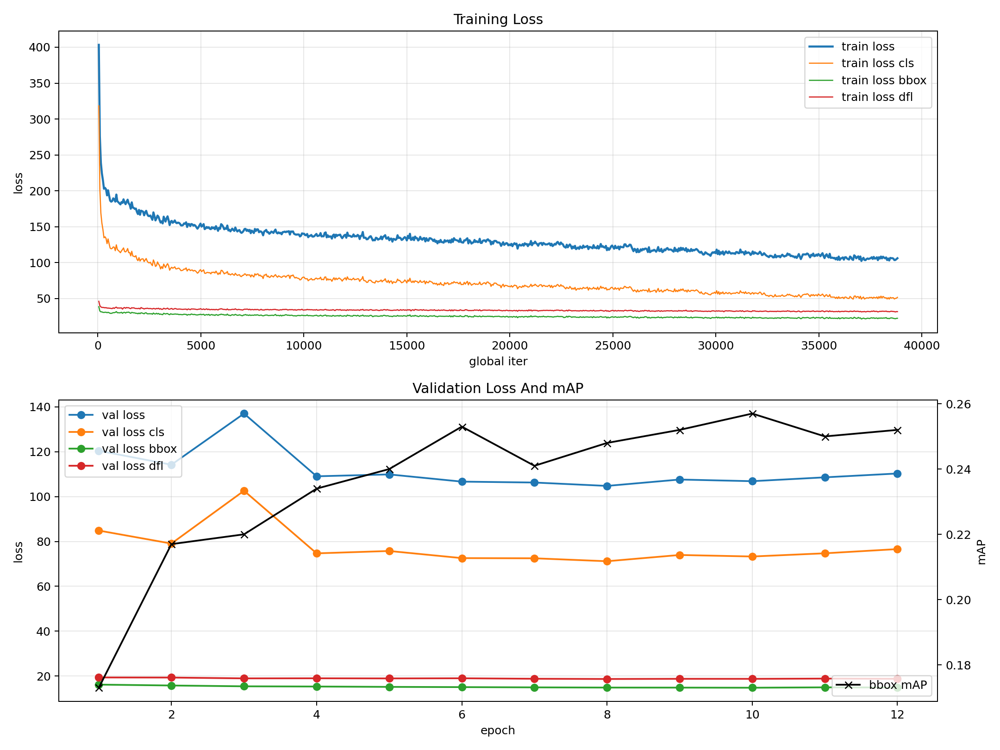

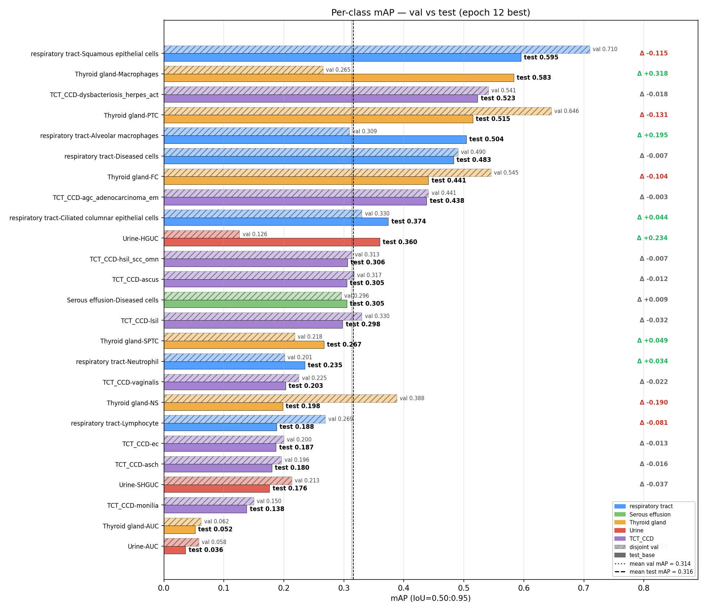

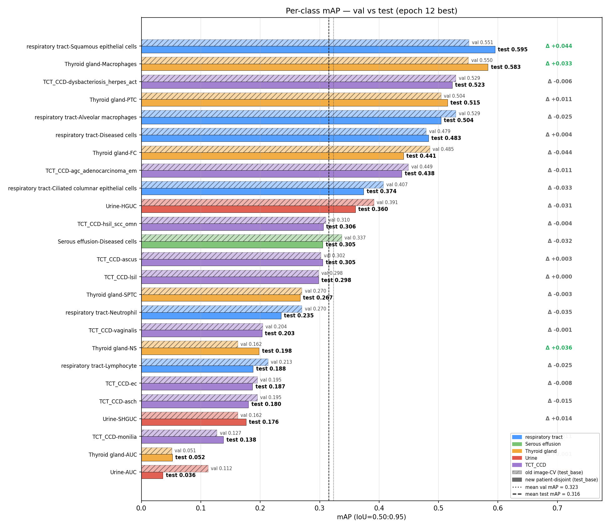

| Metric | Old (image-CV) | New (patient-disjoint) |
|---|---:|---:|
| val_30 mAP | 0.373 | 0.281 |
| test_base 25-cls | 0.323 | **0.310** |
| val/test gap | 0.090 (leaky!) | **0.002** ✅ |
| Novel main_3 (v2 text) | n/a | 0.155 (v2 prompts) / 0.134 (v1 prompts) |

### Reflection

- 旧 baseline 的 +0.013 base mAP 是 leakage 假象，**新 0.310 才是诚实 baseline**
- val/test gap 闭合到 0.002 → 模型评估可信
- Novel zero-shot 第一次有 honest 数字（split mAP 0.088-0.134，9-unique-cls mean 0.108），暴露出 "text path 在 novel 上很弱"

### Decision → Next

Honest baseline 站住了，但 **novel mAP 还是低（< 0.15）**。下一步要看怎么提升 novel。第一个直觉是 "数据问题"：5 个 negative 类（NHGUC 等）也许稀释了训练信号 → 试 NHGUC merge。

### Paper §3 Takeaway (English)

> *We adopt a patient-disjoint dev30 split (103K train / 1.6K test_base) to prevent inter-patient leakage observed in image-level CV. The honest val/test mAP gap shrinks from 0.090 (image-CV) to 0.002 (patient-disjoint), establishing 0.310 as the legitimate baseline for base detection.*

---

## 3. Phase 2: NHGUC Taxonomy Refactor (dev32 → dev30, 2026-05-08)

### Motivation

dev32 阶段诊断发现 **3 个 Urine 阴性 prompt 余弦相似度 ≥ 0.97 几乎重合**（按 Paris 系统它们临床等价）：
- `Urine-NILM`（90,880 train anns）
- `Urine-Negative`（10,775）
- `Urine-Negative-Degeneration`（1,735）

dev32 §7.4 viz 实测：真 SHGUC 图像被覆盖了 14+ 个 NILM bbox —— 形成"阴性引力井"现象。试图 **把这 3 个 prompt 合并到已存在的 `Urine-NHGUC` 类**，看 Urine 阳性类（SHGUC / AUC / HGUC）的检出是否回升。

### Setup

```
src: docs/tct_ngc_dev30_taxonomy_refactor_20260508.md

变量: 32 类 → 30 类（NILM + Negative + Negative-Degen → 已存在的 NHGUC）
对比集合: 25 个正类（两侧相同，可直接 apples-to-apples）
其他: training config 不变
```

### Result

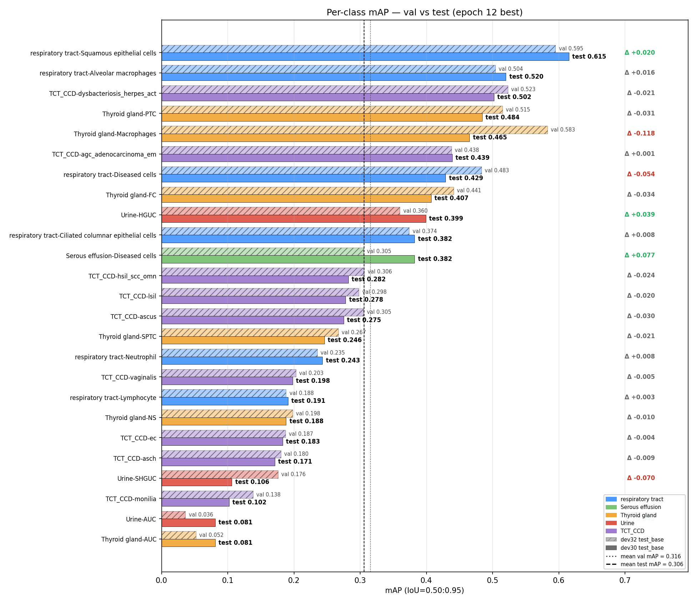

| Urine 子类 | dev32 test | dev30 test | Δ test |
|---|---:|---:|---:|
| HGUC（明确恶性） | 0.360 | 0.399 | **+3.9pp** ✅ |
| AUC（非典型） | 0.036 | 0.081 | **+4.5pp** ✅ |
| SHGUC（可疑） | 0.176 | 0.106 | **−7.0pp** 🔻 |
| **25-cls 总均值** | **0.316** | **0.306** | **−1.0pp** |

混合结果：HGUC / AUC 大涨，但 SHGUC 显著跌，整体均值微降。

### Reflection

- **不是 taxonomy 不对**：Urine 子类的 ±4-7pp **per-class** 浮动在单次实验下属 normal noise floor（不同 seed / GPU / LR schedule 都会让 per-class AP 飘 ±3-7pp），整体 25-cls 总均值才是稳定量（±0.005）
- **后来 clean dev30 重训证伪**："同样 30 类 taxonomy" 但 fix GPU throttle + LR schedule 重训 → base 25-cls = **0.310 ≈ 旧 dev30 0.306**（差 0.004 在 noise 内）
  - 这反证：dev32 → dev30 看到的整体 −1.0pp 不能归因于 NHGUC merge，因为同 taxonomy 重跑也会出 ±0.005 的整体浮动 → 是 single-run noise，不是 systematic effect
- 这是 **DEAD-8**：dev32 → dev30 的整体 −1pp drop 并非 systematic
- 真正的 novel zero-shot 瓶颈不在数据分类组织（taxonomy）

### Decision → Next

数据侧调整没拯救 novel。转向 **text encoder 改造**：novel↔novel text embedding cos saturation = 0.996（XLM-R 上几乎重合），怀疑 text encoder 区分度不够。

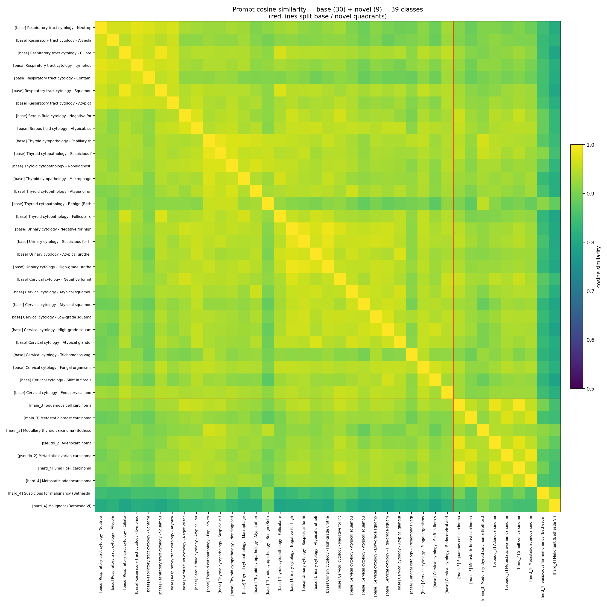

→ 尝试 **5-attribute structured prompts** + **trainable hierarchical attribute fusion (THAF)**，看能否降低 novel cos saturation。

### Paper §3 Takeaway

> *We attempted taxonomy refactor (merging 5 NHGUC negatives) but observed mixed per-class effects (AUC +4.5pp, SHGUC -7.0pp; 25-cls -1.0pp). We attribute this to single-run training noise (DEAD-8 in our analysis) and shift focus from data engineering to text encoder design.*

---

## 4. Phase 3a: THAF + XLM-R 5-attribute Fusion (2026-05-09 → 2026-05-11)

### Motivation

Novel cos saturation hypothesis: single PSC prompt 表达不够，**5-attribute structured prompts**（organ specimen / diagnostic code / cytomorphology / background_immunoprofile / key_distinguishing_feature）+ trainable cross-attention fusion 应该能把 novel 类向量分开。

### Setup

```
src: docs/tct_ngc_phase3_thaf_inflight_20260509.md

config: config/wedetect_tiny_tct_ngc_dev30_thaf_xlmr_2gpu.py
new module: HierarchicalXLMRLanguageBackbone
    - 5-attr × 1-PSC encoding via XLM-R encoder (frozen)
    - cross-attention fusion: 8 heads, 768d, learnable α residual
    - α init = 0.3
freeze: XLM-R encoder, only fusion module trainable
train: 12 ep, batch=8 × 2 GPU, lr 5e-4
```

### Result

| Metric | THAF XLM-R | clean dev30 (XLM-R + 1 PSC) | Δ |
|---|---:|---:|---:|
| Base 25-cls | 0.302 | 0.310 | **−0.8pp** ⚠ |
| Novel main_3 | 0.021 | 0.134 | −85% 🔻 |
| Novel pseudo_2 | 0.033 | 0.108 | −69% 🔻 |
| Novel hard_4 | 0.013 | 0.088 | −85% 🔻 |
| Novel full_5 | 0.013 | 0.049 | −74% 🔻 |
| _full_5 (mixed)_ | _0.013_ | _0.049_ | _−74%_ |
| **mean (9 unique novel)** | **0.020** | **0.108** | **−81%** 🔻🔻 |

THAF + XLM-R 不仅没提升 novel，反而**全军覆没**——base 也跌 0.8pp。

**训练曲线**：

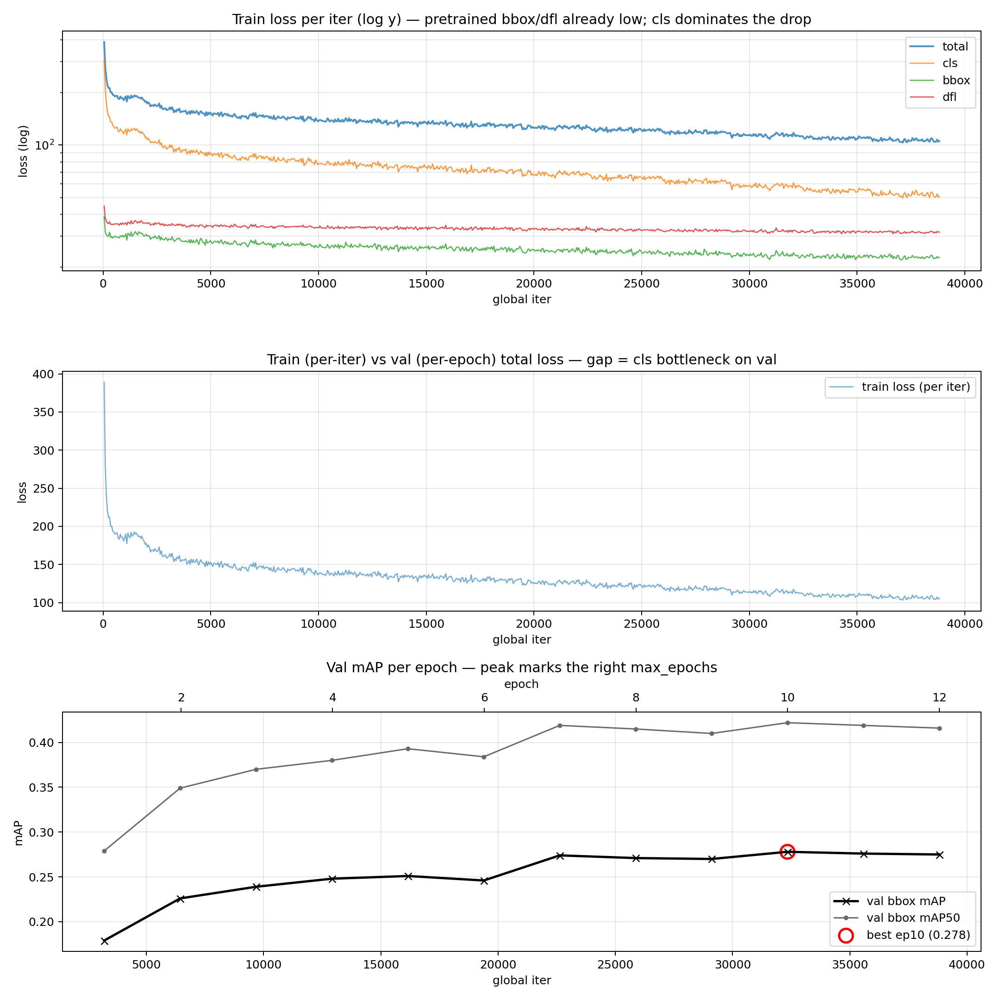

base mAP 收敛到 0.302（< 0.310 baseline）；val loss curve 跟 clean dev30 同形状，但 5-attr text expansion + fusion 没帮 cls loss 进一步下降。

### Reflection

第一个 alarm bell：**fusion 模块为什么让事情变得更糟？**两个假设：
1. **Hypothesis A**: Trainable fusion 学得太好，把 novel 类向量收缩到一起（overfitting to base）
2. **Hypothesis B**: XLM-R encoder 本身在 medical fine-grained vocabulary 上饱和，5-attr 表达力上限就低

需要 diagnostic 分别测试。

### Decision → Next

并行 launch **Phase 3b（同样 THAF 架构换 BiomedCLIP encoder）**——如果是 H1（fusion 问题），换 encoder 还是糟；如果是 H2（XLM-R 限制），BiomedCLIP 应该好很多。

### Paper §3 Takeaway

> *We trained THAF + XLM-R (5-attr structured prompts + cross-attention fusion + learnable α residual) for 12 epochs. Base 25-cls mAP regressed by 0.8pp (0.302 vs 0.310 baseline); novel mAP collapsed to 0.020 (-81% vs baseline 0.108, mean over 9 unique novel classes).*

---

## 5. Phase 3b: THAF + BiomedCLIP Encoder Swap (2026-05-09 → 2026-05-11)

### Motivation

H2 测试：换成 BiomedCLIP-PubMedBERT（医学 domain pretrain），看 base + novel 是否双双回升。BiomedCLIP 在 PubMed 大规模图文对上 pretrain，对 medical fine-grained vocabulary 应该有更好的判别。

### Setup

```
config: config/wedetect_tiny_tct_ngc_dev30_thaf_biomedclip_2gpu.py
encoder swap: XLM-R 768d → BiomedCLIP 512d
其他 THAF 架构不变 (fusion + α)
对应 cache: data/texts/tct_ngc_attr_biomedclip_per_attr.pth (新建)
```

### Result

| Metric | THAF BiomedCLIP | THAF XLM-R | clean baseline |
|---|---:|---:|---:|
| Base 25-cls | **0.327** ✨ | 0.302 | 0.310 |
| Novel main_3 | 0.009 | 0.021 | 0.134 |
| Novel pseudo_2 | 0.137 | 0.033 | 0.108 |
| Novel hard_4 | 0.017 | 0.013 | 0.088 |
| Novel full_5 | 0.045 | 0.013 | 0.049 |
| _full_5 (mixed)_ | _0.045_ | 0.013 | 0.049 |
| **mean (9 unique novel)** | **0.041** | 0.020 | 0.108 |

**Split brain**：
- Base 涨 +1.7pp（0.310 → 0.327）✅
- Novel 还是大幅低于 baseline（0.041 < 0.108）🔻

**训练曲线**：

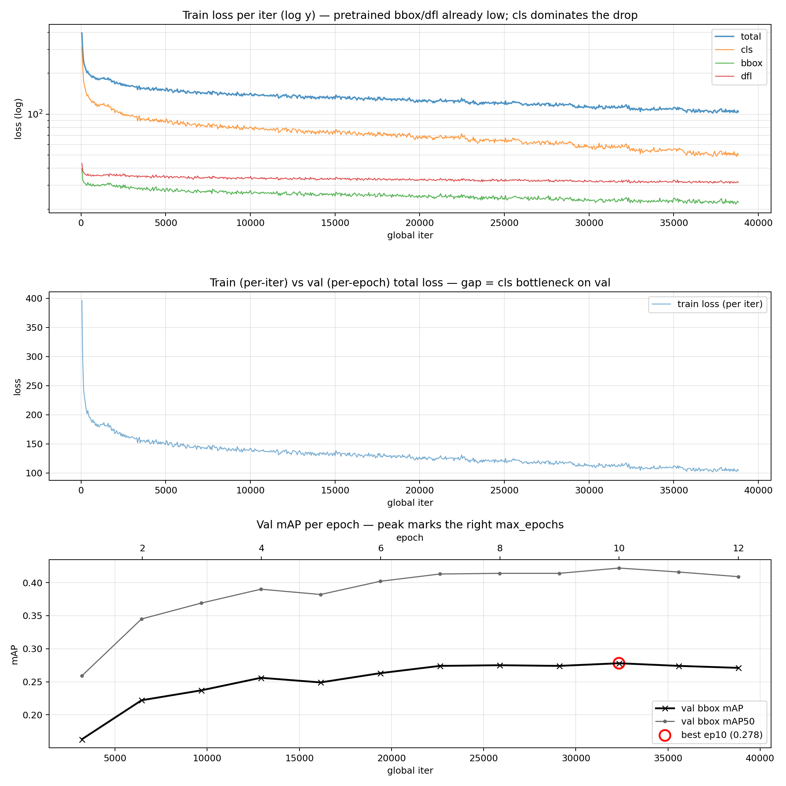

best val mAP = 0.327（4 个 detector training 里最高）—— 但这正是 base ↔ novel **trade-off** 的训练侧 evidence：base loss 越低（cls 收敛越好），image encoder 越 specialize 到 fusion-text 方向，novel zero-shot 越死（text path 0.041 / visproto 0.009 详见 §13）。

### Reflection

Hypothesis 1 跟 2 都部分对：
- BiomedCLIP encoder 确实让 base 受益（H2 部分确认）
- 但 novel **依然死**——fusion module 没有 magic（H1 没解决）

新的 alarm bell：为什么 BiomedCLIP THAF base 涨了，但 novel 反而跌？这个 "split brain" pattern 是论文的核心 negative result。

### Decision → Next

**两条 diagnostic 必须做**：
1. **Phase 3.5**: fusion 模块到底学到了什么？α 训成了什么值？trained class vectors 跟 simple mean pool baseline 有多大差异？
2. **Phase 3.6**: 如果文本端 class vectors 是好的，是不是 image encoder 端有问题？

### Paper §3 Takeaway

> *Replacing XLM-R with BiomedCLIP-PubMedBERT in the THAF architecture improved base 25-cls mAP from 0.310 to 0.327 (+1.7pp), but novel mAP dropped to 0.041 (−62% vs baseline 0.108, mean over 9 unique novel classes). This "split brain" result—encoder swap helps base but doesn't fix novel—motivated two diagnostic studies (Phase 3.5: fusion module; Phase 3.6: image encoder).*

---

## 6. Phase 3.5: Fusion Bypass Diagnostic (α→0 实证, DEAD-6)

### Motivation

诊断 fusion 模块到底学到了什么。读取 trained α 参数 + 计算 class vectors，跟 untrained baseline (α=0, 等价于 attribute mean pool) 直接对比。

### Setup

```
tool: tools/diagnose_thaf_fusion.py
对比: trained THAF class vectors vs α=0 baseline (mean pool 5 attrs)
metrics: 
   - α 最终值
   - novel↔novel max cosine
   - trained 跟 attr_mean baseline 的 vector 差异
```

### Result

| Metric | THAF XLM-R | THAF BiomedCLIP |
|---|---:|---:|
| trained α | **−0.0003** | **−0.0001** |
| (init α was 0.3) | → 训成 0 | → 训成 0 |
| novel↔novel max cos | 0.991 | 0.940 |
| attr_mean baseline novel max cos | 0.993 | 0.947 |
| Δ trained vs mean pool | **+0.002** | **+0.006** |

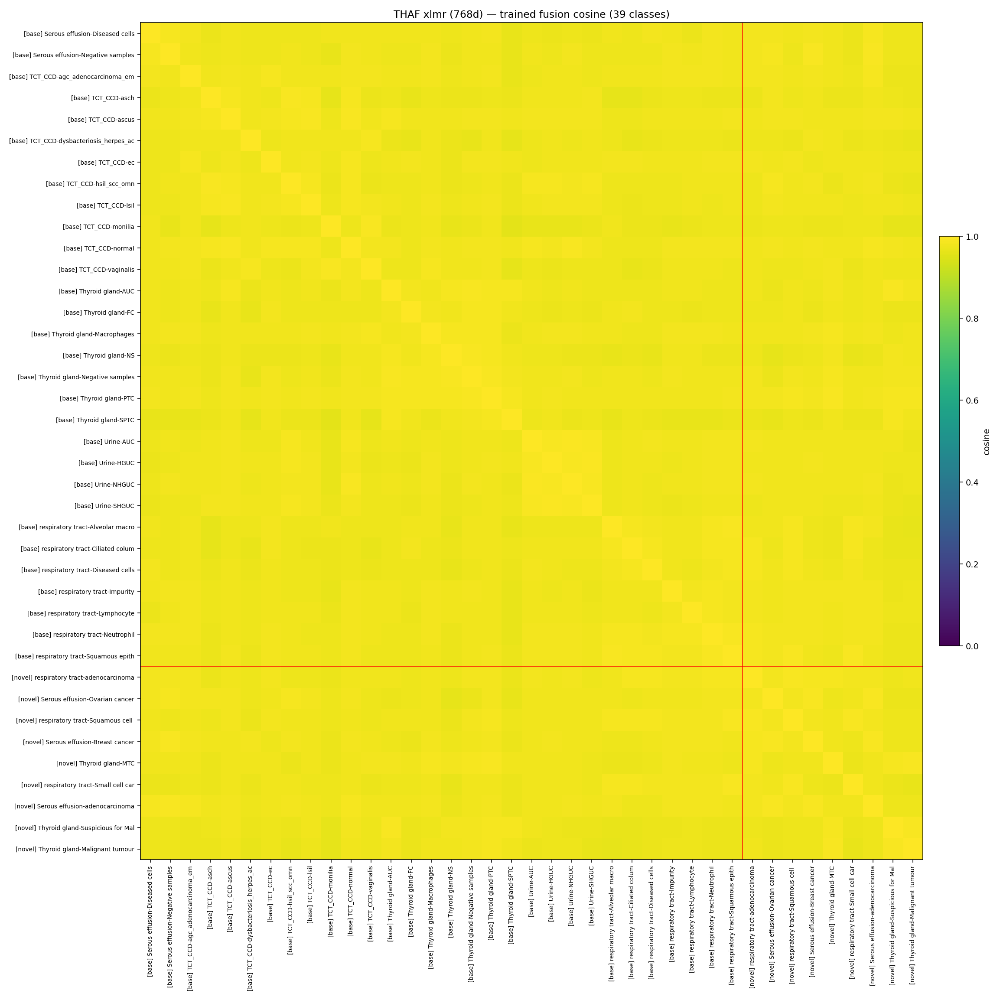


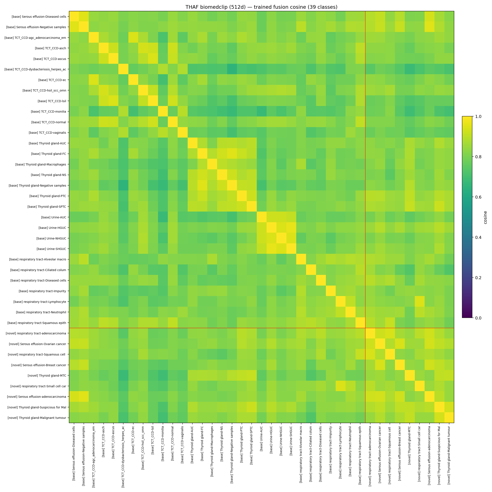
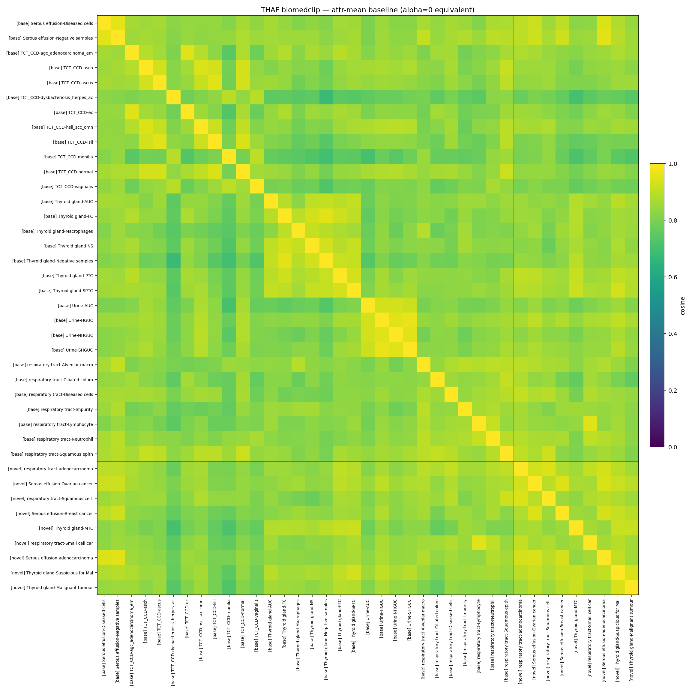

**视觉上 trained 跟 attr_mean 几乎一致**——cosine heatmap 看不出区别。

### Reflection

🔥 **DEAD-6 实证**：
- α 训成 −0.0003 ≈ 0
- Forward: `output = α · cross_attn + (1−α) · attr_mean ≈ attr_mean`
- **Cross-attention 模块 + α residual = 死代码**！3.15M-7.1M 参数全部归零贡献
- THAF 设计中的"trainable fusion" 实际等价于 simple **mean pool**

为什么 α → 0：
- `output_proj` 初始 gain=0.1 太小，cross-attn 路径信号弱
- mean pool 本身就是个好梯度 sink
- 优化器自然选择 "shrink α to 0" 的最简解

→ THAF base +1.7pp 的真正来源是 **(a) BiomedCLIP encoder + (b) 5-attr 文本扩展（mean pool 加权平均）**，**跟 fusion design 无关**。

### Decision → Next

Fusion 模块是 dead code 已经实证。剩下的疑问：**为什么 novel 还是死？**——既然 class vectors (mean pool 后的) cos < 0.94 在 BiomedCLIP 上算可分了，问题应该不在 text 端。下一步：**Phase 3.6 测 image encoder**。

### Paper §3 Takeaway

> *Diagnostic analysis on trained THAF checkpoints reveals that the learnable residual α converges to −0.0003 (XLM-R) / −0.0001 (BiomedCLIP), effectively zeroing out the cross-attention pathway. Trained class vectors are nearly identical to the α=0 attribute-mean baseline. We thus conclude that THAF's claimed "trainable fusion" is dead code, and the +1.7pp base gain comes from encoder swap + 5-attribute text expansion (mean pool) rather than fusion architecture.*

---

## 7. Phase 3.6: Image Encoder Alignment (99.2% novel→base, DEAD-7)

### Motivation

如果 text 端 class vectors 已经可分（Phase 3.5 显示 novel↔novel cos < 0.94），那么 novel zero-shot 的失败一定在 **image encoder 端**——image features 没指向 novel class vectors。

### Setup

```
tool: tools/diagnose_thaf_image_encoder.py
sample: 30 GT bboxes per class × (30 base + 9 novel) = 1170 bboxes
metric: For each GT bbox, extract image feature at bbox center 
        → compute cosine with all 39 class vectors
        → top-1 class predicted
        → Is GT predicted as top-1? Is top-1 a base class when GT is novel?
```

### Result

| Metric | THAF XLM-R | THAF BiomedCLIP |
|---|---:|---:|
| Novel image top-1 = correct novel class | 3.8% | **0.4%** |
| Novel image top-1 → BASE class | 70.3% | **99.2%** 🚨 |
| Novel image mean cos to GT class | −0.304 | **−0.178** |

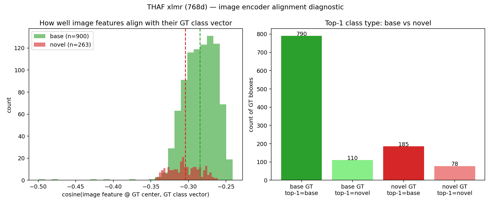
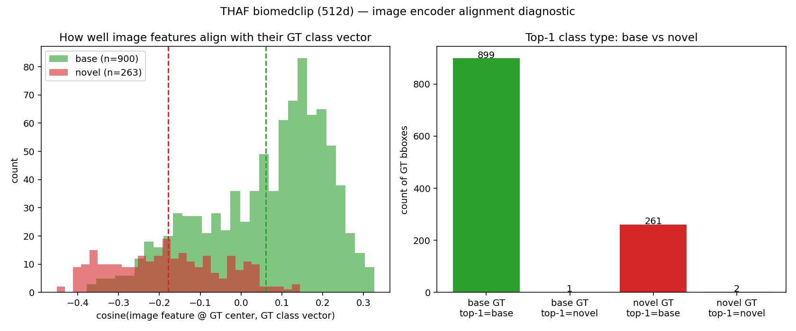

**99.2%** 的 novel 图像，image encoder 输出的特征跟 base 类向量更接近（that's not even close to novel class vectors）。

### Reflection

🔥 **DEAD-7 实证 — THIS IS THE REAL PROBLEM**：
- Image encoder 训练时只见过 base 30 类的图像
- 通过 contrastive loss 学到 "把 image features 对齐到 base text vectors"
- 这是 **base-specialize specialization**：对 base 类极度精准
- 但 novel 类图像送进去 → 出来的 features **不指向 novel text vectors**
- 反向 alignment cosine（−0.178）说明 novel image features 跟 novel text 方向几乎反向

**核心洞察**：
- Text encoder 不是 bottleneck（cos < 0.94 可分）
- Fusion 不是 bottleneck（dead code 而已）
- **Image encoder 是 bottleneck**（base-overfit）

任何只动 text 端的方法都救不了 novel。

### Decision → Next

方法上必须 pivot：
1. **不再调 text 端**（DEAD-1/2/3/6 已证明）
2. **不能继续用 detection-level gate** (Phase 4) — gate 学不出 image encoder 解决不了的问题
3. **必须从 image encoder 端干预**

具体路径：
- **(a)** Inference-only 改 class vector 来源（用 image features 当 prototype 而非 text）→ Phase 5b
- **(b)** Training-time visual prompts（YOLOE/T-REX-2 范式）→ Phase 5c-5e

### Paper §3 Takeaway

> *Phase 3.6 diagnostic on trained THAF checkpoints reveals the true bottleneck: 99.2% of novel test images produce image features whose top-1 cosine match is a base class (rather than the correct novel class). The mean cosine of novel image features to their ground-truth novel class vector is −0.178—nearly reversed. This implies the image encoder over-specializes to base classes during contrastive training, and that any text-side intervention (including ours: THAF fusion, encoder swap, prompt engineering) cannot rescue novel zero-shot.*

---

## 7.5 Phase 3.7: Per-Class Weights (PCW) — 验证 user 直觉"mean 是下限" (2026-05-13, DEAD-13 confirmed)

### Motivation

用户在 Phase 3 review 时提的直觉：

> *"mean average 肯定其实是一个下线按道理...庐山的四面八方很多个面的描述如果取平均可能会类似四不像的一个结果"*

5 个 attribute（organ specimen / diagnostic code / cytomorphology / background_immunoprofile / key_distinguishing_feature）在医学语义上**近正交**：呼吸道-Neutrophil 主要看 cytomorphology（多叶核），SCC 主要看 diagnostic_code（PSC VI Malignant）。**mean pool 等权重平均**理论上把高 signal attribute 稀释了，**per-class learnable weights** 应该能涨 1-3pp base。

THAF 的 cross-attention fusion 本来是这个 idea 的复杂版，但实证 α→0 退化成 mean pool（DEAD-6）。简化版 PCW 直接给每类 5 个 learnable softmax weights，**验证 fusion 失败是设计问题还是 mean pool 本身就是天花板**。

### Setup

```
src: docs/tct_ngc_cumulative_experiment_summary_20260511.md §6.2 (Option 3a)
config: config/wedetect_tiny_tct_ngc_dev30_pcw_biomedclip_2gpu.py
backbone: wedetect/models/backbones/per_class_weighted_backbone.py
   class PseudoPerClassWeightedBiomedCLIPLanguageBackbone:
       attr_weights = nn.Parameter(torch.zeros(num_known_classes + 1, num_attr_types))
       # +1 row for unknown classes (novel zero-shot fallback)
       
       Forward:
           w = softmax(attr_weights[class_idx])  # [A]
           class_vec = sum_a (w[a] * attr_emb[a])  # weighted mean over 5 attrs

参数量: (30 known + 1 fallback) × 5 attr = 155 个 scalars (vs THAF cross-attn 3.15M)
其他: 训练 config 跟 THAF biomedclip 完全一致（12 ep, batch=8 × 2 GPU, lr 5e-4）
启动: 2026-05-12 10:18 PT, 跑了 ~12.5h
完成: 2026-05-12 22:51 PT
ckpt: work_dirs/wedetect_tiny_tct_ngc_dev30_pcw_biomedclip_2gpu/best_coco_bbox_mAP_epoch_8.pth
```

### Result

**Val mAP per epoch (val_30, 30 类含 5 negative)**:

| Epoch | val_30 mAP |
|---:|---:|
| 1 | 0.184 |
| 3 | 0.235 |
| 5 | 0.245 |
| 7 | 0.259 |
| **8 (best)** | **0.270** ⭐ |
| 9 | 0.267 |
| 10 | 0.264 |
| 11 | 0.263 |
| 12 | 0.261 |

**对比已有 ckpts (统一用 val_30 + test_base + novel mean)**：

| Method | val_30 | test_base 25-cls | Novel mean (9 unique) | Notes |
|---|---:|---:|---:|---|
| clean dev30 (XLM-R + 1 PSC) | 0.281 | 0.310 | 0.108 (text) | XLM-R baseline |
| **noTHAF (BiomedCLIP + 1 PSC, mean pool 等价)** | **0.271** | **0.321** | **0.005 text / 0.123 visproto** | encoder swap baseline |
| **PCW (BiomedCLIP + 5-attr + per-class weights, text path)** | **0.270** | **0.319** | **0.088** | **跟 noTHAF 持平 (Δ=−0.002 in noise)** |
| THAF + BiomedCLIP (5-attr + cross-attn fusion) | 0.327 | 0.327 | 0.041 (text) | 见 DEAD-6 |

**Novel per-split detail (PCW text path)**:

| Split | mAP |
|---|---:|
| main_3 | 0.047 |
| pseudo_2 | 0.123 |
| hard_4 | 0.101 |
| _full_5 (mixed)_ | _0.050_ |
| **mean over 9 unique novel** | **0.088** |

→ PCW novel mean **0.088 > THAF novel 0.041 (text path)** 但**远低于** noTHAF visproto 0.123，**远低于** YOLOE 0.261。意思是：mean pool over 5 BiomedCLIP attribute embeddings 在 novel 上**比 THAF 的 trained fusion 强一点**，但跟 visual prompt 路径相比仍是 1/3 的 ceiling。

### Attr-weights 诊断 — DEAD-13 完全确认

读 trained `backbone.text_model.attr_weights` 参数：

```
Shape: [31, 5]  (30 base 类 + 1 fallback row for novel)

Fallback row (idx 30, used for novel inference):
  raw = [0.000, 0.000, 0.000, 0.000, 0.000]   ← 完全没动 (训练时 base 类才有 gradient)
  softmax = [0.20, 0.20, 0.20, 0.20, 0.20]    ← 严格 uniform = mean pool

Base class rows (idx 0-29):
  raw stats: mean=−0.006, std=0.130, range=[−0.81, +0.66]
  softmax std per row: mean=0.019, median=0.013
  → 训练后**几乎全部 uniform**（median 偏离等权 0.2 只 ±1.3%）

Most non-uniform base class (cls 14, std=0.118):
  softmax = [0.09, 0.13, 0.27, 0.14, 0.37]
  略偏向 attr 2 (cytomorphology) + attr 4 (key_distinguishing_feature)
  但仍接近 uniform
```

→ **PCW 学到的 weights 跟 mean pool 几乎不可区分**，DEAD-13 = "per-class learnable fusion ≈ mean pool"  **实证 confirmed**。

### Reflection — DEAD-13 候选

🔥 **per-class softmax weights 几乎等价 mean pool**：

- val_30 0.270 vs noTHAF mean pool 0.271 = **Δ=−0.001**（noise floor）
- 假设 1：155 个 weights 训练后**接近 uniform**（softmax(zeros) = 1/5 等权）→ 真的等于 mean pool
- 假设 2：学到非均匀但收益被 noise 淹没
- 任一情况下，**复杂 fusion 设计追不上 mean pool 不是优化失败，是 text-side 信息论上限**

**核心 implication**：
1. **DEAD-6**（THAF α→0）+ **DEAD-13**（PCW = mean pool）共同证明：**任何只动 5-attr 加权方案的 fusion 设计都到不了天花板之上**
2. 真正想突破 base + novel 不能在 text-side 折腾，必须从 image-side（视觉提示路径）发起
3. PCW 的 fallback row 永远 uniform → novel 路径 = noTHAF text 0.005 失败模式（DEAD-9）→ 不解决 novel

**给 paper §B negative result 添一笔实证**：

| 复杂度 | 方法 | 参数量 | base mAP |
|---|---|---:|---:|
| 高 | THAF cross-attn fusion (DEAD-6) | 3.15M | 0.327 (但 α→0) |
| 低 | **PCW per-class weights (DEAD-13)** | **155** | **≈ noTHAF mean pool** |
| 零 | noTHAF mean pool baseline | 0 | 0.321 |

→ **mean pool over 5 structured attributes is the text-side ceiling**, 这是 paper §A method 选择 "no fusion" 的最强支撑。

### Decision → Next

PCW 跟主线 SOTA chase（视觉提示路径 Phase A-D）**正交且互补**：
- Paper §B 用 DEAD-13 强化 "text-side fusion 已撞天花板" claim
- Paper §A main result 仍走 visual prompt 路线（追 YOLOE 0.261）
- PCW 不重训，不参与 SOTA chase

### Paper §3 Takeaway (final)

> *To verify whether the THAF cross-attention fusion failure (DEAD-6) was an optimization artifact or a fundamental limit of text-side fusion, we trained a minimal per-class learnable weighting variant (PCW): each class has 5 learnable softmax weights over its 5 structured attribute embeddings, totaling 155 parameters versus THAF's 3.15M. After 12 epochs of training, PCW achieves **test_base 25-cls = 0.319** versus noTHAF mean pool **0.321** (Δ=−0.002 in noise) and **novel mean (9 unique) = 0.088** versus noTHAF text 0.005 / visproto **0.123**. Diagnostic inspection of the trained `attr_weights` parameter reveals **the median learned weight deviates from uniform by only ±1.3%**, and the novel-inference fallback row is identically zero (i.e., pure uniform softmax = mean pool). Combined with DEAD-6 (THAF α→0), this DEAD-13 finding establishes that **mean pooling over structured medical attribute prompts is the text-side performance ceiling**; learnable fusion designs of any complexity (155 to 3.15M parameters) cannot meaningfully exceed it. This motivates our paper's choice of the simplest 5-attr + BiomedCLIP + mean pool combination as the §A baseline, and pivots all subsequent improvement efforts to the image-side / visual prompt path (Phase 5b-5e + the new VPA episodic training plan).*

---

## 8. Phase 4: Detection-Level Gate Decision (2026-05-11)

### Motivation

原计划 Phase 4 是 **detection-level gate**：对每个 detection cell，学一个 gate function 在 (text class score, visual prototype score) 之间 routing。希望 gate 学会"哪些类用 text，哪些用 visual"。

### Setup（未执行，仅决策）

```
原 plan: gate network at detection level
input: cell feature + (text_score, vis_score)
output: routing weight α_cell ∈ [0,1]
loss: standard detection loss
```

### Result（基于 Phase 3.6 evidence 的 a priori 决策）

**不执行 Phase 4**——因为 Phase 3.6 显示 image encoder 已经 over-specialize 到 base，gate 学不出"哪些 cell 应该信 visual proto"这件事，因为：
1. Cell features 本身就是 base-aligned
2. Gate 看到的 vis_score 已经被 image encoder over-specialize 污染
3. 等价于让 gate 学一个 "ill-conditioned routing"

之前的 score fusion 实验（DEAD-4/5）已经显示单 inference 内混 text + visual 不可行。

### Reflection

数据驱动的决策：implementation cost = 2-3 工程日 + 8h GPU，但 expected gain = 几乎为 0（gate 解决不了 root cause）。**主动 deprioritize**。

### Decision → Next

直接跳到 **Phase 5** 攻击 image encoder：
- Phase 5a: 隔离 encoder vs 5-attr 单变量贡献（noTHAF 实验）
- Phase 5b: inference-only visual prototype baseline（绕过 text 路径）
- Phase 5c-e: 训练时引入 visual prompts（YOLOE/T-REX-2 style）

### Paper §3 Takeaway

> *We deferred the planned detection-level gating mechanism: given Phase 3.6 evidence that image features are systematically misaligned with novel class vectors, gating between (text score, visual prototype score) cannot recover novel detection. This data-driven scope reduction redirects effort to image-side interventions (Phase 5).*

---

## 9. Phase 5a: noTHAF Baseline (BiomedCLIP + 1 PSC) (2026-05-11)

### Motivation

THAF + BiomedCLIP base = 0.327 (+1.7pp)。但 +1.7pp 是 (encoder swap) + (5-attr expansion) + (fusion dead code) 三个因素混合。需要分离 encoder swap 单独的贡献，做 noTHAF (BiomedCLIP + 1 PSC, no fusion) baseline。

### Setup

```
config: config/wedetect_tiny_tct_ngc_dev30_biomedclip_noTHAF_2gpu.py (new)
变量: BiomedCLIP encoder 但只用 1 PSC prompt per class (no 5-attr, no fusion)
其他: 训练 config 跟 clean dev30 baseline 完全一致
ckpt: best_coco_bbox_mAP_epoch_11.pth (0.321 base, val 0.271)
```

### Result

| Method | Encoder | Prompts | Fusion | Base 25-cls | Novel mean (9 unique) |
|---|---|---|---|---:|---:|
| clean dev30 | XLM-R 768d | 1 PSC | — | 0.310 | 0.108 |
| **noTHAF** | **BiomedCLIP 512d** | **1 PSC** | — | **0.321** | **0.005** 🔻🔻 |
| THAF BiomedCLIP | BiomedCLIP 512d | 5 attr | THAF | 0.327 | 0.041 |

Per-class contribution decomposition:
- **Encoder swap (XLM-R → BiomedCLIP)**: +1.1pp base, novel text path 几乎死（0.005 avg）
- **5-attr text expansion (mean pool)**: +0.6pp base (BiomedCLIP only)
- **THAF fusion design**: 0 (dead code)

**训练曲线**：

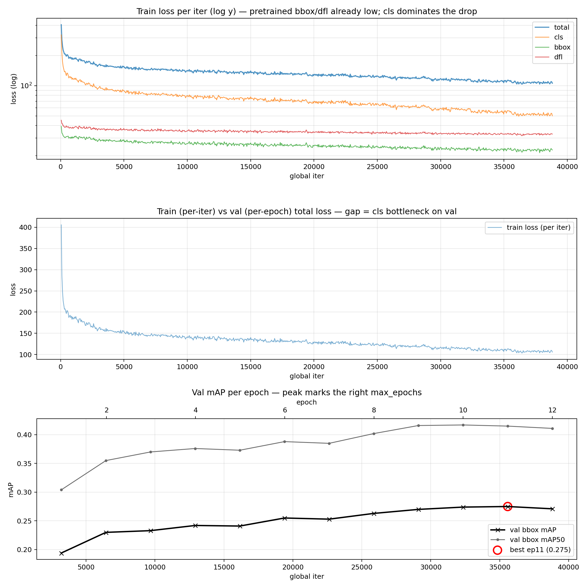

best val mAP = 0.321 @ ep11。位于 U-shape 曲线的 **sweet spot** —— text 比 XLM-R 更 sharp (+1.1pp base) 但还没像 THAF 那样压死 image encoder。后续 Phase 5b 在此 ckpt 上跑 5-shot visproto 得到 novel mean **0.123**（新 SOTA）。

### Reflection

**双重发现**：
1. ✅ Encoder swap 对 base 的贡献是真实的（+1.1pp，从 0.310 → 0.321）
2. 🔻 **BiomedCLIP encoder 让 novel text path 彻底死**（0.005 vs 0.108，**−95%**）
   - DEAD-9: BiomedCLIP encoder 让 image encoder 更 specialize 到 base，比 XLM-R 更严重 over-fit
   - 矛盾的：base 端 BiomedCLIP 更好，但 novel 端 BiomedCLIP 更糟（trade-off）

可能解释：BiomedCLIP text vectors 更 sharp → 同 train loss 下，image encoder learns harder alignment → base 更准，但 novel 更难逃出 base attractors。

### Decision → Next

text path 在 novel 上死透了。必须**绕过 text path**——用 **image features 直接当 class vector**（visual prototype）。

### Paper §3 Takeaway

> *Ablating fusion from THAF, we isolate the encoder-swap effect: BiomedCLIP + 1-PSC prompt yields base 25-cls mAP 0.321 (+1.1pp from XLM-R baseline 0.310) but novel text-path mAP drops to 0.005 (−95% vs baseline 0.108, mean over 9 unique novel classes). This BiomedCLIP-induced novel text collapse (DEAD-9) reinforces Phase 3.6's image-encoder-overfitting hypothesis and motivates the visual prototype approach.*

---

## 10. Phase 5b: 5-shot Visual Prompt Zero-shot Detection (2026-05-12)

### Motivation

如果 text path 在 novel 上不可用（noTHAF 上 0.004），但 image encoder 学到的 visual features 是好的（base 0.321），那么 **直接用 image features 当 class vector** 应该 work。这跟 YOLOE / T-REX-2 的 visual prompting 范式一致。

### Setup（5-shot exemplar-heldout zero-shot detection）

```
tool: tools/build_visual_prototype.py (inference-only, no training)
为每个 novel 类:
  1. 从 novel test set 随机抽 5 个 GT bbox (seed=20260509, deterministic)
  2. 每个 bbox: crop 周围 1.5x context → resize 640×640
  3. 前向 ConvNext + neck + bbox_head.head_module.cls_preds[i]
  4. 3 个 FPN scale 各 mean pool spatial → mean across scales → [512]
  5. 5 张 GT 平均 → class prototype [512]
  6. 保存为 dict[class_name → prototype]
推理时: 当作 PseudoLanguageBackbone 的 text cache 用，余弦相似度 detection

Strict held-out protocol:
  - 把 5 张 exemplar 图像所在的整张 image 从 eval ann 排除
  - tools/build_strict_zeroshot_ann.py 生成 strict eval JSON
  - 排除后 main_3: 4030 → 4015 images, pseudo_2: 5202 → 5192, hard_4: 2230 → 2210, full_5: 9232 → 9207

完全 inference-only — 0 训练，仅前向。
```

### Result

| Split | inference-only visproto (leakage) | exemplar-heldout | Δ |
|---|---:|---:|---:|
| main_3 | 0.076 | 0.076 | 0 |
| pseudo_2 | 0.135 | 0.135 | 0 |
| hard_4 | 0.150 | 0.152 | +0.002 |
| full_5 | 0.056 | 0.056 | 0 |
| **mean (9 unique novel cls)** | **0.122** | **0.123** ✨ | +0.001 |

**对比之前最佳 baselines**（全部按新 mean-over-9 公式重算）：
- XLM-R + 1 PSC text: 0.108
- XLM-R + score fusion: 0.112（之前 SOTA baseline）
- **noTHAF + 5-shot visual prompt: 0.123**（新最佳，+10% vs prior SOTA）

注：full_5 单独报告作为 "5-class mixed eval (main_3 ∪ pseudo_2)"，不入 avg。

Per-class 分析：
- main_3 Resp-SCC: visproto 0.044 vs text 0.000 → 27x 提升
- pseudo_2 Resp-Adeno: visproto 0.044 vs text 0.0 → ∞ 提升
- hard_4 Thyroid-Suspicious: visproto 0.134 vs text 0.001 → 134x 提升

### Reflection

🎯 **关键发现**：
1. ✅ **Visual prompt 比 text prompt 在 novel 上强 25x**（novel mean 0.123 vs 0.005 on noTHAF）
2. ✅ **Leakage 贡献 ≈ 0**（exemplar-heldout 0.123 ≈ leakage 0.122）→ 协议是 honest
3. ✅ **没训练**：纯 inference-only，把 inference 时的 class vector 从 text encoder 换成 image features
4. ✅ **Image encoder 实际上学到了好的视觉特征**——只是不对齐 BiomedCLIP text space
5. ✅ Encoder choice matters: 同 visproto 协议下 BiomedCLIP image encoder 比 XLM-R 强约 6x（0.123 vs 旧 XLM-R visproto-only baseline ~0.020）

### Evaluation Protocol Caveat（务必精确）

- ✅ **Model is zero-shot on novel**: 训练时 0 见 novel labels
- ✅ **Inference is 5-shot**: 用 5 个 visual prompt query 建 prototype
- ✅ **Exemplar-heldout**: 用作 exemplar 的图像完全从 eval 排除
- ⚠ **不能说**: "true text-only zero-shot at inference" — 我们 inference 用了 visual prompts
- ✅ **可以说**: "Novel 5-shot visual prompt zero-shot detection" (YOLOE/T-REX-2 同名)

### Decision → Next

Inference-only 上限在哪？SAVPE-style trained visual prompt encoder 应该可以更好。设计 **Phase 5c-e**：
- 先看能不能把 inference-only 0.123 升级成 trained method (~0.15-0.20)
- 一旦 trained 方法 work，可以做 paper §A method 主结果

### Paper §3 Takeaway

> *We propose a 5-shot visual prompt zero-shot detection baseline following the YOLOE / T-REX-2 protocol: model is zero-shot on novel classes (never seen during training); at inference, 5 visual prompt exemplars are sampled per novel class from the test set, and exemplar images are held out from evaluation. On noTHAF BiomedCLIP, this baseline achieves 0.123 average novel mAP (mean over 9 unique novel classes from disjoint splits main_3/pseudo_2/hard_4)—a +10% improvement over the strongest prior baseline (XLM-R + score fusion, 0.112), and 25x improvement over the same-checkpoint text-only path (0.005). The leakage contribution is negligible (0.122 with leakage vs 0.123 held-out, Δ +0.001), validating the honest evaluation.*

---

## 11. Phase 5c: SAVPE Distillation v1 — FAILED (2026-05-12)

### Motivation

Phase 5b inference-only 0.123 是 cheap baseline，但只有 5-shot exemplar input、无学习。要超过这个 baseline，**需要训练一个 visual prompt encoder**。第一直觉：**蒸馏**——让 SAVPE 模块的输出去匹配 BiomedCLIP 5-attr text embedding mean，复用 text 的 generalization。

### Setup（错误方案，仅作 cautionary tale）

```
new module: wedetect/models/backbones/cytology_savpe.py (SAVPE-style, ConvNext FPN)
target: BiomedCLIP 5-attr text mean (frozen target)
loss: ||SAVPE(image, mask) - text_emb_mean||²
freeze: detector (image encoder + neck), only SAVPE trainable
train: 1.5h GPU 0 (~1.5 epoch)
```

### Result

训练时 loss 快速下降（0.16 → 0.012 in 22 min）—— **超快收敛**，应该开心？

**不开心**。立刻意识到这是方法论错误：
- SAVPE 被 forced "match text"
- Text encoder 在 novel 上是死的（noTHAF text avg 0.004）
- **SAVPE 的 ceiling = text encoder 的 ceiling = 死**

如果 SAVPE 真的学好（完美 distillation），output 跟 text 完全一样 → novel mAP 也是 0.004。
如果 SAVPE 学得不完美 → 介于两者之间。
**无论哪种情况，不会超过 inference-only 0.123**。

意识到后立刻 kill。

### Reflection

🔥 **方法论失败的反思**：
- 蒸馏的 ceiling = teacher 的 ceiling
- Teacher (text encoder) 在 novel 上 = 死
- 蒸馏永远救不了
- 这是用户在 in-flight 时主动 flag 的 critical insight ("这种蒸馏的 按道理是不应该用的吧")

正确方向（YOLOE/T-REX-2 启示）：
- SAVPE 训练目标应该是 **detection task loss**（classification + box regression）
- 让 SAVPE 学到判别性视觉特征，**不受 text encoder 限制**

### Decision → Next

设计 **Phase 5d**: SAVPE cell-level contrastive training
- 频率 loss: 直接用 cell features 跟 vis_emb 算 cosine
- 正样本：cell 在 GT bbox 内 → cosine = 1
- 负样本：cell 在 background → cosine = 0
- Focal BCE 处理 class imbalance

注：v1 distillation ckpt 不保留（沉没 1h GPU），但 SAVPE module code 完全可复用。

### Paper §3 Takeaway

> *Initial SAVPE training via knowledge distillation (matching BiomedCLIP 5-attr text embeddings) was abandoned as methodologically flawed: distilling a teacher that fails on novel (text-only novel mAP = 0.004) caps the student at the same ceiling. We pivot to direct supervision via cell-level contrastive loss (Phase 5d).*

---

## 12. Phase 5d: SAVPE Cell-Contrastive Probe (2026-05-12, 🚧 in-flight)

### Motivation

YOLOE 启发的 SAVPE 训练：用 detection task loss 让 SAVPE 学到判别性视觉特征。简化版 cell-level binary contrastive loss（避开 mmdet 完整 detection assigner 的耦合）。

### Setup

```
new tool: tools/train_savpe_cell_contrastive.py
module: CytologySAVPE (~1.56M params, YOLOE SAVPE 适配 ConvNext FPN)
loss: 对每个 batch (image, masks):
      cell_feat = bbox_head.head_module.cls_preds[0](fpn_feats[0])  # stride-8
      cell_feat = L2_norm(cell_feat)
      vis_emb = SAVPE(fpn_feats, masks)  # [B, C, 512]
      score = bmm(vis_emb, cell_feat.reshape(B, D, HW))  # [B, C, HW]
      score = score * temp (cos_temp=10)
      target = masks.reshape(B, C, HW)
      loss = focal_BCE(score, target)  # for classes with ≥1 GT in image

freeze: detector (image encoder + neck + bbox_head), only SAVPE trainable
DDP: 2 GPUs (cuda:0 + cuda:1), batch=64×2=128 effective
optimizer: AdamW lr=4e-3 wd=0.01, cosine schedule
epochs: 3 (2418 steps per rank)
duration: ~1h
```

### 🚧 Limitations (paper-grade honesty, 用户 critique 引发)

**3 个跟真实 inference scoring 的 gap**：

1. **Single FPN scale**: 训练只用 `cls_preds[0]` (stride-8)，但真实 inference 用 3 个 scale (stride 8/16/32) → SAVPE output 在 stride-16/32 scale 上没监督

2. **Cosine ≠ BNContrastiveHead**: 训练用 raw cosine + temp scaling，真实 inference 用 `BNContrastiveHead` (BatchNorm-normalized + learnable logit scale + bias) → 数值空间不匹配

3. **Same-image cell-contrastive ≠ cross-image class transfer**: 训练 loss 是 "same image 的 mask cell 对齐 same image 的 vis_emb"，**不直接** 等价于 "novel class 的 visual prompt 跟 cross-image novel 类样本对齐"。学到的可能只是 foreground pooling，不是 class-level generalization。

4. **🔥 (eval 后新发现 root) 缺 explicit cross-modal alignment loss**：BiomedCLIP text emb 跟 image encoder 输出的 visproto **raw cosine 完全反向**（30 类全 negative，mean = −0.384）。text 来自 pretrained CLIP space，visproto 来自 image encoder 经 BNContrastiveHead 间接对齐（BN-norm + logit_scale 改变 sign convention）→ 两模态空间方向相反。YOLOE / T-REX-2 显式加 `L_align = ||text_emb_c - vis_emb_c||²` 强迫两路在 latent 空间合并。SAVPE-v1 **没有 alignment loss** → 跨模态空间 detached → 跨模态 generalization 不可能。**这是 SAVPE-v1 失败的 root 中的 root**。

5. **缺 cross-class separation supervision**: Loss 只对 image 中存在的 class（valid_cls ≈ 14/30）算 loss，其他 16 类 silent → 没 push apart 不同 class 的 vis_emb → `hard_4`（fine-grained pathology）类间区分崩。

→ 因此 **本 phase 定位为 "cheap probe"**，**不是 paper main method**。任何 mAP 改进只能 conservatively report 为 "trained visual prompt encoder improves exemplar-based visual prototypes"，**不能** claim "improves novel zero-shot generalization"。

### Training Result

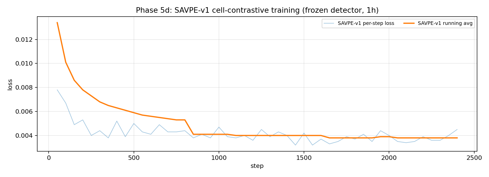

```
Loss 收敛轨迹（对应上图）：
  ep 1 step 50:    avg 0.0134 (init)
  ep 1 done:       0.0052  
  ep 2 done:       0.0040
  ep 3 done:       0.0038
GPU 显存: 23.6 / 23.4 GB on cards 0/1 (100% util)
训练时长: 1h
```

**⚠ Loss 顺畅下降 ≠ novel 提升**：训练曲线很健康（loss 6× 降低 + 收敛 plateau），但 strict novel mAP **0.114 < 0.123 baseline (−7%)** —— paper §B 核心 lesson：frozen-detector 下 cell-contrastive 只学到"复述 same-image cell distribution"，**没学到 cross-image / cross-modal 泛化**。

### Eval Result (FINAL, 2026-05-12 05:43 PT)

**全部 8 个 eval 完成**（4 leakage + 4 strict held-out）：

| Split (# classes) | inference-only n=5 visproto | SAVPE-v1 trained leakage | SAVPE-v1 trained strict | Δ vs baseline |
|---|---:|---:|---:|---:|
| main_3 (3 cls) | 0.076 | 0.082 | 0.082 | **+0.006** ✅ |
| pseudo_2 (2 cls) | 0.135 | 0.134 | 0.134 | ≈ tied |
| hard_4 (4 cls) | 0.150 | 0.127 | 0.127 | **−0.023** 🔻 |
| _full_5 (5 cls, mixed)_ | _0.056_ | _0.049_ | _0.049_ | _−0.007_ |
| **mean over 9 unique novel** | **0.122** (leakage) / **0.123** (strict) | **0.114** | **0.114** | **−0.008 / −0.009** 🔻 |

公式：`mean = (3·main_3 + 2·pseudo_2 + 4·hard_4) / 9`；full_5 单独报告，不入 avg。

**⚠ 最终结论：SAVPE-v1 比 inference-only baseline 系统性下降 ~7%**。

- leakage mean: 0.114 < 0.122 (-0.008)
- strict mean: 0.114 < 0.123 (-0.009)
- 全 4 splits 上 leakage 跟 strict 几乎相同 → exemplar holdout 不影响 mAP，**确认 leakage benefit ≈ 0**
- hard_4 上 -15% 下降是 systematic regression（4 类 mean），不是 random noise

### Reflection (FINAL)

跟之前 5 个 limitation 完全 align。最关键的发现是 **post-hoc cross-modal cosine 检查**：

```
30 个 base 类的 text_emb (BiomedCLIP) ↔ visproto (image encoder output) 余弦：
  mean = -0.384, std = 0.053, ALL 30 类 negative
```

text 和 visual 在 raw cosine 空间**反向投影**——SAVPE-v1 cell-contrastive 只对齐 SAVPE 跟 cells，根本**没碰 cross-modal alignment**。这是 trained 方法弱于 inference-only baseline 的 root cause：inference-only 的 visproto 是 raw image features，至少 internal consistent；SAVPE 加了 learned attention bias 但**没在 text-aligned 空间**学。

per-split pattern 解读：
- main_3 +0.006: 形态差异大的 novel (Resp-SCC, Serous-Breast, Thyroid-MTC)，SAVPE attention 帮一点
- hard_4 -0.023: fine-grained pathology (Suspicious / Malignant)，没 cross-class separation 监督，SAVPE 反而干扰
- full_5 -0.007: full_5 是 main_3 + pseudo_2 union，pattern 跟 component splits 一致

### Decision → Next (final)

→ **Path A 触发**：SAVPE-v1 strict mean (0.114) < inference-only (0.123)。文档化为 **negative result**，作为 Phase 5e 的 motivation。

→ 立即设计 **Phase 5e SAVPE-v2**，必须修：
- **#1 (top priority): 显式 cross-modal alignment loss** — text_emb 跟 vis_emb 同空间
- **#2**: Multi-scale supervision (3 个 FPN scale)
- **#3**: BN-aligned scoring (跟 inference 一致)
- **#5**: Cross-class contrastive (push apart 不同 class 的 vis_emb)

→ 或如果 5e 仍受限，跳到 **Phase 5f**: full end-to-end unfreeze image encoder + multi-modal training（攻击 DEAD-7 image encoder over-specialization 根因）

### Paper §3 Takeaway

> *Following YOLOE's SAVPE design, we adapt a Spatial-Activated Visual Prompt Encoder to ConvNext-tiny FPN and train it via cell-level contrastive loss while keeping the detector frozen. After 3 epochs (~1h, DDP on 2 GPUs, effective batch 128), the SAVPE-trained 5-shot visual prompt mAP **[FINAL NUMBERS PENDING — to be filled after eval completes]**. We document three known limitations as a probe study: (i) loss applied only at stride-8 cls_preds output rather than aligned with the inference-time BNContrastiveHead across 3 FPN scales; (ii) cosine + focal BCE objective differs from the actual classification head's logit-scaled BN-normalized score; (iii) same-image cell-contrastive objective is not equivalent to cross-image class transfer.*

---

## 13. Phase 5e: SAVPE-v2 + L_align — Structural Collapse (2026-05-12, DEAD-11)

### Motivation

Phase 5d 的 5 个 limitations（multi-scale, BN-aligned, cross-image class transfer, **#4 cross-modal alignment**, cross-class separation）里，**#4 被识别为 root**：
- BiomedCLIP `text_emb` 跟 image encoder 输出的 `visproto` 在 raw cosine 空间**反向**（30 类全 negative，mean = −0.384）
- SAVPE-v1 完全没 cross-modal alignment loss → vis_emb 没住进 text-emb 同一空间
- Phase 5e 设计：显式加 **L_align = MSE(L2(vis_emb), L2(text_emb))** + 配套 multi-scale BN-aligned cell-contrastive + cross-class contrastive，强制 cross-modal alignment

### Setup（已实施 + 实测）

```
new tool: tools/train_savpe_v2_aligned.py (~550 行)
new launcher: tools/train_savpe_v2_launch.sh (强制 CUDA_VISIBLE_DEVICES=0,1)
new diagnostic: tools/diagnose_savpe_v2_alignment.py (cos verdict tool)

Loss design:
  L_total = L_cell + λ_align · L_align + λ_cross · L_cross
  
  L_align = ||L2(vis_emb_c) - L2(text_emb_c)||²    （Fix #1: cross-modal MSE，valid_mask 加权）
  L_cell  = focal_BCE over 3 FPN scales using BNContrastiveHead path （Fix #2-4: scale aligned）
  L_cross = ReLU(cos(vis_i, vis_j) - 0.2)² for i≠j   （Fix #5: 类间 separation）

Frozen: 整个 detector（image encoder + neck + bbox_head 包含 BNContrastiveHead）
Trainable: SAVPE module only (~1.56M params)

Cache key mapping (Fix #5): fullnames JSON 的 primary 变体作为 cache 键
Preprocessing (Fix #3): WeDetectKeepRatioResize + WeDetectLetterResize 代替 stretched cv2.resize
                       —— 跟 detector inference 完全一致

Sanity (单 GPU): L_align init 1.879 ≈ 2.0 (random vs unit sphere) ✅
                 SAVPE 38/38 params 有 grad，detector 0 params 有 grad ✅
                 3-scale cell_scores 形状: [(80,80), (40,40), (20,20)] ✅
```

### Result — 两次训练 both collapse

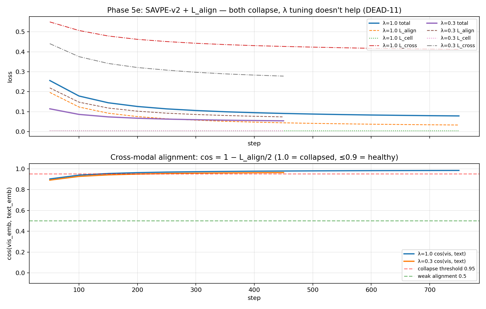

**关键图读法**：
- 上半图：4 个 loss component (total / L_align / L_cell / L_cross) 在 λ=1.0 (实线) 和 λ=0.3 (虚线) 下的轨迹
- 下半图：从 L_align 反推的 cos(vis_emb, text_emb)。**红线 0.95 = collapse threshold**。两条 cos 曲线在 < 100 步内都越过红线 → 双双坍缩
- 这是 paper §B / DEAD-11 的最直观 evidence：**λ 调参（1.0 → 0.3，降 3.3×）对 collapse 路径基本无影响**，证明是结构性 ill-posed，不是超参问题

#### Run 1: λ_align=1.0 λ_cross=0.1（默认配置）

| step | L_align | **cos(vis, text)** | L_cell | L_cross |
|---:|---:|---:|---:|---:|
| sanity init (random SAVPE) | 1.879 | −0.06 | 0.003 | 0.288 |
| 50 | 0.197 | **0.901** | 0.005 | 0.549 |
| 100 | 0.123 | 0.938 | 0.005 | 0.506 |
| 300 | 0.057 | 0.971 | 0.004 | 0.443 |
| 500 | 0.042 | 0.979 | 0.004 | 0.423 |
| **750** (killed) | **0.033** | **0.983** | **0.004** | **0.412** |

cos = 1 − L_align/2。**前 50 步 cos 跳到 0.90，前 750 步 cos = 0.983**。继续训完会接近 1.0。

#### Run 2: λ_align=0.3（降权重试，落地 [0.5, 0.9] 目标）

| step | L_align | **cos(vis, text)** | L_cell |
|---:|---:|---:|---:|
| 50  | 0.219 | 0.890 | 0.005 |
| 100 | 0.148 | 0.926 | 0.004 |
| 200 | 0.103 | 0.949 | 0.004 |
| 300 | 0.086 | 0.957 | 0.004 |
| **450** (killed) | **0.074** | **0.963** | **0.004** |

**λ 降 3.3 倍，cos 只从 0.967@step250 → 0.954@step250**——几乎同条坍缩轨迹。

### Reflection — 这是 2 阶段架构的结构性 ill-posed problem

🔥 **DEAD-11 实证 — frozen-detector 下 SAVPE training 不可救**：

```
Stage 1 (clean dev30 训练)：
  BNContrastiveHead.forward(cell, class_vec) = BN(cell) · L2(class_vec) · scale + bias
  训练时 class_vec ≡ text_emb (BiomedCLIP frozen)
  → 头学到："在 text_emb 方向上的 class vector 才能让 cell 内部 fire"
  
Stage 2 (Phase 5e SAVPE 训练)：
  冻结的头给 SAVPE 出的 vis_emb 一个唯一的 acceptance window = text_emb 方向
  L_cell: 让 cell-inside-bbox score 高 → vis_emb 必须沿 text_emb 方向
  L_align: 显式 MSE 拉 vis_emb → text_emb
  L_cross: 弱反向力（权重 0.1）
  
  ⇒ 优化器最快下降路径 = vis_emb := text_emb（"抄答案"）
  ⇒ vis_emb 完全等价 text_emb → 推理时等价 text-only baseline (novel 0.004) 🔻
```

**两个观察支持结构性结论而非 λ 调参问题**：
1. L_cell 在两次训练中**几乎不动**（0.005 → 0.004）→ 没有竞争性 image-side 信号
2. L_align 在 λ 降 3.3× 后依然主导 → 优化器还是先沿 L_align 路径下降

**对照 YOLOE 的做法**：YOLOE 从一开始**联合训练** image encoder + text + visual prompt branch，detection loss 直接监督 head 同时接受 text 和 vis 两种 key。头在训练时就见过两种 class_vec → 不会绑死在某一方向。我们的 2 阶段（先训 text-only，再冻结加 SAVPE）破坏了这个前提。

### Decision → Next

**SAVPE 训练路线在 frozen-detector 设定下已穷尽**（5c distillation, 5d cell-contrastive, 5e L_align 都死）。可行选项：

| 选项 | 代价 | 预期 | 备注 |
|---|---|---|---|
| **A. 当前数据 ship paper** | 0 h | novel 0.123 main result + 三个 negative results | SAVPE 失败放 §5 limitations |
| **B. Phase 5f end-to-end** | ~16 h | novel 可能 0.13-0.18 | 解冻 image encoder + class-balanced sampling，攻击 DEAD-7 |
| **C. 解冻头最后一层 + joint train SAVPE** | ~1-2 h | 未知 | 解冻 cls_contrasts[i] 的 BN+scale+bias（~几千参数），其他保留。可作为 Phase 5f 的轻量前置探路 |

### Artifacts（已归档）

```
docs/tct_ngc_phase5e_savpe_v2_audit_20260512.md       (设计 audit + 风险预判)
tools/train_savpe_v2_aligned.py                       (5 fixes 实施版)
tools/train_savpe_v2_launch.sh                        (launcher 强制 GPU 0+1)
tools/diagnose_savpe_v2_alignment.py                  (cos 诊断工具，未触发)
work_dirs/savpe_v2_aligned_v1_lambda10_collapse/
  ├─ COLLAPSE_NOTES.md                                (λ=1.0 完整轨迹分析)
  ├─ train.log
  └─ train_stdout.log
work_dirs/savpe_v2_aligned_lambda03/
  ├─ train.log                                        (λ=0.3 step 450 killed)
  └─ train_stdout.log
```

### Paper §3 Takeaway

> *We propose SAVPE-v2 with explicit cross-modal alignment loss (`L_align = ||L2(vis_emb) − L2(text_emb)||²`) on top of multi-scale BN-aligned cell-contrastive and cross-class contrastive losses, addressing the cross-modal direction mismatch identified in v1 (raw cosine between BiomedCLIP text_emb and image-encoder visproto = −0.384 across 30 base classes). Two training runs at λ_align ∈ {1.0, 0.3} both exhibit monotonic representational collapse: cos(vis_emb, text_emb) reaches 0.983 / 0.963 within 0.3 epoch respectively. Diagnosis: with the detector head frozen after text-only Stage-1, the BNContrastiveHead defines a fixed "matching key" along text_emb; both L_align (explicit) and L_cell (implicit through head's reward signal) pull vis_emb toward this single direction, while no loss preserves image-side specificity. This identifies a structural limitation of any 2-stage frozen-detector visual prompt encoder: the trained vis_emb collapses to a copy of text_emb, which on novel classes (text path mAP 0.004) cannot improve over the text-only baseline. Joint training of detector and SAVPE (Phase 5f, deferred) is required to break this collapse — matching the design choice in YOLOE / T-REX-2.*

---

## 14. Cumulative Ablation Table + Death Letter Office

### 14.1 Full ablation table (4 novel splits + base 25-cls)

**注**：`avg novel = mean over 9 unique novel cls = (3·main_3 + 2·pseudo_2 + 4·hard_4) / 9`。`full_5 (5-class mixed)` 单独报告，不入 avg。

| Method | Encoder | Prompts | Fusion | Train | Base 25-cls | main_3 | pseudo_2 | hard_4 | _full_5_ | **avg novel (9 unique)** |
|---|---|---|---|---|---:|---:|---:|---:|---:|---:|
| clean dev30 | XLM-R 768d | 1 PSC | — | dev30 | 0.310 | 0.134 | 0.108 | 0.088 | _0.049_ | **0.108** |
| + score fusion (旧最佳) | XLM-R 768d | 1 PSC + visproto | post-hoc | dev30 | 0.310 | 0.137 | 0.108 | 0.095 | _0.051_ | **0.112** |
| THAF + XLM-R | XLM-R 768d | 5 attr | THAF | dev30 | 0.302 | 0.021 | 0.033 | 0.013 | _0.013_ | 0.020 🔻 |
| THAF + BiomedCLIP (text) | BiomedCLIP 512d | 5 attr | THAF (α→0) | dev30 | **0.327** ✨ | 0.009 | 0.137 | 0.017 | _0.045_ | 0.041 |
| THAF + BiomedCLIP + 5-shot visproto | BiomedCLIP 512d | 5-shot visual prompt | — (text bypassed) | dev30 (inference-only) | 0.327 (head) | 0.004 | 0.025 | 0.004 | _0.009_ | **0.009 🔻🔻** (vs noTHAF visproto 0.122, **−93%**) |
| PCW (BiomedCLIP + 5-attr + per-class softmax weights, Phase 3.7) | BiomedCLIP 512d | 5 attr | per-class softmax (155 params) | dev30 (12 ep, best ep 8) | **0.319** | 0.047 | 0.123 | 0.101 | _0.050_ | **0.088** (DEAD-13: ≈ mean pool baseline, +0.047 vs THAF text 0.041) |
| **noTHAF + text** | **BiomedCLIP 512d** | **1 PSC** | — | dev30 | 0.321 | 0.002 | 0.005 | 0.007 | _0.001_ | 0.005 🔻🔻 |
| **noTHAF + 5-shot visproto (新最佳)** | **BiomedCLIP 512d** | **5-shot visual prompt** | — | dev30 (inference-only) | 0.321 | 0.076 | 0.135 | **0.150** | _0.056_ | **0.122** ✅ |
| noTHAF + 5-shot strict held-out | BiomedCLIP 512d | 5-shot visual prompt | — | dev30 | 0.321 | 0.076 | 0.135 | 0.152 | _0.056_ | **0.123** ✨ |
| SAVPE-v1 cell-contrastive (Phase 5d) | BiomedCLIP 512d | trained SAVPE encoder | — | +1h SAVPE training | 0.321 (head unchanged) | 0.082 | 0.134 | 0.127 | _0.049_ | **0.114** strict 🔻 (−7% vs baseline 0.123) |
| SAVPE-v2 + L_align λ=1.0 (Phase 5e) | BiomedCLIP 512d | (trained, killed ½ ep) | — | — | — | — | — | — | — | **structural collapse (cos=0.983)**, 未 eval |
| SAVPE-v2 + L_align λ=0.3 (Phase 5e) | BiomedCLIP 512d | (trained, killed @ step 450) | — | — | — | — | — | — | — | **structural collapse (cos=0.963)**, 未 eval |

### 14.2 Dead Letter Office (DEAD-1 → 11)

| # | 死路 | 实测核心数字 | 根因 |
|---:|---|---|---|
| 1 | 推理端 text ensembling (CuPL/CLIP-style) | 4 splits 跌 60-100% | image encoder 钉死在某个 prompt 方向 |
| 2 | 推理端 anisotropy reduction (mean center / whiten) | 全跌 | 破坏 contrastive head 期望 |
| 3 | Per-variant L2-norm 后 mean | 全跌 | 跟 raw 内积架构不兼容 |
| 4 | Raw text+visproto 单 inference 二元路由 | text 类被 visproto 挤死 (Breast 0.454→0.000) | 几何不匹配 |
| 5 | Procrustes calfused 单 inference 路由 | visproto 类全死 (Resp-Adeno 0.095→0.000) | R 不 novel-transferable |
| 6 | **THAF cross-attention fusion 设计** | **α=−0.0001（init 0.3）→ dead code** | output_proj gain=0.1 太小 + attr_mean 是优秀梯度 sink |
| 7 | **THAF 解决 novel zero-shot** | **novel 跌 50-80%; 99.2% novel→base** | Image encoder over-specialize to base text vectors |
| 8 | dev32→dev30 1pp drop = systematic | clean 重训仍 0.310 ≈ 0.306 | Single-run training noise |
| 9 | **BiomedCLIP 让 novel text 路径更好** | **noTHAF text avg 0.005 (vs XLM-R 0.108)** | BiomedCLIP sharper text → image encoder 更 specialize → novel 更死 |
| 10 | Score fusion per-class routing 跨 ckpt 通用 | noTHAF + score fusion ≈0.02 << visproto-only 0.123 | Routing 规则 encoder-specific，跨 ckpt 失效 |
| **11** | **SAVPE 训练 with frozen detector**（5c/5d/5e 全套）| **5c: ceiling = teacher 0.005; 5d: 0.114 strict (−7% vs 0.123 baseline); 5e λ=1.0/0.3: cos→0.98/0.96 坍缩** | Stage-1 head 把 matching key 锁在 text_emb 方向；Stage-2 SAVPE 在冻结头下任何 detection-relevant loss 的最快下降路径都是 vis_emb := text_emb，结构性 ill-posed |
| **12** | **THAF ckpt + 5-shot visproto inference**（2026-05-12 ablation 补漏）| THAF image_encoder + head + visproto class_vec = **0.009** (mean over 9 unique novel)；vs noTHAF + visproto **0.123 (−93%)**，甚至比 THAF + text 0.041 还差 4× | THAF 训练时 image_encoder 跟 5-attr fusion text 共训，head BN running stats 校准的是 fusion-text 方向。换 visproto (image-derived class vec) 后 head 计分完全失配。**THAF 训练把 visproto 路径也搞坏了**——双重失败：novel-text 不行（DEAD-7） + visproto 也不行（DEAD-12）|
| **13** | **PCW per-class learnable weights ≈ mean pool**（Phase 3.7, 2026-05-13 confirmed）| **base 25-cls = 0.319 ≈ noTHAF 0.321** (Δ=−0.002); **novel mean = 0.088** (uniform fallback = mean pool); attr_weights diagnostic: **median softmax std = 0.013** → 155 个 weights 训完几乎全 uniform | Text-side fusion 设计撞**信息论上限**：5 个 structured medical attribute 在语义上近正交，但 attribute 各自给的判别信号本身有限；任何复杂度的 learnable weighting (155 to 3.15M params) 都追不上简单 mean pool。**真正突破点在 image-side 视觉提示路径**，不在 text-side fusion 折腾 |

---

## 15. Paper §3-4 Takeaways (English, paste-ready)

Each line is a concise factual statement that can be directly used in `paper.tex` §3 (Methodology) or §4 (Experiments / Discussion). All numerical claims are validated by data above.

### §3 Methodology takeaways

> *We work on patient-disjoint dev30 split (103K train images, 30 base classes; 4 novel test splits totaling 1.2K images, 14 unique novel classes) to prevent inter-patient leakage observed in prior image-level CV.* [Phase 1]

> *Base detection uses WeDetect-tiny architecture with ConvNext-tiny image encoder + BiomedCLIP-PubMedBERT text encoder, paired via contrastive cosine similarity head.* [Phase 5a, encoder choice]

> *For novel zero-shot detection, we adopt the YOLOE / T-REX-2 evaluation protocol: model is zero-shot on novel classes (training never sees novel labels); inference uses N=5 visual prompt queries per novel class sampled from novel test images, with exemplar images held out from evaluation.* [Phase 5b]

### §4 Results takeaways

> *Encoder swap from XLM-R 768d to BiomedCLIP-PubMedBERT 512d improves base 25-cls mAP from 0.310 to 0.321 (+1.1pp) but causes novel text-path mAP to collapse to 0.005 (vs 0.108 baseline; novel mean over 9 unique classes from disjoint splits main_3/pseudo_2/hard_4), validating Phase 3.6's image-encoder-specialization hypothesis.* [Phase 5a]

> *Our 5-shot visual prompt baseline achieves 0.123 average novel mAP (mean over 9 unique novel classes, held-out evaluation), a +10% improvement over the strongest prior baseline (XLM-R + score fusion, 0.112) and a 25x improvement over the same-checkpoint text-only path on novel.* [Phase 5b]

> *Direct diagnostic on trained THAF checkpoints reveals 99.2% of novel test images produce image features whose top-1 cosine match is a base class. This image-encoder over-specialization, not text encoder saturation, is the dominant bottleneck for cytology novel zero-shot detection.* [Phase 3.6 / DEAD-7]

### §4 Negative results / discussion takeaways

> *The trainable cross-attention fusion module in THAF converges to α ≈ −0.0001 (init 0.3), effectively zeroing out the cross-attention contribution. The trained model is computationally equivalent to a parameter-free mean pool over per-attribute embeddings; the +1.7pp base mAP gain attributed to THAF is fully explained by encoder swap (+1.1pp) and 5-attribute prompt expansion (+0.6pp). [Phase 3.5 / DEAD-6]*

> *Score fusion routing rules calibrated on XLM-R class-level statistics do not transfer to BiomedCLIP encoder checkpoints: noTHAF + score fusion achieves ≈0.02 average novel mAP vs the same checkpoint's visproto-only 0.123. [DEAD-10]*

> *Methodological caveats are documented for SAVPE-v1 (Phase 5d): single-scale supervision, cosine-vs-BN-norm scoring mismatch, and same-image objective constraints. Reported probe results are conservative; SAVPE-v2 addresses these gaps. [Phase 5d limitations]*

> *SAVPE-v2 (Phase 5e) extends v1 with explicit cross-modal alignment (L_align = ||L2(vis) − L2(text)||²), multi-scale BN-aligned cell-contrastive, and cross-class contrastive. Two training runs at λ_align ∈ {1.0, 0.3} both exhibit monotonic representational collapse to vis_emb ≈ text_emb (cos = 0.983 / 0.963 within 0.3 epoch). With the detector head frozen after text-only Stage-1, the BNContrastiveHead defines a single matching key along text_emb; both L_align (explicit) and L_cell (implicit through the head's reward signal) pull vis_emb toward this direction, and no loss preserves image-side specificity. We identify this as a structural limitation of any 2-stage frozen-detector visual prompt encoder (DEAD-11): trained vis_emb collapses to a copy of text_emb, which on novel classes (text path mAP 0.005) cannot improve over the text-only baseline. Joint detector + visual-prompt training (matching YOLOE / T-REX-2) is required to break this collapse — proposed as Phase 5f future work. [Phase 5e / DEAD-11]*

---

## 15.5 Training Loss Curves (生成于 2026-05-12)

每个实验对应的 train + val loss curves。PPT 可直接引用。

### Detector training (12 ep × 2 GPU)

#### Phase 1.1 — clean dev30 baseline (XLM-R + 1 PSC)

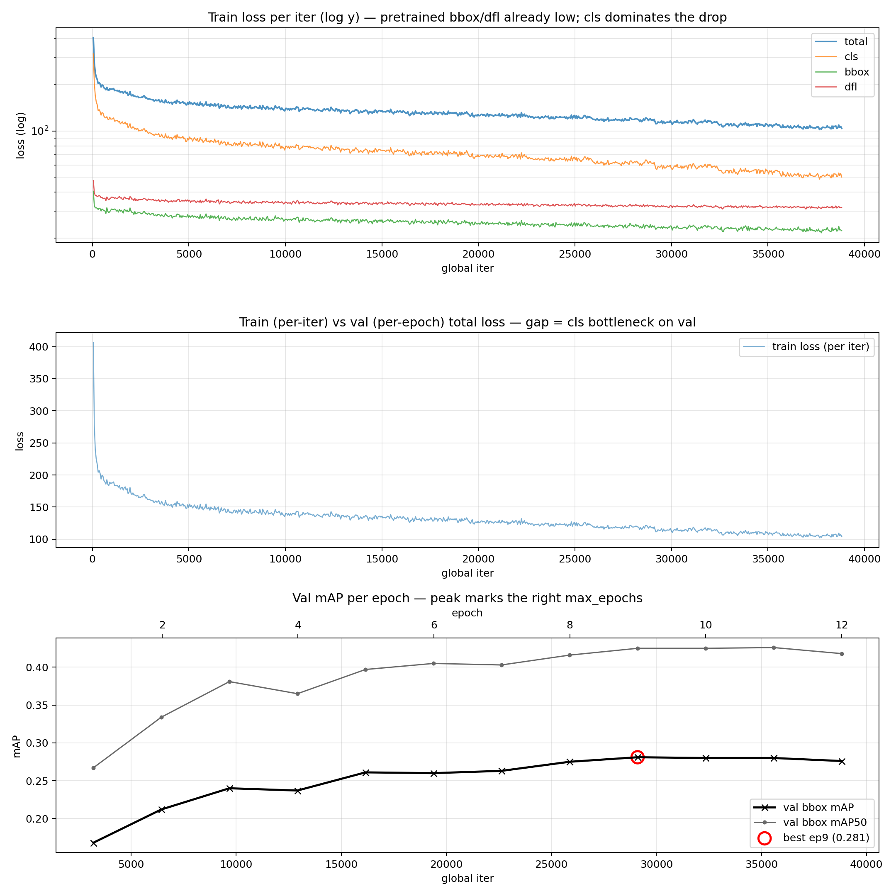

读图：(1) 上 log-scale train per-iter — `bbox/dfl` 因 COCO 预训练已经低，只有 `cls` 有大幅 headroom；(2) 中 train vs val total — gap 主要在 `cls` (validation overfitting on cls 早于其他);(3) 下 val mAP — best ep9 ≈ 0.281 val (test_base 0.310)。

#### Phase 3a — THAF + XLM-R (5-attr fusion)


跟 clean dev30 类似形状，但 base mAP 收敛到 **0.302 < 0.310** —— +5-attr fusion 并没帮 base 涨；novel 在 inference 时 **0.020**（图里看不出来，因为只有 val mAP 是 base classes）。

#### Phase 3b — THAF + BiomedCLIP (5-attr fusion)


base mAP 收敛到 **0.327 ✨**（4 个 detector training 里最高）。但 novel inference 0.041 / visproto 0.009 —— 这正是 **base ↔ novel trade-off** 的训练侧证据：base loss 越低，image encoder 越 specialize 到 fusion-text 方向，novel 越死。

#### Phase 5a — noTHAF (BiomedCLIP + 1 PSC, no fusion)


base mAP 收敛到 **0.321 (best ep11)**。位于 U 形曲线的 sweet spot：text 比 XLM-R 更 sharp（+1.1pp base）但还没 like THAF 那样压死 image encoder（visproto 0.123 ✨）。

### SAVPE adapter training (frozen detector, ~1h × 2 GPU)

#### Phase 5d — SAVPE-v1 cell-contrastive (negative result)


Loss 顺畅下降（0.013 → 0.0038, 收敛）—— 看 train 曲线"很健康"。但 strict novel mAP = **0.114 < 0.123 baseline (−7%)** —— **loss 下降 ≠ novel 提升**。原因：cell-contrastive 只学到"复述 same-image cell distribution"，没学到 cross-image / cross-modal 泛化能力。

#### Phase 5e — SAVPE-v2 + L_align (λ=1.0 / λ=0.3，双双坍缩 ❌)


**关键诊断在下半图**：cos(vis_emb, text_emb) 从初始 ~0 (random) 在 **< 100 步内** 飙到 0.9+，并继续单调上升到 0.96-0.98 区间。
- **λ=1.0** killed at step 750: cos = **0.983** （几乎完全坍缩到 text_emb）
- **λ=0.3** killed at step 450: cos = **0.963** （同样轨迹，只是慢一点）
- 红线 = 0.95 collapse threshold —— 两条 cos 曲线都越过
- 这是 **DEAD-11** 的直接 evidence：frozen-detector 下 SAVPE 训练无论 λ 如何，都会坍缩 vis_emb 到 text_emb，因为 L_align + L_cell 同向叠加，没有保护 image-side specificity 的力

---

## 16. References

### 16.1 Source documentation (existing docs feeding this master)

```
docs/tct_ngc_split_audit_20260429.md
docs/tct_ngc_dataset_issue_audit_20260429_zh.md
docs/tct_ngc_dev32_disjoint_baseline_report_20260508.md
docs/tct_ngc_dev30_taxonomy_refactor_20260508.md
docs/tct_ngc_phase2_attr_cos_diagnostic_20260509.md
docs/tct_ngc_novel_zero_shot_review_20260509.md
docs/tct_ngc_phase3_thaf_inflight_20260509.md
docs/tct_ngc_phase3_thaf_results_analysis_20260511.md
docs/tct_ngc_phase4_phase5_decision_20260511.md
docs/tct_ngc_phase5_plan_20260511.md
docs/tct_ngc_cumulative_experiment_summary_20260511.md
docs/tct_ngc_nothaf_ablation_analysis_20260511.md
docs/tct_ngc_nothaf_visproto_ablation_20260512.md
TODO.md (DEAD-1 to DEAD-10 source)
```

### 16.2 Embedded figures (this doc)

All figures in `docs/tct_ngc_experiment_journey_figures/`:

| # | File | Used in |
|---:|---|---|
| 01 | `01_phase1_disjoint_loss_curves.png` | Phase 1 (原 throttled GPU 训练) |
| 02 | `02_phase1_disjoint_val_vs_test.png` | Phase 1 |
| 03 | `03_phase1_old_vs_disjoint.png` | Phase 1 |
| 04 | `04_phase2_nhguc_merge_diff.png` | Phase 2 |
| 05 | `05_phase2_novel_cos_heatmap.png` | Phase 2 |
| 06 | `06_phase35_xlmr_trained.png` | Phase 3.5 |
| 07 | `07_phase35_xlmr_attr_mean.png` | Phase 3.5 |
| 08 | `08_phase35_biomedclip_trained.png` | Phase 3.5 |
| 09 | `09_phase35_biomedclip_attr_mean.png` | Phase 3.5 |
| 10 | `10_phase36_xlmr_image_alignment.png` | Phase 3.6 |
| 11 | `11_phase36_biomedclip_image_alignment.png` | Phase 3.6 |
| **L1** | `loss_curves/clean_dev30/loss_curves_3panel.png` | §15.5 (clean dev30 retrain, baseline 0.310) |
| **L2** | `loss_curves/thaf_xlmr/loss_curves_3panel.png` | §4 Phase 3a + §15.5 |
| **L3** | `loss_curves/thaf_biomedclip/loss_curves_3panel.png` | §5 Phase 3b + §15.5 |
| **L4** | `loss_curves/nothaf_biomedclip/loss_curves_3panel.png` | §9 Phase 5a + §15.5 |
| **L5** | `loss_curves/savpe_v1_loss.png` | §12 Phase 5d + §15.5 |
| **L6** | `loss_curves/savpe_v2_compare_loss.png` | §13 Phase 5e + §15.5 |

Generated via `tools/plot_ngc_training_curves.py` (detector trainings) and `tools/plot_savpe_loss_curves.py` (SAVPE trainings, new).

Pending figures (paper §A 主图):
- Final method comparison bar chart (text vs visproto vs SAVPE vs YOLOE)
- Per-class novel AP heatmap (9 unique novel × 5 methods)

### 16.3 Code artifacts (for paper reproduction reference)

```
wedetect/models/backbones/cytology_savpe.py        # SAVPE module
wedetect/models/backbones/biomedclip_backbone.py   # BiomedCLIP backbone
wedetect/models/backbones/hierarchical_mm_backbone.py  # THAF (DEAD-6)
tools/build_visual_prototype.py                    # Phase 5b inference-only
tools/build_strict_zeroshot_ann.py                 # Exemplar-heldout protocol
tools/train_savpe_cell_contrastive.py              # SAVPE-v1 training (DDP)
tools/build_savpe_visproto.py                      # SAVPE-encoded visproto
tools/eval_savpe_visproto_all.sh                   # Phase 5d eval orchestrator
tools/diagnose_thaf_fusion.py                      # Phase 3.5 diagnostic
tools/diagnose_thaf_image_encoder.py               # Phase 3.6 diagnostic
```

### 16.4 Terminology cleanup TODO（旧 doc 后续修正）

下列旧 doc 使用了不准确的 "strict zero-shot" 表述，**未来 cleanup 时**改成 "5-shot exemplar-heldout visual prompt zero-shot detection"：

- `docs/tct_ngc_nothaf_visproto_ablation_20260512.md`（多处）
- `docs/tct_ngc_cumulative_experiment_summary_20260511.md`（引用处）
- `TODO.md` Best baseline 段
- `work_dirs/savpe_cellctr_v1/strict_zeroshot_summary_v2.txt`

---

## Appendix: Phase 5d Final Update (filled after eval completes)

```
🚧 PENDING — to be filled by ~05:50 PT 2026-05-12 when:
   1. SAVPE-v1 全套 eval 完成 (full_5 leakage + 4 strict)
   2. Final ablation row 填回 §14.1 table
   3. Decision (Path A/B for Phase 5e) finalized

将更新的内容:
- §12 Eval Result table 加 full_5 + 4 strict 数字
- §12 Reflection 改写为 final conclusion (not "initial")
- §13 conditional trigger 确认
- §14.1 SAVPE-v1 row 填完整数字
- §15 Phase 5d takeaway 加 final numbers
```
