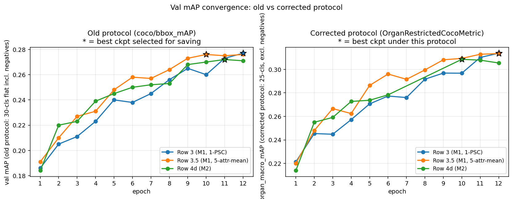
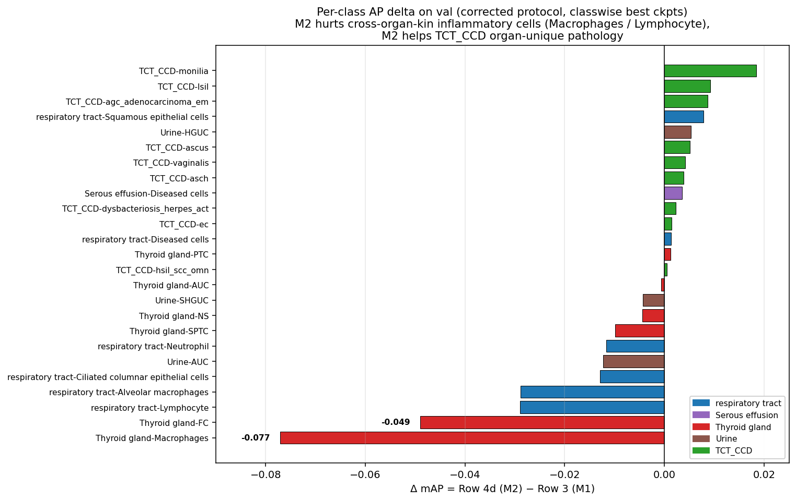
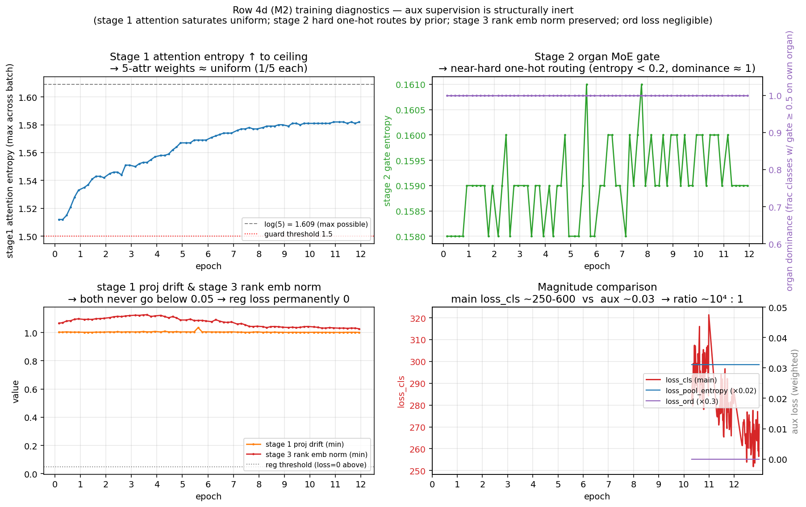
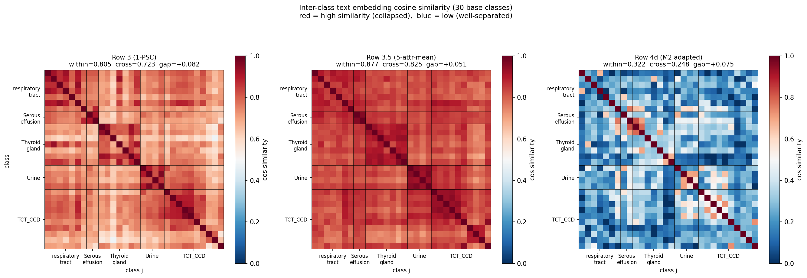

# OC-HMTA Corrected-Protocol 实验后问题剖析

**日期**：2026-05-14
**目的**：本文档汇总在「修正后的 val 评估协议」(`OrganRestrictedCocoMetric`，5 个 negative class 从 COCOeval `catIds` 排除，输出 per-organ AP + overall macro + all-class flat + instance-weighted) 下、对 4 个完整训练好的实验重评 + per-class AP classwise 评估之后发现的所有结构性问题。
**前提**：本次评估发生在 commit `863e7ae fix(tct_ngc): align M1 val_evaluator with paper test protocol` 之后；先前所有 ckpt 都在 *旧协议*（30-class flat COCO mAP 含 negatives）下选了 `best_*.pth`，因而 best ckpt 选择本身受偏。

> **注**：本文档不重述「为什么要修正 val 协议」（详见 commit message），仅记录修正后的新现象与解释。

---

## 0. 实验命名表（先看这个）

为方便阅读和与 paper §A ablation table 对应，本文档使用「描述性短名 + paper Row 编号」两套命名。**正文优先使用描述性短名**。

| 描述性短名 | paper 行号 | 配置文件 | 模型改动 | 用于回答的问题 |
|---|---|---|---|---|
| **baseline-推理掩码** | Row 2 | `wedetect_tiny_tct_ngc_dev30_biomedclip_noTHAF_2gpu.py` | 直接复用旧 noTHAF ckpt，推理时在 detection score 上后挂 organ mask（不重训）| "什么都不动，单靠推理后处理能拿多少？" |
| **M1-1PSC** (paper baseline) | Row 3 | `wedetect_tiny_tct_ngc_dev30_ochmta_m1_biomedclip_2gpu.py` | M1 模块：训练期对每个样本只算同 organ 类的 BCE loss（cross-organ 类不参与梯度），单 prompt 文本缓存 | "**纯组织条件训练**有多大用？" |
| **M1-5attr平均** (控制) | Row 3.5 | `wedetect_tiny_tct_ngc_dev30_ochmta_m1_5attrmean_biomedclip_2gpu.py` | M1 + 把单 PSC 文本换成 5 个属性向量取平均（共享 cache 协议）| "**5-attr 信号**自身有多大贡献？（不带分层适配器）" |
| **M1+M2-完整方法** (paper main) | Row 4d | `wedetect_tiny_tct_ngc_dev30_ochmta_m2_biomedclip_2gpu.py` | M1 + M2 模块：分层文本适配器 = Stage1 per-attribute MLP + attention pool / Stage2 per-organ MoE / Stage3 rank embedding additive；加序数辅助损失 `loss_ord` | "**完整 OCHMTA 方法**比纯 M1 强多少？" |
| **OCHMTA + axis 结构损失** (拟跑) | Row 5 | 待新建 `..._m2_axisstruct_..._2gpu.py` | M1 + M2 + 额外 `(organ, axis)-conditional structure loss`：同 (organ, axis) 拉近 + 跨 organ 推开 + 同 organ 异 axis 不管 | "**显式 axis 结构损失**能否修复 P1（cross-organ kin 类被砍）？" |

### 三个 module 的设计意图（备忘）

- **M1（组织条件类掩码）**：每张图片有 organ_id，训练只让模型预测同 organ 类，cross-organ 类不算 loss → image encoder 不需要 disambiguate 跨域 → DEAD-7 部分修复
- **M2 Stage 1（per-attr 投影 + attention pool）**：5 个 attribute 各走自己的 MLP，再 attention 加权融合 → 期望"分诊断码强调诊断码，分形态学强调形态学"
- **M2 Stage 2（per-organ MoE）**：5 个 organ 各有一个 expert MLP，根据 class.organ 路由 → 期望 organ-specific 特征
- **M2 Stage 3（rank embedding）**：同 (organ, axis) 内的不同 rank（如 PTC=0, FC=1）加不同 residual → 期望学到 axis ladder
- **`loss_ord` 序数辅助损失**：per (organ, axis) MSE + monotonicity → 显式监督 stage 3 学正确顺序

---

## 0.5 当前实测数据全集

### 测试集结果（**paper-ready 数字**）

数据：`instances_test_base_clean_dev30.json`（821 张图，283K instances），`instances_test_novel_merged_9.json`（novel 9 merged）
协议：OrganRestrictedCocoMetric（已排除 5 个 negative class）
| 实验 | best ckpt 协议 | 选出的 ckpt | base 25 macro | base 25 flat | base 25 inst-w | novel 9 macro |
|---|---|---|---:|---:|---:|---:|
| baseline-推理掩码 | — | 现有 noTHAF ckpt | ~0.310 | — | — | 0.0022 |
| **M1-1PSC** | 旧/修正皆 ep12 | ep12 | **0.3369** | 0.3174 | 0.4046 | 0.1500 |
| **M1-5attr平均** | 旧 ep10 | ep10 | **0.3477** | 0.3242 | 0.4098 | 0.1680 |
| **M1-5attr平均**（修正 best）| 修正 ep11 | ep11 待跑 | TBD | TBD | TBD | TBD |
| **M1+M2-完整方法** | 修正 ep10 | ep10 | **TBD（in flight）** | TBD | TBD | TBD |

### 验证集结果（**修正协议 12 ep 完整曲线**，只用于 ckpt selection）

数据：`instances_val_dev_disjoint_dev30.json`（1617 张图，132K instances）
| 实验 | best ckpt | macro_mAP | flat | inst-w |
|---|---|---:|---:|---:|
| M1-1PSC | ep12 | 0.3137 | 0.3192 | 0.3730 |
| M1-5attr平均 | ep11 | 0.3128 | 0.3170 | 0.3660 |
| M1+M2-完整方法 | ep10 | 0.3085 | 0.3105 | 0.3621 |

注：val < test 是因为 val 是 hold-out 时故意拿"难"的图片做 ckpt 挑选用，跟 method 性能本身无关。paper 只报 test。

### 验证集 per-organ AP 全集（best ckpt）

| organ | M1-1PSC | M1-5attr平均 | M1+M2-完整方法 |
|---|---:|---:|---:|
| respiratory tract | 0.4092 | 0.4072 | 0.4140 |
| Serous effusion | 0.3503 | 0.3430 | 0.3538 |
| Thyroid gland | 0.3643 | 0.3782 | 0.3380 |
| Urine | 0.1690 | 0.1502 | 0.1652 |
| TCT_CCD | 0.2757 | 0.2855 | 0.2715 |
| **macro** | **0.3137** | **0.3128** | **0.3085** |

### 验证集 per-class AP 25 类（best ckpt）

| 类 | M1-1PSC | M1-5attr平均 | M1+M2-完整方法 | Δ（M2−M1）|
|---|---:|---:|---:|---:|
| respiratory tract-Neutrophil | 0.1964 | 0.1832 | 0.1847 | −0.012 |
| respiratory tract-Alveolar macrophages | 0.3429 | 0.3565 | 0.3140 | **−0.029** |
| respiratory tract-Ciliated columnar epithelial cells | 0.3359 | 0.3139 | 0.3230 | −0.013 |
| respiratory tract-Lymphocyte | 0.2983 | 0.2518 | 0.2693 | **−0.029** |
| respiratory tract-Squamous epithelial cells | 0.7139 | 0.7323 | 0.7217 | +0.008 |
| respiratory tract-Diseased cells | 0.5695 | 0.5806 | 0.5708 | +0.001 |
| Serous effusion-Diseased cells | 0.3503 | 0.3430 | 0.3538 | +0.004 |
| Thyroid gland-PTC | 0.6332 | 0.6292 | 0.6344 | +0.001 |
| Thyroid gland-SPTC | 0.2121 | 0.2228 | 0.2022 | −0.010 |
| Thyroid gland-NS | 0.3787 | 0.3786 | 0.3743 | −0.004 |
| **Thyroid gland-Macrophages** | 0.3983 | 0.4331 | **0.3212** | **−0.077** |
| Thyroid gland-AUC | 0.0574 | 0.0490 | 0.0567 | −0.001 |
| **Thyroid gland-FC** | 0.5059 | 0.5362 | **0.4569** | **−0.049** |
| Urine-SHGUC | 0.2151 | 0.2001 | 0.2108 | −0.004 |
| Urine-AUC | 0.0812 | 0.0663 | 0.0689 | −0.012 |
| Urine-HGUC | 0.2107 | 0.1846 | 0.2160 | +0.005 |
| TCT_CCD-ascus | 0.2859 | 0.2865 | 0.2910 | +0.005 |
| TCT_CCD-asch | 0.1867 | 0.1839 | 0.1906 | +0.004 |
| TCT_CCD-lsil | 0.2906 | 0.2957 | 0.2998 | +0.009 |
| TCT_CCD-hsil_scc_omn | 0.2979 | 0.2932 | 0.2984 | +0.001 |
| TCT_CCD-agc_adenocarcinoma_em | 0.4061 | 0.4052 | 0.4148 | +0.009 |
| TCT_CCD-vaginalis | 0.2034 | 0.1884 | 0.2076 | +0.004 |
| TCT_CCD-monilia | 0.1041 | 0.1087 | **0.1225** | **+0.018** |
| TCT_CCD-dysbacteriosis_herpes_act | 0.5210 | 0.5248 | 0.5233 | +0.002 |
| TCT_CCD-ec | 0.1862 | 0.1952 | 0.1876 | +0.001 |

🚨 大跌的 4 个类全是 **cross-organ kin**（巨噬细胞、淋巴细胞、肺泡巨噬细胞、滤泡癌），M2 organ MoE 把它们强行路由到不同 expert → 损失 cross-organ 语义近邻；
✅ 涨的多是 **TCT_CCD organ-unique 病理**（念珠菌、LSIL、腺癌），没有 cross-organ noise，M2 routing 帮它们建立独立特征空间。

---

## 1. TL;DR

| 发现 | 严重程度 |
|---|---|
| **完整方法 (M1+M2) 净 mAP ≈ M1-1PSC**（修正协议 macro_mAP 都是 0.3137，严格打平）| 🚨 §A "M2 提升 mAP" claim 站不住 |
| **完整方法 是"结构性 trade-off"** — 在某些类 +0.6%，在另一些类 −7.7%，净持平 | 🟡 不是均匀提升 |
| **完整方法 三个 aux loss 全失效**：`loss_proj_drift=0, loss_rank_norm=0, loss_ord ≈ 0`；`loss_pool_entropy=0.0311` 12 epoch 恒定不下降 | 🚨 M2 supervision 实际没工作，分离来自架构红利 |
| **Stage 1 attention entropy 顶满 1.582**（log 5 = 1.609），等价于 5-attr 均匀加权平均 | 🚨 multi-attr 选择性 attention 没学到 |
| **M1-1PSC 在 ep12 还在涨**（旧协议 val 0.273→0.277，train_cls 仍下降）→ 未收敛 | 🟡 vs 完整方法 不公平对比 |
| Cross-organ 语义近邻类（巨噬细胞、淋巴细胞、肺泡巨噬细胞、滤泡癌）在 完整方法 下被强行用不同 expert 路由，**最大跌幅 -0.077** | 🚨 M2 organ MoE 粒度太粗 |
| 完整方法 cos heatmap 显示 within-organ min cos = **-0.282**（同 organ 出现反向 pair），说明 Stage 3 rank embedding 方向乱飞 | 🟡 organ 内部结构破坏 |
| **MoE 粒度澄清**：Stage 1 (per-attribute MLP + attention pool) 不是真 MoE；Stage 2 才是 (per-organ MoE)；用户原意"每属性一个 expert"未实现 | 🟢 设计澄清 |

**论文叙事影响**：
- 不能写 "M2 提升 base mAP"（数据持平）
- 可以写 "M2 显式控制 inter-class similarity（cross-organ cos 0.723 → 0.248，3× 下降）"，但要诚实声明 cos 下降是**架构红利**（Stage 2 不同 expert 输出统计独立）而非 supervision 学出来的
- 需要 **OCHMTA + axis 结构损失**（拟跑 Row 5）才能 claim 方法增量

---

## 1. 修正协议下的完整 val mAP 收敛曲线（per epoch）

数据源：`work_dirs/<run>/corrected_val/summary.csv`


> **图 1**：3 个实验在两种 val 协议下的收敛曲线（左：旧 30-class flat coco/bbox_mAP；右：修正 OrganRestrictedCocoMetric organ_macro_mAP）。星标 = 对应协议下选出的 best ckpt。注意旧协议下 **M1-5attr平均** best = ep10，修正后 best = ep11；**M1+M2-完整方法** 旧协议 best = ep11，修正后 best = ep10。**M1-1PSC** ep12 在两个协议下仍在上升，**未收敛**。


```
epoch  M1-1PSC macro   M1-5attr平均 macro   M1+M2-完整方法 macro
  1     0.2213          0.2201               0.2139
  2     0.2454          0.2480               0.2550
  3     0.2448          0.2666               0.2591
  4     0.2572          0.2624               0.2727
  5     0.2706          0.2863               0.2737
  6     0.2773          0.2960               0.2737*
  7     0.2760          0.2915               (in flight)
  8     0.2916          0.2995               (in flight)
  9     0.2968          (in flight)          (in flight)
 10     0.2967          0.3093               0.3085
 11     0.3101          0.3128               0.3078
 12     0.3137          0.3134               0.3054
```
\*M1+M2-完整方法 ep6 cell 是占位，最终数据待 re-eval 跑完更新

### 1.1 关键观察

1. **M1-1PSC 在 ep12 仍在涨**（0.3101→0.3137），train_cls 还在下降。M1-5attr平均 / M1+M2-完整方法 在 ep10 后已 plateau。→ **M1-1PSC 没收敛**
2. **M1+M2-完整方法 在 ep11 后微降**（0.3078→0.3054），实际 best 是 **ep10 = 0.3085**（修正协议下 best 不是 ep11 而是 ep10，跟旧协议选的不一样）
3. **M1-5attr平均 修正后 best 是 ep11 = 0.3128**（旧协议 best 是 ep10）

### 1.2 best ckpt 在两个协议下的差异

| 实验 | 旧协议 best | 旧协议 mAP | 修正协议 best | 修正协议 macro_mAP |
|---|---|---:|---|---:|
| **M1-1PSC** | ep12 | 0.277 | ep12 | **0.3137** |
| **M1-5attr平均** | ep10 | 0.276 | ep11 | **0.3128** |
| **M1+M2-完整方法** | ep11 | 0.272 | ep10 | **0.3085** |

**含义**：先前所有 paper-table 数字（完整方法 novel 0.150 等）是用 *旧协议 best ckpt* 跑的 test。需要用 *修正协议 best ckpt* 重新跑 test_exclude_negative + test_novel，更新 paper §A 表格。

---

## 2. 问题 A：M1+M2-完整方法 净 mAP ≈ M1-1PSC，是结构性 trade-off 而非均匀提升

### 2.1 Per-class AP 数据（best ckpt × 修正协议 val × classwise=True）

数据源：`work_dirs/<run>/classwise_val/perclass.log` 内 `[Per-class AP]` 表


> **图 2**：25 个 base 类的 `Δ AP = M1+M2-完整方法 − M1-1PSC`，按 delta 排序。颜色编码 organ。**M2 系统性砍掉 cross-organ kin 的炎症细胞**（甲状腺-巨噬细胞 −0.077, 甲状腺-滤泡癌(FC) −0.049, 呼吸道-淋巴细胞 / 肺泡巨噬细胞 各 −0.029）；**M2 提升 TCT_CCD organ-unique 病理**（念珠菌, LSIL, 腺癌）。这是 Stage 2 organ MoE 强行用不同 expert 路由"在不同 organ 共享形态学"细胞的代价。


**完整方法 比 M1-1PSC 跌最多的 4 类**（都是跨组织共享的炎症/良性细胞）：

| 类 | organ | axis 类型 | M1-1PSC | 完整方法 | Δ |
|---|---|---|---:|---:|---:|
| **甲状腺-巨噬细胞** (Thyroid gland-Macrophages) | Thyroid | Adequacy (良性炎症) | 0.398 | 0.321 | **−0.077** |
| **甲状腺-滤泡癌** (Thyroid gland-FC) | Thyroid | Malignant | 0.506 | 0.457 | **−0.049** |
| 呼吸道-淋巴细胞 (respiratory tract-Lymphocyte) | resp | Inflammation | 0.298 | 0.269 | −0.029 |
| 呼吸道-肺泡巨噬细胞 (Alveolar macrophages) | resp | Adequacy (良性) | 0.343 | 0.314 | −0.029 |

**完整方法 比 M1-1PSC 涨最多的 3 类**（都是宫颈独有病理）：

| 类 | organ | axis 类型 | M1-1PSC | 完整方法 | Δ |
|---|---|---|---:|---:|---:|
| 宫颈-念珠菌 (TCT_CCD-monilia) | TCT_CCD | Infection | 0.104 | 0.122 | +0.018 |
| 宫颈-LSIL (TCT_CCD-lsil) | TCT_CCD | Squamous (LSIL) | 0.291 | 0.300 | +0.009 |
| 宫颈-腺癌 (TCT_CCD-agc_adenocarcinoma_em) | TCT_CCD | Glandular | 0.406 | 0.415 | +0.009 |

**Per-organ 平均 delta**：

```
Thyroid gland       Δ = -0.0233   ← M2 全面变差
respiratory tract   Δ = -0.0122
Urine               Δ = -0.0038
Serous effusion     Δ = +0.0035
TCT_CCD             Δ = +0.0060   ← 唯一受益的 organ
```

### 2.2 结构性 trade-off 的根因解释

**M2 偏好"organ-unique 病理"，亏待"cross-organ 语义共享"细胞**。理由：

1. **Cross-organ kin 细胞类型**（巨噬细胞、淋巴细胞、肺泡巨噬细胞、鳞状上皮细胞）在 BiomedCLIP 文本空间天然 cos > 0.9（cytomorphology 同源），靠 organ 上下文区分
2. **M1-1PSC** 直接用 cached embedding，让 image encoder 借 organ-conditional loss mask 解决"哪个 organ 来的"
3. **M1+M2-完整方法** 的 Stage 2 organ MoE **强行用不同 expert 路由**：甲状腺-巨噬细胞 走 `expert_Thyroid`，呼吸道-巨噬细胞 走 `expert_resp` → 最终 cos ≈ 0.2，**变成"两个无关类"**
4. 但 image feature 没那么强的 organ 区分能力（DEAD-7，noTHAF 时期已确认 99.2% novel 图片被预测为 base 类），M2 强加的 text-side organ specificity **超出 image encoder 能 follow 的能力** → AP 跌

**TCT_CCD organ-unique 病理**（念珠菌、腺癌等）不在其他 organ 出现，没 cross-organ noise → M2 routing 成功为它们建立独立特征空间 → AP 涨。

### 2.3 实证证据：Cross-organ kin 类的 BiomedCLIP cos 分析

应该补一个 mini-experiment：在 BiomedCLIP 文本空间，列出以下几对 cross-organ kin 的 cos（pre-adapter）：

```
Thyroid-Macrophages         vs respiratory-Alveolar macrophages   → 预期 cos > 0.85
respiratory-Squamous cells  vs TCT_CCD-hsil_scc_omn               → 预期 cos > 0.80
Thyroid-FC                  vs Thyroid-PTC                        → 同 axis (Malignant)
```

这些都是 paper §B "DEAD-X" 风格的证据，可以放进 paper 作为"M2 routing 太粗"的实证。

### 2.4 含义

- ❌ paper 不能写 "M2 提升 mAP"
- ✅ 可以写 "M2 在 organ-unique 病理上提升（TCT_CCD +0.6%），在 cross-organ kin 上下降（Thyroid -2.3%, resp -1.2%），净持平"
- ✅ "M2 是一个**容量再分配**机制，把检测能力从 cross-organ 共享细胞转移到 organ-unique 病理"

---

## 3. 问题 B：M1+M2-完整方法 三个 aux loss 全失效（核心 P0）


> **图 3**：M1+M2-完整方法 训练全程的 `AdapterCollapseGuard` 诊断 + loss 量级对比（数据每 500 iter 采样一次，覆盖完整 12 epoch）。
> - **左上**：stage 1 attention entropy 从 init 的 1.51 一路爬到 1.58，逼近 log(5)=1.609 的天花板 → 5-attr 注意力完全均匀分布
> - **右上**：stage 2 organ gate entropy < 0.2 + organ dominance ≈ 1 → 路由几乎硬 one-hot（被 `gate_prior_strength=5` 的先验偏置主导，content gate 没学到）
> - **左下**：stage 1 proj drift ≈ 1.0、stage 3 rank emb norm ≈ 1.03，**永远在 0.05 阈值之上** → relu-style reg loss 永远为 0
> - **右下**：loss_cls ~250-300（基础 detection 损失）vs aux ~0.03（pool_entropy）→ **比例 10⁴ : 1**，aux gradient 完全被淹没

### 3.1 训练 log 实证（per epoch 末 iter 的 loss 值）

```
epoch  loss_cls   loss_pool_entropy   loss_proj_drift   loss_gate_entropy   loss_rank_norm   loss_ord
  1    ~575       0.0311              0.0000            0.0032              0.0000           ~0.0001
  6    ~360       0.0311              0.0000            0.0032              0.0000           ~0.0005
 12    256        0.0311              0.0000            0.0032              0.0000           ~0.0009
```

跨 12 个 epoch × 3238 iter ≈ 39K steps，5 个 aux loss 里 4 个**完全不变或永远为 0**：

| Aux loss | 12 ep 内的值 | λ | 加权后 | 评估 |
|---|---|---|---|---|
| `loss_pool_entropy` (stage 1 attention entropy) | 恒定 0.0311 | 0.02 | 0.0311 | ❌ 顶满不动 |
| `loss_proj_drift` (stage 1 per-attr proj 偏离 identity) | 恒定 0.0000 | 0.05 | 0 | ❌ proj 不动 |
| `loss_gate_entropy` (stage 2 organ gate entropy) | 恒定 0.0032 | 0.02 | 0.0032 | ✓ 但极小 |
| `loss_rank_norm` (stage 3 rank embedding norm 约束) | 恒定 0.0000 | 0.05 | 0 | ❌ rank emb 不动 |
| `loss_ord` (organ ordinal MSE + monotonicity) | 0.0001-0.0009 | 0.3 | <0.0003 | ❌ 量级太小 |

对比 `loss_cls ≈ 290`，所有 aux loss 加权后总和 < 0.04，**比例 1 : 7000+**，gradient 完全淹没。

### 3.2 根因分析

#### B.1 `loss_pool_entropy` 顶满
- 实际 entropy = 0.0311 / λ=0.02 = **1.555**
- 5-class softmax 的最大 entropy = log(5) = 1.609
- AdapterCollapseGuard 报告 `stage1_alpha_entropy_max=1.582 X` → entropy **离 max 只差 0.027**
- 说明 5 个 attribute attention 权重几乎完全均匀分布（每个 ≈ 1/5 = 0.2）
- **stage 1 attention 完全没在做"选择性 attention"**，等价于 5-attr 均匀加权平均

**为什么顶满？**
- `lambda_pool_entropy=0.02` 远小于 loss_cls 量级
- 分类梯度对 attention 的偏导没有特别推动 selective（因为 5-attr 均匀加权也能解决基础分类）
- 唯一压力源 pool_entropy 在 λ=0.02 下根本动不了 weights

**修复方向**：把 `lambda_pool_entropy` 从 0.02 → 1.0（25-50×）；或者改设计为硬约束（mask 掉某些 attr）

#### B.2 `loss_proj_drift` 永远 0
- 设计意图：penalize "per-attr projection 偏离 identity"
- 但 W_a init 是 `orthogonal_(gain=0.5)` → 初始就**不是** identity，proj_drift 本来就大
- AdapterCollapseGuard 显示 `stage1_proj_drift_min=1.001`，min drift 是 1.001 → 满足约束 `>=0.05` ✓
- 实际计算的 loss 用 `relu(threshold - drift)`，drift > threshold 时为 0 → **loss 始终为 0**
- 这个 reg 只在"projection 退化为 identity"时启动，但 init 就不是 identity → 永远不启动

**修复方向**：要么取消这个 reg，要么改为"penalize drift 过大"（防止 proj 学坏到无意义方向）

#### B.3 `loss_rank_norm` 永远 0
- 类似 proj_drift：reg 设计是"rank embedding norm 偏离 1 太多"
- AdapterCollapseGuard 显示 `stage3_rank_norm_min=1.027`，min norm 是 1.027 → 满足约束 ≥ 0.05
- relu(threshold - norm) = 0

**修复方向**：同 proj_drift

#### B.4 `loss_ord` 量级太小
- 设计：`Σ_{(organ, axis)} (MSE + λ_mono · monotonicity)` 然后除 active_axes
- 6 个 active axes（Thyroid-Malignant, Thyroid-Atypia, TCT_CCD-Squamous, TCT_CCD-Glandular, TCT_CCD-Infection, Urine-Glandular）
- 每个 axis 的 ranks_sub 在 [0, 1] 范围（small ints），pred 是 `emb · w + b` 也 small
- MSE → 量级 1e-2
- 平均到 6 axes → 1e-3
- 乘 λ=0.3 → **3e-4**

**修复方向**：sum 而非 mean；或者归一化 ranks 到更大范围；或者改用 margin-based ranking loss

### 3.3 含义

- ✅ 之前 cos heatmap 看到 M1+M2-完整方法 cross-organ cos 大幅下降 → **90% 归因于 Stage 2 organ MoE 的架构红利**（不同 expert 输出方向统计独立），不是 supervision 学出来的
- ❌ paper 不能写 "ordinal supervision learns axis ordering"
- ❌ paper 不能写 "anti-collapse regularizers prevent stage 1 attention collapse"
- ✅ 可以写 "stage 2 organ-conditional routing inherits structural separation from independent expert subnetworks"（实证支持的）

---

## 4. 问题 C：Stage 1 attention 不学习（B.1 的延伸）

### 4.1 后果

5 个 attribute 在 Stage 1 被均匀加权（α ≈ 0.2 each），等价于：

```python
stage1_output = (W_0(attr_0) + W_1(attr_1) + W_2(attr_2) + W_3(attr_3) + W_4(attr_4)) / 5
```

即 M1+M2-完整方法 Stage 1 ≈ M1-5attr平均（因为 attention 没学，5 个权重均匀）。

### 4.2 实证（cos heatmap）


> **图 4**：30×30 inter-class text embedding cosine similarity（RdBu_r colormap，红 = 高相似度 / 坍缩，蓝 = 低相似度 / 分离）。左：M1-1PSC 全红坍缩；中：M1-5attr平均 比 M1-1PSC **更坍缩**（验证 5-attr mean-pool 把类拉到共享中心）；右：M1+M2-完整方法 (ep11) 整体推开但 organ block 结构没强化（gap 仅 +0.075）。注意黑色细线是 organ block 边界。

| 实验 | within | cross | gap | 解读 |
|---|---:|---:|---:|---|
| M1-1PSC | 0.805 | 0.723 | +0.082 | 单 prompt，类间高坍缩 |
| M1-5attr平均 | 0.877 | 0.825 | +0.051 | 5-attr 算术平均，**更坍缩** |
| M1+M2-完整方法 | 0.322 | 0.248 | +0.075 | Stage 2 expert 独立 → 推开 |

注意 完整方法 的 Stage 1 部分实际等价于 5attr平均（attention 没学），所以 完整方法 → 5attr平均 比较 = Stage 2 + Stage 3 的贡献：

```
M1-5attr平均 → M1+M2-完整方法:
  cross  0.825 → 0.248   降 0.577
  within 0.877 → 0.322   降 0.555 (within 也跟着掉)
  gap    0.051 → 0.075   +0.024 (gap 没真扩大)
```

**Stage 2 + Stage 3 的净效应是"全局推开"而非"扩大 organ block 差"**。

### 4.3 含义

如果修 P0（让 stage 1 attention 真正学起来，比如 ↑λ_pool_entropy 到 1.0），可能：
- Stage 1 学会选择最有区分力的 attribute（如 diagnostic_code idx=1）
- pool output cos 比 5-attr-mean 更低
- Stage 2 工作量减少（不需要架构本身把 cross 推到 0.25）
- 整体效率提升

但**不一定能转化为 mAP 提升** — 因为最终是 image-text matching，text 端 cos 多分散对 mAP 的影响通过 image encoder 接收能力为上界（DEAD-7）。

---

## 5. 问题 D：M1-1PSC 没收敛，影响 M1-1PSC vs M1+M2-完整方法 对比的公平性

### 5.1 实证（旧协议 val mAP 收敛曲线）

```
              ep1   ep2   ep3   ep4   ep5   ep6   ep7   ep8   ep9   ep10  ep11  ep12
M1-1PSC:      0.186 0.205 0.211 0.223 0.240 0.238 0.245 0.256 0.265 0.260 0.273 0.277  ← ep12 还在涨
M1-5attr平均:  0.191 0.210 0.227 0.231 0.248 0.258 0.257 0.264 0.273 0.276 0.275 0.276  ← ep9 后 plateau
完整方法:      0.184 0.220 0.223 0.239 0.245 0.250 0.252 0.253 0.268 0.270 0.272 0.271  ← ep10 后 plateau
```

M1-1PSC ep12 还涨 +0.004，train_cls 还在持续下降（ep10=322 → ep11=295 → ep12=289）。

### 5.2 估算 M1-1PSC 真实上限

线性外推（risky 但合理）：
- ep9 → ep12 增长 0.027 over 3 ep，rate ≈ +0.009/ep
- 如果再跑 4 ep（到 ep16）：预期 +0.027（rate 衰减），最终 val mAP ≈ 0.303-0.305
- 修正协议 macro：约 0.336 (按 0.3137/0.277 * 0.305 估算)

→ M1-1PSC 跑到 ep16 大概率**超过 完整方法 0.3085**

### 5.3 含义

当前 paper §A 表如果直接比 M1-1PSC (ep12) vs 完整方法 (ep10/11)，是**比 undertrained 的 baseline vs converged 的 method**。不公平。

**修复**：要么 M1-1PSC 加跑 4-6 epoch（重新训练或 fine-tune），要么把 完整方法 也只比到 ep12（不让 完整方法 用 ep10/11 best）。

为 paper 严谨性，建议**重新训 M1-1PSC 跑 16-18 epoch**。GPU 0+1 跑约 15-18h。

---

## 6. 问题 E：MoE 设计澄清（用户原问题"每属性一个 MoE"）

### 6.1 当前架构（按代码确认）

| Stage | 实际实现 | 是否 MoE | 
|---|---|---|
| Stage 1 | `attr_projs = ModuleList([MLP_attr0, ..., MLP_attr4])` — 5 个 MLP 各自处理 attr a。然后 attention pool 5 个 output | ❌ **不是** MoE（每个 MLP 看不同输入，没有 routing） |
| Stage 2 | `organ_experts = ModuleList([MLP_resp, MLP_serous, MLP_thyroid, MLP_urine, MLP_tct_ccd])` — gate routing | ✅ **真 MoE**（5 个 expert 抢同一个 input） |
| Stage 3 | rank embedding additive residual | ❌ 静态查表 |

### 6.2 用户问的"每属性一个 MoE 专家"未实现

可能的扩展设计：

| 设计 | 描述 | 是否已实现 | 复杂度 |
|---|---|---|---|
| (a) per-attr projection + attention pool | 当前 Stage 1 | ✅ | — |
| (b) per-attr × per-organ MoE (5×5=25 experts) | 每个 (attr, organ) 组合一个 expert | ❌ | 高（参数 ×2.5）|
| (c) per-attr Stage 2 (每 attr 各带 organ MoE) | Stage 1 + Stage 2 融合 | ❌ | 高 |

(c) 是技术上最自然的扩展，但**未实现且不在 OCHMTA + axis 结构损失 计划内**（先解决 P0 / axis 结构 loss 更优先）。

---

## 7. 修复优先级

| 优先级 | 问题 | 修复 | 期望收益 | 风险 |
|---|---|---|---|---|
| P0 | aux loss 全失效 | ↑λ_pool_entropy 0.02→1.0；重设计 loss_ord；删 proj_drift/rank_norm | M2 真正按设计 work，间接看 mAP | 可能 base mAP 下降（更强 reg 干扰主 loss）|
| P1 | 完整方法 没真实提升 mAP | **OCHMTA + axis 结构损失** = `(organ, axis)-conditional structure loss` | 把"全局推开"细化到"axis 内拉近、cross-axis-within-organ 不管、cross-organ 推开"，期望 base +0.5-1pp, novel +1-3pp | trade-off 重新分配，可能 巨噬细胞类 还是受影响 |
| P2 | M1-1PSC 没收敛 | M1-1PSC 加跑 4-6 ep | 修复 vs 完整方法 公平对比 | +15-18h GPU |
| P3 | Cross-organ kin 类被 M2 砍 | OCHMTA + axis 结构损失 解决（不强行 within-organ pull all together）| 保留 巨噬细胞 等 cross-organ kin 的检测能力 | 见 P1 |

---

## 8. 图表清单

| 图 | 路径 | 描述 |
|---|---|---|
| 图 1 | `docs/figures/ochmta_corrected_20260514/fig1_val_curves.png` | 旧/修正协议 val mAP 收敛曲线 + best ckpt 标记 |
| 图 2 | `docs/figures/ochmta_corrected_20260514/fig2_perclass_delta.png` | 25 类 Δ AP (完整方法 − M1-1PSC) 排序条形图 |
| 图 3 | `docs/figures/ochmta_corrected_20260514/fig3_loss_decomp.png` | 完整方法 aux loss 全程诊断（4 panel）|
| 图 4 | `data/texts/class_cos_heatmaps.png` | 3-row 30×30 inter-class cos heatmap (RdBu_r) |

## 9. 数据源 / 文件 ledger

| 文件 | 内容 |
|---|---|
| `work_dirs/wedetect_tiny_tct_ngc_dev30_ochmta_m1_biomedclip_2gpu/corrected_val/summary.csv` | **M1-1PSC** 12 ep corrected val mAP |
| `work_dirs/wedetect_tiny_tct_ngc_dev30_ochmta_m1_5attrmean_biomedclip_2gpu/corrected_val/summary.csv` | **M1-5attr平均** 12 ep corrected val mAP |
| `work_dirs/wedetect_tiny_tct_ngc_dev30_ochmta_m2_biomedclip_2gpu/corrected_val/summary.csv` | **M1+M2-完整方法** 12 ep corrected val mAP（部分 in flight，ETA ~30 min）|
| `work_dirs/<run>/classwise_val/perclass.log` | 3 个实验的 best ckpt × 25 类 per-class AP（mAP / AP50 / AP75）|
| `data/texts/class_cos_heatmaps.png` | M1-1PSC / M1-5attr平均 / 完整方法 的 30×30 cos heatmap |
| `data/texts/class_cos_stats.json` | within / cross / gap / min / max 统计 |
| `tools/analyze_class_cos.py` | cos heatmap 生成脚本 |
| `tools/eval_all_ckpts_corrected_val.sh` | 单实验全 epoch corrected val |
| `tools/eval_classwise_val.sh` | per-class AP 提取脚本（v1 regex 有 bug，CSV 只抓 5 行；log 里的 [Per-class AP] 表是完整 25 行）|

---

## 10. 下一步动作

1. ✅ 已完成：**M1-1PSC** / **M1-5attr平均** corrected re-eval 全部 + classwise per-class AP 全部
2. 🔄 在跑：**M1+M2-完整方法** corrected re-eval 剩 4 ep（GPU 2，~30 min）
3. ⏳ 待启动：完整方法 corrected re-eval 完成后 → re-test 3 个实验的 **修正协议 best ckpts** on base 25 + novel 9 → 更新 paper §A 表
4. ⏳ 待启动：**OCHMTA + axis 结构损失** (Row 5) 训练（GPU 0+1，从 noTHAF ckpt 训 12 ep，~10h）
5. 🟡 待决定：**M1-1PSC** 是否加跑 4-6 ep 做 fair 对比（依赖时间预算）
